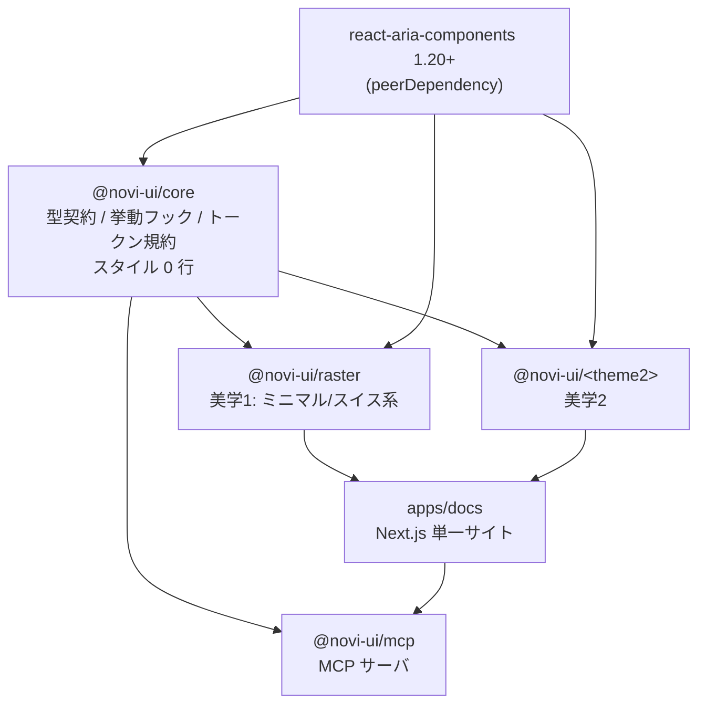

# Novi UI — Architecture

| 項目 | 値 |
|------|-----|
| Status | **Approved** |
| Last Updated | 2026-08-19 |
| Steering | [./steering.md](./steering.md) |

> 本書中の MUST / MUST NOT / SHOULD / SHOULD NOT / MAY は RFC 2119 に従う。

---

## 1. 解くべき問題

Novi UI は「**1つの core に、複数の美学**」という構造を取る。ここには本質的な緊張がある。

| 満たしたいこと | 対立する要求 |
|---|---|
| テーマごとに**本物の美学差**を出したい（色と角丸だけの差は一瞬でバレる） | → DOM 構造を変えられる必要がある |
| ドキュメントサイトは**1本**で、テーマ切替だけで見せたい | → 公開 API はテーマ横断で完全に同一である必要がある |
| a11y 修正は core 1箇所で直したい | → 挙動は core に集約する必要がある |

**つまり「構造は自由・API は同一・挙動は共通」を同時に満たす設計が要る。**
本書の残りは、ほぼ全部この1点のための設計である。

---

## 2. パッケージ構成



`react-aria-components` はテーマからも直接使う。core は**それを隠蔽しない**。
隠蔽すると core が RAC の全 API を再エクスポートする巨大な壁になり、上流の改善が届かなくなるため。

---

## 3. core の責務境界

### 3.1 core が担うもの

| # | 責務 | 具体物 |
|---|---|---|
| 1 | **公開 API の型契約** | `variant` / `size` / `color` / `radius` の union 型、共通 props インターフェース |
| 2 | **slot 語彙** | 各コンポーネントの slot 名の集合と、必須/任意の区別 |
| 3 | **挙動フック** | RAC で足りない部分（IME 安全な入力、スクロールロック等） |
| 4 | **トークン規約** | `--novi-*` CSS 変数の命名規則と型、`base.css`（reset / `@layer` 定義） |
| 5 | **不安定 API の封じ込め** | RAC の `UNSTABLE_*` を1ファイルに閉じ込め、安定名で再公開 |

### 3.2 core が担わないもの

| 担わないもの | 理由 |
|---|---|
| **DOM 構造** | 固定した瞬間、テーマが構造を変えられなくなる（= 美学差が出せなくなる） |
| **スタイル** | 1行でも漏れると、テーマがそれを上書きする戦いが始まる |
| **実行時のコンポーネントファクトリ** | v0.1 では作らない。理由は §7 |
| **RAC の再エクスポート** | 上流の改善が届かなくなる |

> **MUST NOT**: `packages/core/src/**` に `.css` を追加してはならない（`base.css` を除く）。
> CI でこれを機械的に検査する。

---

## 4. slot 契約 — 構造の自由と API の同一を両立させる仕組み

### 4.1 slot 契約とは何か

**core は「コンポーネントを構成する部位の名前」だけを決める。JSX は決めない。**

```ts
// packages/core/src/modal/modal.contract.ts
export const modalSlots = [
  'backdrop', 'panel', 'header', 'title', 'closeButton', 'body', 'footer',
] as const

/** 必須 slot。テーマは必ずこれらを描画する MUST */
export const modalRequiredSlots = ['backdrop', 'panel', 'body'] as const

export type ModalSlot = (typeof modalSlots)[number]
```

型ヘルパも core が提供する。

```ts
// packages/core/src/slots.ts

/**
 * slot 名の集合から tv() の slots オブジェクトの型を作る。
 * R に指定した slot は必須、それ以外は任意になる。
 *
 * @example
 * const slots: SlotMap<typeof modalSlots, typeof modalRequiredSlots[number]> = {
 *   backdrop: 'fixed inset-0 bg-black/40',
 *   panel:    'bg-[--novi-color-bg] border border-[--novi-color-border]',
 *   body:     'px-6 py-4',
 * }
 */
export type SlotMap<
  S extends readonly string[],
  R extends S[number] = never,
> = Record<R, string> & Partial<Record<Exclude<S[number], R>, string>>
```

**ルール**

- テーマは slot 語彙の**外の名前を発明してはならない**（MUST NOT）。docs / テスト / ユーザーの上書きが横断で成立しなくなるため
- テーマは必須 slot 以外を**描画しなくてよい**（MAY omit）
- テーマは slot の**順序・入れ子・要素種別を自由に決めてよい**（MAY）← ここが美学差の源泉

### 4.2 `data-slot` 属性 — 契約を実行時に見えるようにする

全テーマは、slot に対応する要素に `data-slot="<slot名>"` を出力する（MUST）。

```tsx
<div data-slot="panel" className={styles.panel()}>
```

これ1つで4つの問題が同時に解ける。

| 解ける問題 | どう解けるか |
|---|---|
| テストがテーマ依存になる | `getByTestId` 不要。`[data-slot="panel"]` で全テーマ共通にクエリできる |
| 視覚回帰がテーマごとに書き直しになる | 同上。1本のテストが全テーマに効く |
| ユーザーが CSS で上書きできない | `[data-slot="panel"] { ... }` で確実に狙える |
| AI が構造を推測できない | 「Novi の全コンポーネントは data-slot を出す」と1行教えれば済む |

### 4.3 `classNames` prop — slot 契約のユーザー向け出口

全コンポーネントは `classNames` prop を受ける（MUST）。キーは slot 名と一致する。

```tsx
<Modal classNames={{ panel: 'max-w-2xl', footer: 'justify-start' }} />
```

**テーマを差し替えてもこの記述は壊れない。** これが slot 契約をユーザーに還元する形になる。

```ts
export type ClassNames<S extends readonly string[]> = Partial<Record<S[number], string>>
```

---

## 5. 実現可能性の検証 — Modal を2テーマ分書き下ろす

設計が本当に成立するかを確かめるため、**構造が根本的に違う2テーマ**で同じ Modal を書く。
公開 API と slot 語彙が同一のまま、DOM が別物になることを確認する。

### 共通の公開 API（core が定義）

```ts
// packages/core/src/modal/modal.contract.ts
export interface ModalProps extends NoviBaseProps {
  isOpen?: boolean
  defaultOpen?: boolean
  onOpenChange?: (isOpen: boolean) => void
  size?: NoviSize | 'full'
  isDismissable?: boolean
  isKeyboardDismissDisabled?: boolean
  classNames?: ClassNames<typeof modalSlots>
  children?: React.ReactNode
}
```

### テーマ A: `@novi-ui/raster`（ミニマル / スイス系）
閉じるボタンは**ヘッダー右上の小さなアイコン**。角は立て、影は使わず、細い境界線で面を切る。

```tsx
// packages/raster/src/modal/modal.tsx
import { ModalOverlay, Modal as RACModal, Dialog, Button } from 'react-aria-components'
import type { ModalProps } from '@novi-ui/core'
import { modalStyles } from './modal.styles'

export function Modal({ size = 'md', classNames, children, ...props }: ModalProps) {
  const s = modalStyles({ size })
  return (
    <ModalOverlay {...props} data-slot="backdrop" className={s.backdrop({ class: classNames?.backdrop })}>
      <RACModal data-slot="panel" className={s.panel({ class: classNames?.panel })}>
        <Dialog>
          {({ close }) => (
            <>
              {/* 見出しと閉じるを同じ行に置く = 情報の階層を横方向で作るスイス的処理 */}
              <div data-slot="header" className={s.header({ class: classNames?.header })}>
                <h2 data-slot="title" className={s.title({ class: classNames?.title })}>
                  {/* title は children から slot 経由で受け取る */}
                </h2>
                <Button
                  slot="close"
                  data-slot="closeButton"
                  className={s.closeButton({ class: classNames?.closeButton })}
                  onPress={close}
                  aria-label="閉じる"
                >
                  ✕
                </Button>
              </div>
              <div data-slot="body" className={s.body({ class: classNames?.body })}>{children}</div>
              <div data-slot="footer" className={s.footer({ class: classNames?.footer })} />
            </>
          )}
        </Dialog>
      </RACModal>
    </ModalOverlay>
  )
}
```

```ts
// packages/raster/src/modal/modal.styles.ts
import { tv } from 'tailwind-variants'
import type { SlotMap } from '@novi-ui/core'
import { modalSlots, modalRequiredSlots } from '@novi-ui/core'

const slots: SlotMap<typeof modalSlots, (typeof modalRequiredSlots)[number]> = {
  backdrop:    'fixed inset-0 z-50 grid place-items-center bg-[--novi-color-overlay]',
  panel:       'w-full bg-[--novi-color-bg] border border-[--novi-color-border] rounded-[--novi-radius-none] shadow-none',
  header:      'flex items-baseline justify-between gap-4 px-6 pt-6 pb-4 border-b border-[--novi-color-border]',
  title:       'text-[--novi-text-lg] font-medium tracking-tight',
  closeButton: 'shrink-0 size-8 grid place-items-center text-[--novi-color-muted] hover:text-[--novi-color-fg]',
  body:        'px-6 py-5',
  footer:      'flex justify-end gap-2 px-6 pb-6',
}

export const modalStyles = tv({
  slots,
  variants: { size: { sm: { panel: 'max-w-sm' }, md: { panel: 'max-w-md' }, lg: { panel: 'max-w-lg' }, full: { panel: 'max-w-none h-dvh' } } },
  defaultVariants: { size: 'md' },
})
```

### テーマ B: `@novi-ui/<mobile-first テーマ>`（比較用の仮想テーマ）
**下から出るボトムシート**。閉じるは**フッターのフルワイドボタン**。ヘッダーは描画せず、掴み手（grabber）を出す。

```tsx
export function Modal({ size = 'md', classNames, children, ...props }: ModalProps) {
  const s = modalStyles({ size })
  return (
    <ModalOverlay {...props} data-slot="backdrop" className={s.backdrop({ class: classNames?.backdrop })}>
      <RACModal data-slot="panel" className={s.panel({ class: classNames?.panel })}>
        <Dialog>
          {({ close }) => (
            <>
              {/* header slot は描画しない（任意 slot なので契約違反ではない） */}
              <div aria-hidden className={s.grabber?.()} />
              <div data-slot="body" className={s.body({ class: classNames?.body })}>{children}</div>
              {/* 閉じるボタンが footer の中にあり、フルワイド。構造が A と全く違う */}
              <div data-slot="footer" className={s.footer({ class: classNames?.footer })}>
                <Button
                  slot="close"
                  data-slot="closeButton"
                  className={s.closeButton({ class: classNames?.closeButton })}
                  onPress={close}
                >
                  閉じる
                </Button>
              </div>
            </>
          )}
        </Dialog>
      </RACModal>
    </ModalOverlay>
  )
}
```

### 検証結果

| 確認項目 | 結果 |
|---|---|
| 公開 API（props）が同一か | ✅ 両方 `ModalProps` そのまま。docs のコード例が両テーマで動く |
| slot 語彙が同一か | ✅ `closeButton` は A ではヘッダー内、B ではフッター内。**名前は同じで位置が違う** |
| 任意 slot の省略ができるか | ✅ B は `header` / `title` を描画していない |
| DOM 構造が本当に違うか | ✅ A は 中央モーダル + 上部横並びヘッダー、B は ボトムシート + フルワイドフッター |
| テストが共通化できるか | ✅ `[data-slot="closeButton"]` を押す test は両方で通る |
| a11y が共通化できるか | ✅ フォーカストラップ・Escape・`aria-modal` は RAC が両方で担保 |

> **この検証が成立する理由**: core が `<Modal>` の JSX を持っていないから。
> もし core が `<header>` を内部で描画する `<Modal>` を export していたら、
> テーマ B は閉じるボタンをフッターへ動かせず、この構想は成立しなかった。
>
> **grabber の扱いに注意**: テーマ B の掴み手は slot 語彙にない。
> これは**装飾要素なので `data-slot` を付けず `aria-hidden` にする**ことで契約違反を避けている。
> 「テーマ固有の装飾要素は slot にしない」というルールを §4.1 の運用として守る。

---

## 6. slot 語彙 — MVP 20 コンポーネント全一覧

**太字が必須 slot**（テーマは MUST 描画）。それ以外は MAY omit。

### 入力系

| コンポーネント | slot |
|---|---|
| Button | **root**, startContent, **label**, endContent, spinner |
| Input (TextField) | **root**, label, **inputWrapper**, **input**, startContent, endContent, description, errorMessage |
| TextArea | **root**, label, **inputWrapper**, **textarea**, description, errorMessage |
| Checkbox | **root**, **control**, indicator, label, description |
| CheckboxGroup | **root**, label, **list**, description, errorMessage |
| Radio | **root**, **control**, indicator, label, description |
| RadioGroup | **root**, label, **list**, description, errorMessage |
| Switch | **root**, **track**, **thumb**, label, description |
| Select | **root**, label, **trigger**, **value**, icon, **popover**, **listbox**, **option**, description, errorMessage |
| NumberField | **root**, label, **inputWrapper**, **input**, decrement, increment, description, errorMessage |
| ComboBox | **root**, label, **inputWrapper**, **input**, trigger, icon, **popover**, **listbox**, **option**, description, errorMessage |
| Pagination | **root**, **list**, **item**, **prev**, **next**, ellipsis |
| Table | **root**, **header**, **column**, sortIcon, **body**, **row**, **cell**, empty |
| DatePicker | **root**, label, **inputWrapper**, **dateInput**, **segment**, **trigger**, icon, **popover**, **calendar**, calendarHeader, calendarTitle, prevButton, nextButton, **calendarGrid**, **calendarCell**, description, errorMessage |

### 表示系

| コンポーネント | slot |
|---|---|
| Card | **root**, header, **body**, footer, image |
| Badge | **root**, dot, **label** |
| Avatar | **root**, image, fallback, badge |
| Progress | **root**, label, **track**, **indicator**, valueLabel |
| Spinner | **root**, **circle**, label |
| Skeleton | **root** |

### オーバーレイ系

| コンポーネント | slot |
|---|---|
| Modal | **backdrop**, **panel**, header, title, closeButton, **body**, footer |
| Popover | **root**, arrow, **content** |
| Tooltip | **root**, arrow, **content** |
| Menu (DropdownMenu) | **trigger**, **popover**, **list**, **item**, itemLabel, itemDescription, itemShortcut, separator, section, sectionLabel |

### ナビ / 構造系

| コンポーネント | slot |
|---|---|
| Tabs | **root**, **list**, **tab**, indicator, **panel** |
| Accordion | **root**, **item**, **heading**, **trigger**, indicator, **panel** |
| Breadcrumbs | **root**, **list**, **item**, link, separator, current |
| Toast | **region**, **root**, icon, **content**, title, description, closeButton, action |

> **合計 20 コンポーネント**（Checkbox/CheckboxGroup, Radio/RadioGroup, Progress/Spinner はそれぞれ1コンポーネント扱い）。
> slot 語彙の追加・変更は **Ask first**（steering.md の境界定義）。全テーマに波及するため。

---

## 7. 抽象化の段階設計 — ここを間違えると MVP が溶ける

1本目の時点で `createComponent(contract, impl)` のようなテーマファクトリを作りたくなるが、**やってはいけない**。
1本しかない状態では「何が本当に共通か」が分からず、想像で作った抽象は必ず外れる。
グローバル CLAUDE.md の「3回以上の重複が出てから抽象化する（YAGNI）」に従い、段階を踏む。

| 段階 | 契機 | core の姿 | テーマの書き方 |
|---|---|---|---|
| **v0.1** | 今回（1本目） | 型契約 + slot 語彙 + 挙動フック + トークン規約のみ。**実行時ファクトリなし** | RAC を直接使って普通に実装。props は core の型に従う |
| **v0.2** | 2本目を作る時 | 1本目と2本目で**実際に重複した箇所だけ**を core に引き上げる | 引き上がった分は core 経由、残りは直接実装 |
| **v0.3** | 3本目で重複が確定した時 | ~~必要ならファクトリを導入~~ → **導入しない**（ADR-09） | v0.1 のまま |

### 引き上げの判断基準（v0.2 で使う）
次の**すべて**を満たしたものだけを core に上げる。

1. 2つ以上のテーマで**バイト単位に近いレベルで同一**のコードである
2. そのコードが**スタイルを含まない**
3. 引き上げても、テーマが構造を変える自由を奪わない

3 を満たさないものは、たとえ重複していても**引き上げてはならない**（MUST NOT）。
構造の自由がこのプロジェクトの存在理由そのものであるため。

### v0.2 の判断結果（2026-08-22・tactile T-48）

2本目が揃ったので棚卸しした。`.tsx` の一致率は次のとおり。

| 一致率 | 件数 | コンポーネント |
|---|---|---|
| **100%** | 16 | accordion / avatar / badge / breadcrumbs / card / checkbox / input / menu / popover / progress / radio / skeleton / spinner / switch / textarea / toast |
| 98.1% | 1 | button |
| 90.7% | 1 | select |
| 89.8% | 1 | tabs |
| 71.4% | 1 | modal |

**結論: 何も引き上げない。** 16個は基準1（バイト単位に近い同一）と基準2（スタイルを含まない）を
満たすが、**基準3で全滅する**。

理由は、一致している 16 個が「共通なので抽象化できる」のではなく、
**2本ともたまたま同じ構造を選んだだけ**だから。同じ `.tsx` に見えても、
そこには「どの slot を描くか」「条件付きでどれを省くか」というテーマの判断が含まれている
（Checkbox / Radio は5箇所、Input は4箇所の条件付き描画を持つ）。
core に上げた瞬間、3本目のテーマは**その判断に従うしかなくなる**。

実際、構造差を作った4つ（modal 71% / tabs 90% / select 91% / button 98%）は
一致率が低い。**低い方が正常**で、100% はまだ差を作る必要がなかったという意味でしかない。
「Avatar は3テーマとも同じだった」は、4本目が Avatar の構造を変えない保証にならない。

> **この棚卸し自体が成果物**。「重複していても引き上げない」を数値の裏づけとともに
> 一度書いておかないと、次に誰かが同じ一致率を見て「共通化できる」と判断する。

### v0.3 の条件（3本目で再判定する）

- 3本目でも同じ `.tsx` になったものだけを再検討する（2本の一致は偶然と区別できない）
- ファクトリではなく**引き上げから始める**。ファクトリは構造の自由を最も強く奪う形
- 引き上げるとしても、条件付き描画を持たないもの（skeleton / badge / popover / card / toast /
  accordion）に限る。これらは slot を無条件に描いており、テーマの判断が入っていない

### v0.3 の判断結果（2026-08-26・flatlay T-39）

3本目が揃ったので再判定した。一致率は**空行を除いた行の LCS × 2 ÷ 両者の行数合計**で測る
（v0.2 の数値がこの式で再現する。button 97.9% / select 90.4% / modal 72.6%）。

| コンポーネント | R↔T | R↔F | T↔F | 3本一致 |
|---|---|---|---|---|
| skeleton | 100.0% | 100.0% | 100.0% | **○** |
| spinner | 100.0% | 98.8% | 98.8% | − |
| textarea | 100.0% | 97.9% | 97.9% | − |
| radio | 100.0% | 97.8% | 97.8% | − |
| progress | 100.0% | 97.8% | 97.8% | − |
| input | 100.0% | 97.7% | 97.7% | − |
| avatar | 100.0% | 97.2% | 97.2% | − |
| button | 97.9% | 97.3% | 96.6% | − |
| breadcrumbs | 100.0% | 96.3% | 96.3% | − |
| card | 100.0% | 96.3% | 96.3% | − |
| switch | 100.0% | 95.5% | 95.5% | − |
| badge | 100.0% | 94.3% | 94.3% | − |
| checkbox | 100.0% | 91.9% | 91.9% | − |
| color-picker | 97.3% | 91.0% | 91.0% | − |
| menu | 100.0% | 90.3% | 90.3% | − |
| accordion | 100.0% | 87.6% | 87.6% | − |
| tabs | 90.1% | 94.5% | 86.8% | − |
| select | 90.4% | 82.7% | 81.7% | − |
| modal | 72.6% | 72.8% | 67.9% | − |
| popover | 100.0% | 55.0% | 55.0% | − |
| toast | 100.0% | 49.5% | 49.5% | − |

**結論: ファクトリを導入しない。引き上げも行わない。**

v0.3 の条件は「3本目でも同じ `.tsx` になったものだけを再検討する」だった。
該当は 21 件中 **skeleton の1件だけ**。2本の時点で 16 件あった 100% 一致が、
3本目を書いただけで 1 件に落ちた。

v0.2 で「引き上げるとしてもこれらに限る」と名指しした6件の帰結が、とくにはっきりしている。

| コンポーネント | v0.2（2本） | v0.3（3本の最小値） |
|---|---|---|
| skeleton | 100% | 100% |
| card | 100% | 96.3% |
| badge | 100% | 94.3% |
| accordion | 100% | 87.6% |
| popover | 100% | **55.0%** |
| toast | 100% | **49.5%** |

**引き上げ候補の筆頭だった popover と toast が、全 21 件で最も低い2つになった。**
Flatlay は z 軸を持たないので、Popover は浮かずにフローへ入り、Toast は画面の端に
固定されない。「浮かせるかどうか」という美学の判断が、そのまま構造の差になる。
2本の一致が偶然だったことが数値で確認できた。

残った skeleton も引き上げない。26行・slot 1つ・条件付き描画なしで基準1と2は満たすが、
引き上げるには `skeletonStyles` を外から渡す形にするしかない。それは §7 が最初から
避けてきた**ファクトリそのもの**で、1件の重複を消すために構造の自由を全体で手放すことになる。

> 3本で確定したのは「共通化できるものがある」ではなく、**「無い」という事実の方**。
> v0.1 から据えてきた「実行時ファクトリなし」を、ここで恒久化する（ADR-09）。

#### 付随: 3本とも描かなかった slot が2つある

`arrow`（Popover / Tooltip）と `Toast.icon` は、3テーマを書き終えても一度も描かれなかった。
任意 slot の仕組み自体は機能している（`Tabs.indicator` と `Modal.header` は
テーマによって要る/要らないが分かれた）が、この2つは**どのテーマも要らないと判断した**。

語彙に残っている限り「実装し忘れている slot」に見え、4本目の作者は描くべきか迷う。
削除すれば語彙は正確になるが、**slot 語彙の削除は公開 API の破壊的変更**にあたるため
ここでは記録に留める。判断は v0.4 の入口で行う。

---

## 8. CSS 変数トークン規約

### 8.1 命名規則

```
--novi-<category>-<name>[-<modifier>]
```

Provider を持たないため、**テーマの切り替えは CSS 変数の差し替えだけで完結する**（§10 ADR-04）。

| category | トークン例 |
|---|---|
| `color` | 面と文字: `--novi-color-bg` `-subtle` `-fg` `-muted` `-border` **`-border-strong`** `-overlay` / セマンティック6色: `default` `primary` `secondary` `success` `warning` `danger`（各 `-fg` 付き） |
| `radius` | `--novi-radius-none` `-sm` `-md` `-lg` `-full` |
| `space` | `--novi-space-1` 〜 `--novi-space-16` |
| `text` | `--novi-text-xs` 〜 `--novi-text-4xl`（`-lh` でline-height） |
| `font` | `--novi-font-sans` `--novi-font-mono` |
| `shadow` | `--novi-shadow-none` `-sm` `-md` `-lg` |
| `duration` | `--novi-duration-fast` `-base` `-slow` |
| `ease` | `--novi-ease-standard` `-emphasized` |
| `focus` | `--novi-focus-ring-width` `-color` `-offset` |

**色は必ずセマンティック名にする**（MUST）。`--novi-color-blue-500` のような literal 名を作ってはならない。
literal 名を作ると、テーマ側が色相を変えたときに意味が壊れる。

#### 境界線を2つに分ける（実装時に判明）

`border` を1つにすると必ず破綻する。装飾に合わせれば WCAG 1.4.11 の 3:1 を割り、
基準に合わせればカードの区切り線まで濃くなって画面が重くなる。**用途で分ける。**

| トークン | 用途 | 基準 |
|---|---|---|
| `--novi-color-border` | 装飾。面の区切り、カードの外周 | なし |
| `--novi-color-border-strong` | 機能上必要な境界。入力欄の枠、トグルの輪郭 | **3:1 以上**（WCAG 1.4.11） |

コントラストは目分量で決めず、OKLCH → 相対輝度の変換を実装したテストで検証する
（`packages/core/src/tokens/definitions.test.ts`）。

### 8.2 ライト / ダーク

```css
:root { --novi-color-bg: oklch(99% 0 0); /* ... */ }
[data-novi-scheme="dark"], .dark { --novi-color-bg: oklch(18% 0 0); /* ... */ }

@media (prefers-color-scheme: dark) {
  :root:not([data-novi-scheme="light"]) { /* dark 値 */ }
}
```

JS も Provider も不要。属性かクラスを付けるだけ。RSC でそのまま動く。

### 8.3 `@layer` 順序

`base.css` で以下を宣言する。ユーザーの上書きが常に勝つことを保証するため。

```css
@layer novi.reset, novi.base, novi.component, novi.override;
```

---

## 9. API 命名規約 — AI の生成精度を上げるための規約

**原則: 独自命名を作らない。LLM が既に知っている形に寄せる。**
オリジナリティは見た目で出す。API は退屈でよい。

### 9.1 props 名 — React Aria / HeroUI 系に従う

RAC と shadcn は流儀が違う。**RAC / HeroUI 側を採用する。**

| 概念 | 採用 | 不採用 | 理由 |
|---|---|---|---|
| 無効化 | `isDisabled` | `disabled` | 基盤が RAC。変換層を挟むとバグの温床になる |
| 押下 | `onPress` | `onClick` | 同上。RAC はタッチ/ペン/キーボードを統一的に扱う |
| 選択状態 | `isSelected` / `defaultSelected` | `checked` | 同上 |
| 読み取り専用 | `isReadOnly` | `readOnly` | 同上 |
| 必須 | `isRequired` | `required` | 同上 |
| 無効値 | `isInvalid` | `error` | 同上 |
| 開閉 | `isOpen` / `defaultOpen` / `onOpenChange` | `open` / `onChange` | Radix/RAC/HeroUI で共通 |

> **トレードオフの明示**: shadcn 流の `disabled` / `onClick` に慣れた LLM は最初 `isDisabled` を外す可能性がある。
> これは §11 の `llms.txt` と MCP、および型エラーで吸収する。
> 逆に RAC 準拠をやめると、全コンポーネントに props 変換層が必要になり、
> a11y のバグを自分で作り込むリスクの方が大きい。

### 9.2 variant 語彙 — core で固定し、全テーマに実装を義務づける

**テーマごとに variant 名が違うと、単一 docs + テーマ切替という構想が崩壊する。**
語彙は core が固定し、全テーマが全語彙を実装する（MUST）。見た目の解釈だけがテーマごとに違う。

```ts
// packages/core/src/tokens.ts
export const NOVI_VARIANTS = ['solid', 'outline', 'soft', 'ghost', 'plain'] as const
export const NOVI_SIZES    = ['sm', 'md', 'lg'] as const
export const NOVI_COLORS   = ['default', 'primary', 'secondary', 'success', 'warning', 'danger'] as const
export const NOVI_RADII    = ['none', 'sm', 'md', 'lg', 'full'] as const

export type NoviVariant = (typeof NOVI_VARIANTS)[number]
export type NoviSize    = (typeof NOVI_SIZES)[number]
export type NoviColor   = (typeof NOVI_COLORS)[number]
export type NoviRadius  = (typeof NOVI_RADII)[number]
```

| 語彙 | 意味（テーマはこの意味を守る MUST） |
|---|---|
| `solid` | 塗りつぶし。最も強い視覚的重み |
| `outline` | 境界線のみ。背景は透明 |
| `soft` | 淡い背景。境界線なし |
| `ghost` | 通常時は無装飾、hover で背景が出る |
| `plain` | 常に無装飾。テキストリンク相当 |

`solid` / `outline` / `ghost` は shadcn・HeroUI・MUI で最も共通して使われる語で、LLM の第一候補になりやすい。
`soft` は Radix Themes 由来。

### 9.3 variants の named export

全テーマは `tv()` の定義を named export する（MUST）。

```ts
export const buttonStyles = tv({ /* ... */ })
```

ユーザー側:

```ts
import { buttonStyles } from '@novi-ui/raster'
import { tv } from 'tailwind-variants'

// slot ベースの定義なので `slots` で足す
const myButton = tv({
  extend: buttonStyles,
  slots: { root: 'uppercase tracking-widest' },
})

// variant の追加もできる
const withEmphasis = tv({
  extend: buttonStyles,
  variants: { emphasis: { high: { root: 'font-bold' } } },
})
```

> **`base` は使えない（実装時に判明）。**
> `tv({ extend, base: '...' })` は slot を持たない定義にしか効かず、
> Novi のコンポーネントはすべて slot ベースなので**黙って無視される**。
> 誤った例をドキュメントに載せると AI がそのまま壊れたコードを生成するため、
> 「`base` では効かない」ことをテストで固定してある。

#### 拡張と上書きの使い分け（実装時に判明）

`extend` の `slots` は **base に足される**ため、後から適用される variant のクラスと競合すると負ける。

| やりたいこと | 手段 |
|---|---|
| variant と競合しないクラスを足す（`font-mono` など） | `tv({ extend, slots: { ... } })` |
| **variant のクラスを上書きする**（`w-9` → `w-14` など） | 呼び出し側の `classNames` / `class` |

```tsx
// ✗ size variant の w-9 に負ける
const wide = tv({ extend: switchStyles, slots: { track: 'w-14' } })

// ✓ 呼び出し時に渡せば variant にも勝つ
<Switch classNames={{ track: 'w-14' }} />
```

これが「npm 配布はコードを所有できない」という最大の不満への回答になる。

---

## 10. Decisions (ADR)

### ADR-01: ヘッドレス基盤に React Aria Components を採用する
- **Status**: Accepted (2026-08-19)
- **Context**: Base UI 1.0 が shadcn の新デフォルトになり、開発も活発。一方 RAC は Adobe が実機・支援技術で検証している。
- **Decision**: React Aria Components を採用する。
- **Consequences**:
  - (+) a11y の実機検証品質が最高水準。`@internationalized/date` により将来の日付系で locale 対応が段違いに楽
  - (+) HeroUI と同じ土台のため、API 慣習を借りられて LLM の生成精度が上がる
  - (−) Base UI より verbose。テーマ実装のコード量が増える
  - (−) HeroUI と土台が同じなので「基盤で差別化」はできない。差別化は美学と slot 契約で出す

### ADR-02: 美学ごとにパッケージを分け、core を npm 公開する
- **Status**: Accepted (2026-08-19)
- **Context**: 目的は「複数の美学を1人で作り切ったポートフォリオ」。テーマごとに a11y を書き直すのは個人には不可能。
- **Decision**: モノレポで core を1つ持ち、npm に公開する。テーマは core に依存する別パッケージ。
- **Consequences**:
  - (+) 2本目以降はスタイル層だけで済み、コストが数分の1になる
  - (+) 第三者が core の上に自分のテーマを作れる（エコシステムになりうる）
  - (−) 依存が2パッケージになる。バージョン整合の運用が要る（Changesets で対応）

### ADR-03: slot 契約は「型定義 + `data-slot` 属性」で表現し、実行時ファクトリは作らない
- **Status**: Accepted (2026-08-19)
- **Context**: 構造の自由と API の同一を両立させる必要がある。一方でテーマが1本しかない段階で共通化の形は分からない。
- **Decision**: core は slot 名の集合と型ヘルパのみを提供する。JSX の生成には一切関与しない。全テーマは `data-slot` を出力する。
- **Consequences**:
  - (+) テーマが DOM を完全に自由に組める（§5 で Modal 2テーマで実証済み）
  - (+) テスト・視覚回帰・ユーザーの CSS 上書き・docs が全てテーマ横断で成立する
  - (+) 実行時コスト 0。型はビルド後に消える
  - (−) 契約の遵守は型と CI で担保するしかない。ランタイムの強制力がない
  - (−) テーマ間でボイラープレートが重複する。これは v0.2 で引き上げる（§7）

### ADR-04: Provider を持たない
- **Status**: Accepted (2026-08-19)
- **Context**: AI にコードを書かせると Provider の入れ忘れ・設置場所ミスが頻発する。また Provider は RSC の境界を汚す。
- **Decision**: テーマ・カラースキームは CSS 変数と属性のみで表現する。グローバル Provider を一切要求しない。
- **Consequences**:
  - (+) AI が壊しにくい。import してすぐ使える
  - (+) React Server Components / streaming がそのまま通る
  - (+) HeroUI v3 と同じ判断であり、実績がある
  - (−) i18n locale や PortalProvider が必要になる場面では RAC の Provider を**ユーザーが任意で**足す形になる。必須にはしない

### ADR-05: API 命名は RAC / HeroUI 慣習に従う（shadcn 流を採らない）
- **Status**: Accepted (2026-08-19)
- **Context**: `isDisabled` vs `disabled`、`onPress` vs `onClick` が衝突する。LLM の生成精度を最大化したい。
- **Decision**: RAC / HeroUI 側を採用する。
- **Consequences**:
  - (+) 変換層が不要。RAC の props をそのまま流せるので a11y バグを作り込まない
  - (+) HeroUI ユーザーがそのまま移行できる
  - (−) shadcn に慣れた LLM が最初 `disabled` と書く可能性がある → `llms.txt` / MCP / 型エラーで吸収する

### ADR-06: variant 語彙を core で固定し、全テーマに全語彙の実装を義務づける
- **Status**: Accepted (2026-08-19)
- **Context**: テーマごとに variant 名が違うと、単一 docs + テーマ切替が成立しない。
- **Decision**: `solid | outline | soft | ghost | plain` を core で固定する。全テーマが全語彙を実装する。
- **Consequences**:
  - (+) docs のコード例がテーマを切り替えても一切書き換わらない。これが最大のデモになる
  - (+) AI が variant 名を間違えない
  - (−) 極端にミニマルなテーマでは `soft` と `plain` の差が小さくなる。それは許容する

### ADR-07: 不安定な上流 API は core の1ファイルに封じ込める
- **Status**: Accepted (2026-08-19)
- **Context**: RAC の Toast は 2026年8月時点でも `UNSTABLE_Toast` / `UNSTABLE_ToastRegion` / `UNSTABLE_ToastQueue` のまま alpha 扱い。メンテナは「優先度が上がっておらず、年内に外れる見込みはない」と回答している。
- **Decision**: `UNSTABLE_*` の import は `packages/core/src/unstable/` 配下のファイルからのみ行い、安定した Novi 名で再公開する。テーマパッケージからの直接 import を CI で禁止する。
- **Consequences**:
  - (+) 上流が破壊的変更をしても、修正は core の1ファイルで済む
  - (+) 「なぜ core 層が要るのか」の最も分かりやすい実例になる
  - (−) 1段ラップが挟まる。Toast の RAC 側の新機能が自動では届かない

### ADR-08: アニメーションライブラリを使わない
- **Status**: Accepted (2026-08-19)
- **Context**: HeroUI v3 は Framer Motion を削除してバンドルを削った。UI ライブラリの依存はユーザーのバンドルに直接乗る。
- **Decision**: CSS アニメーション（`@starting-style` / `transition-behavior: allow-discrete` / RAC の `data-entering` `data-exiting`）のみを使う。
- **Consequences**:
  - (+) バンドルが小さい。RSC と相性が良い
  - (+) `prefers-reduced-motion` の尊重が CSS だけで完結する
  - (−) 複雑なジェスチャ連動アニメーションは実装できない。MVP のスコープでは問題にならない

### ADR-09: テーマファクトリを導入しない（v0.3 で確定）
- **Status**: Accepted (2026-08-26)
- **Context**: §7 の段階設計は「3本目で重複が確定したらファクトリを導入」と留保していた。3本目 flatlay が揃ったので実測したところ、2本時点で 16 件あった 100% 一致は **1 件（skeleton）** に落ちた。引き上げ候補の筆頭だった popover / toast は 55.0% / 49.5% と、全 21 件で最も低い2つになった。
- **Decision**: 実行時ファクトリを導入しない。core は型契約 + slot 語彙 + 挙動フック + トークン規約に留める。**4本目以降でこの判定をやり直さない。**
- **Consequences**:
  - (+) テーマは構造を最後まで自由に選べる。z 軸を持たない Flatlay が Popover をフローに入れられたのは、この自由が残っていたから
  - (+) 「3本書いても共通化できなかった」という数値が、次に同じ提案が出たときの回答になる
  - (−) 21 コンポーネント × テーマ数のファイルを書き続ける。skeleton のような小さな重複は残ったままになる
  - (−) 契約を変えるときは全テーマを手で直す。漏れは CI の5点セットで検知する
  - **一致率が上がっても再判定しない。** 高い一致率は「共通だ」ではなく「まだ差を作る必要が無かった」という意味でしかない

---

## 11. AI に書かせても崩れないための設計

| AI が壊すところ | 対策 | 実装先 |
|---|---|---|
| Provider の入れ忘れ・設置ミス | Provider を完全撤廃（ADR-04） | core |
| 存在しない prop を書く | variant を union literal で型定義 → 誤りは型エラー | core |
| variant 名をテーマごとに間違える | 語彙を core で固定（ADR-06） | core |
| 毎回違うスタイルを書いて一貫性が崩れる | 美学をライブラリ側に焼き付ける。AI には「組む」ことだけをさせる | theme |
| 古い / 誤った API を生成する | `llms.txt` / `llms-full.txt` を docs から配信、`@novi-ui/mcp` で props と実例を返す | docs / mcp |
| `import` 元を間違える | 公開エントリを 1パッケージ 1つに限定 | 全パッケージ |
| 構造を推測できず独自の div を挟む | 全要素に `data-slot` を出力し、規則を1行で説明可能にする | theme |

さらに、**全コンポーネントの JSDoc に使用例を1つ書く**（steering.md のコード規約）。
IDE 経由で LLM が読むため、これが実質的に最も効く AI 向けドキュメントになる。

---

## 12. Risks

| Risk | Impact | Likelihood | Mitigation |
|---|---|---|---|
| slot 語彙が2本目のテーマで足りないと判明する | 高 | 中 | §5 の書き下ろし検証を、2本目に着手する前に**全20コンポーネント分**行う。語彙追加は minor では通さず major 扱い |
| RAC Toast の `UNSTABLE_` が破壊的に変わる | 中 | 中 | ADR-07 で core 1ファイルに封じ込め済み |
| RAC の verbose さでテーマ実装が想定より重くなる | 中 | 中 | MVP を 20 に絞る。DataTable / DatePicker 等は Non-Goal |
| v0.1 で抽象化を我慢できず、使われないファクトリを作る | 高 | **高** | §7 の段階設計を steering.md の境界に明記済み。PR レビューで機械的に弾く |
| テーマ差が結局「色と角丸」に収束する | 致命 | 中 | 2本目の着手条件として「Modal・Select・Tabs の3つで DOM 構造が実際に違うこと」を必須にする |
| 個人の稼働が続かず1本目が未完で止まる | 高 | 中 | 1コンポーネント = 1PR で常にリリース可能な状態を保つ。20個揃わなくても公開できる形にする |

---

## 13. Test Strategy

| 層 | 対象 | 手段 |
|---|---|---|
| Unit (core) | 型ヘルパ、挙動フック、IME ハンドリング、トークン定義 | Vitest |
| Unit (theme) | レンダリング、variant/size のクラス適用 | Vitest + Testing Library |
| a11y | 全コンポーネント × 全テーマ | vitest-axe（violations 0 が必須ゲート） |
| Keyboard | フォーカス移動・Escape・矢印キーを持つ全コンポーネント | Testing Library `userEvent` |
| **契約テスト** | **全テーマが必須 slot を `data-slot` で出力しているか** | **共通テストスイートを core が提供し、各テーマが実行する** |
| 視覚回帰 | 全コンポーネント × 全テーマ × light/dark | Playwright スナップショット |
| バンドルサイズ | 主要コンポーネントの gzip サイズ | size-limit（CI で閾値超過を落とす） |

**契約テストが要になる。** core が「このテーマは Modal の backdrop/panel/body を出しているか」を検査する
共通スイートを export し、各テーマパッケージがそれを import して自分のコンポーネントを流す。
これによりテーマが増えても契約の遵守が自動で保証される。
