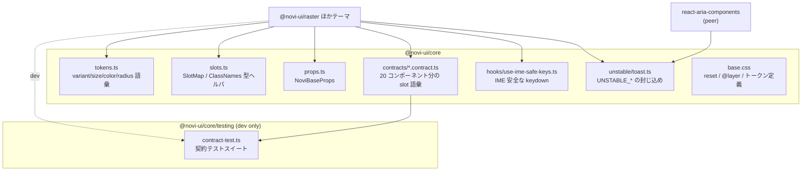
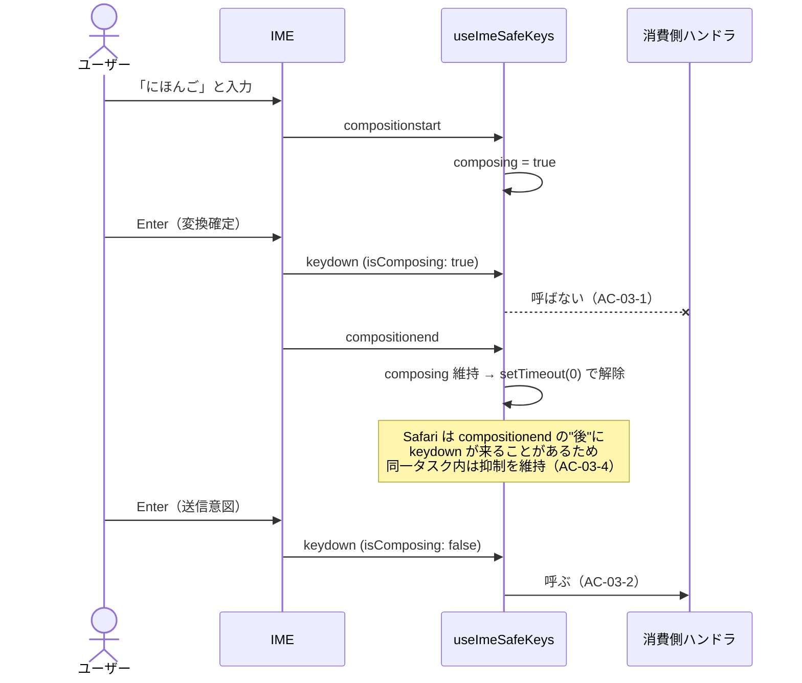
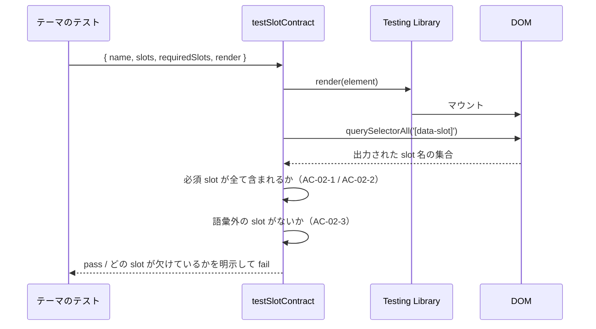

# @novi-ui/core — Design

| 項目 | 値 |
|------|-----|
| Status | **Draft** |
| Author | yuuto |
| Last Updated | 2026-08-19 |
| Requirements | [./requirements.md](./requirements.md) |
| Architecture | [../../architecture.md](../../architecture.md) |

---

## Architecture Overview



### エントリポイント

| エントリ | 用途 | AI に露出するか |
|---|---|---|
| `@novi-ui/core` | 型契約・slot 語彙・トークン語彙。**React を import しない**（RSC 安全） | する |
| `@novi-ui/core/client` | 挙動フック + 封じ込め済み Toast プリミティブ。`'use client'` が付く（ADR-C6） | しない（テーマ実装者のみ） |
| `@novi-ui/core/testing` | 契約テストスイート | **しない**（dev 専用） |
| `@novi-ui/core/base.css` | reset / `@layer` / トークン | する（1回だけ import） |

> steering.md の「公開エントリは1パッケージ1つ」ルールの**明示的な例外**。
> `testing` は devDependency 側でしか使われず、アプリケーションコードには一切現れないため、
> AI が誤用する経路がない。`base.css` も同様に import 文が1行あるだけで、コンポーネント API ではない。

---

## Data Model（型定義）

### tokens.ts — 固定語彙（ADR-06）

```ts
export const NOVI_VARIANTS = ['solid', 'outline', 'soft', 'ghost', 'plain'] as const
export const NOVI_SIZES    = ['sm', 'md', 'lg'] as const
export const NOVI_COLORS   = ['default', 'primary', 'secondary', 'success', 'warning', 'danger'] as const
export const NOVI_RADII    = ['none', 'sm', 'md', 'lg', 'full'] as const

export type NoviVariant = (typeof NOVI_VARIANTS)[number]
export type NoviSize    = (typeof NOVI_SIZES)[number]
export type NoviColor   = (typeof NOVI_COLORS)[number]
export type NoviRadius  = (typeof NOVI_RADII)[number]

/**
 * tv() の variants を型付けするためのヘルパ。
 * 語彙の実装漏れ・語彙外の追加をコンパイルエラーにする（AC-07-1 / AC-07-2）。
 */
export type VariantMap<K extends string, S> = Record<K, S>
```

### slots.ts — slot 契約の型ヘルパ

```ts
/**
 * slot 名の集合から tv() の slots オブジェクトの型を作る。
 * R に含めた slot は必須、それ以外は任意になる。
 *
 * @example
 * const slots: SlotMap<typeof modalSlots, ModalRequiredSlot> = {
 *   backdrop: 'fixed inset-0',
 *   panel: 'bg-[--novi-color-bg]',
 *   body: 'px-6 py-4',
 * }
 */
export type SlotMap<
  S extends readonly string[],
  R extends S[number] = never,
> = Record<R, string> & Partial<Record<Exclude<S[number], R>, string>>

/** ユーザー向け classNames prop の型（architecture.md §4.3） */
export type ClassNames<S extends readonly string[]> = Partial<Record<S[number], string>>
```

### props.ts — 全コンポーネント共通の基底 props

```ts
export interface NoviBaseProps {
  /** ルート要素に付与する追加クラス */
  className?: string
  /** ルート要素の id */
  id?: string
}
```

> **`classNames` は基底に置かない**（実装時に判明・ADR-C4）。
> slot 語彙はコンポーネントごとに異なるため、基底で `Record<string, string | undefined>` として持つと
> 派生側の型が緩くなり、語彙外のキーを弾けなくなる。
> 各コンポーネントが `classNames?: ClassNames<typeof xxxSlots>` を自分で宣言する。

### contracts/ — 20 コンポーネント分の slot 語彙

すべて同じ形で定義する。以下は Modal の例。

```ts
// contracts/modal.contract.ts
export const modalSlots = [
  'backdrop', 'panel', 'header', 'title', 'closeButton', 'body', 'footer',
] as const
export const modalRequiredSlots = ['backdrop', 'panel', 'body'] as const

export type ModalSlot         = (typeof modalSlots)[number]
export type ModalRequiredSlot = (typeof modalRequiredSlots)[number]

export interface ModalProps extends NoviBaseProps {
  isOpen?: boolean
  defaultOpen?: boolean
  onOpenChange?: (isOpen: boolean) => void
  size?: NoviSize | 'full'
  isDismissable?: boolean
  isKeyboardDismissDisabled?: boolean
  classNames?: ClassNames<typeof modalSlots>
  children?: React.ReactNode
}
```

全 20 コンポーネントの slot 語彙一覧は [architecture.md §6](../../architecture.md) にある。**そちらが正**。
本パッケージはそれを機械可読な形にしたものにすぎない。

---

## Sequence: IME 安全な keydown（FR-06 / FR-07）

日本語変換の確定 Enter が「送信」「候補選択」として誤発火する問題を、全テーマで一律に潰す。



### 実装方針

```ts
export function useImeSafeKeys<E extends HTMLElement>(
  onKeyDown?: React.KeyboardEventHandler<E>,
): Pick<React.DOMAttributes<E>, 'onKeyDown' | 'onCompositionStart' | 'onCompositionEnd'>
```

判定は次の**3条件の OR** で行う。1つでは環境差を吸収できない。

| 条件 | 目的 |
|---|---|
| `e.nativeEvent.isComposing === true` | 標準的な変換中判定 |
| `e.keyCode === 229` | `isComposing` が立たない古い環境・一部 IME のフォールバック |
| 内部 `composingRef.current === true` | `compositionend` 直後の同一タスク内 keydown を抑制（Safari 対策） |

`compositionend` での解除は `setTimeout(fn, 0)` を使う（`queueMicrotask` では早すぎて Safari の keydown を取りこぼす）。
人間が1タスク内に Enter を2回押すことは不可能なため、誤抑制の実害はない。

> **なぜ core に置くか**: この処理を各テーマの Input / TextArea / Select / Menu に個別に書くと、
> 必ずどこかで漏れる。漏れた場所だけ日本語入力で誤動作するという、最も再現しにくいバグになる。

---

## Sequence: 契約テスト（FR-05）



```ts
// @novi-ui/core/testing

/** 検査ロジック本体。テストフレームワークに依存しない純粋関数。 */
export function checkSlotContract(
  container: ParentNode,
  contract: NoviContract,
): {
  found: string[]
  missing: string[]
  /** どの契約にも無い、発明された名前。これだけが違反 */
  unknown: string[]
  /** 入れ子の別 Novi コンポーネント由来。違反ではない */
  fromNestedComponents: string[]
}

/** 失敗時に欠落 slot 名を名指しするメッセージを組み立てる。 */
export function formatSlotContractFailure(name: string, result: SlotContractResult): string

/** describe/it を登録する薄いラッパ。 */
export function testSlotContract(options: {
  name: string
  contract: NoviContract
  /** 開いた状態など、全 slot が出る状態でレンダリングすること */
  render: () => React.ReactElement
}): void
```

> **探索対象を `container` ではなく `baseElement` にした理由（実装時に判明）**
> Modal / Popover / Tooltip / Menu / Select は `document.body` 直下のポータルへ描画される。
> Testing Library の `container` だけを見ると、**構造がいちばん重要な5コンポーネントで
> 契約テストがまったく機能しない**（必須 slot が全部欠落として出る）。
> `baseElement`（既定で `document.body`）を探索することでポータルも拾う。

> **語彙外 slot の判定を2段階にした理由（実装時に判明）**
> `RadioGroup` の中に `Radio` を置くと、子の `control` slot が同じツリーに現れる。
> これを「語彙外」と判定すると、**入れ子を持つコンポーネントの契約テストが常に落ちる**。
> 検出したいのは「勝手に発明された slot 名」なので、
> Novi のどの契約にも属さない名前だけを `unknown`（違反）とし、
> 他コンポーネント由来は `fromNestedComponents` として区別する。

> **検査ロジックを純粋関数に分離した理由（実装時に判明）**
> 当初は `testSlotContract` の中に検査を書く設計だったが、それだと
> **「契約が破られたときに本当に失敗するか」自体をテストできない**（`it` の中の失敗は捕まえられない）。
> `checkSlotContract` を切り出したことで、欠落・語彙外・任意 slot の省略・重複出力・空文字 slot まで
> 直接テストできるようになった。契約テスト自身が信用できないと、この仕組み全体が意味を失う。

`vitest` と `@testing-library/react` は **optional peerDependency** とし、
`describe` / `it` / `expect` はグローバルではなく `vitest` から直接 import する。
グローバルに依存すると、消費側が `globals: true` を設定していない場合に動かないため。
ランタイムパッケージ側には一切含まれない。

---

## API Contract（公開エクスポート一覧）

| エクスポート | 種別 | 関連 AC / FR |
|---|---|---|
| `NOVI_VARIANTS` / `NOVI_SIZES` / `NOVI_COLORS` / `NOVI_RADII` | const | FR-04 |
| `NoviVariant` / `NoviSize` / `NoviColor` / `NoviRadius` | type | FR-04, AC-07-1 |
| `VariantMap<K, S>` | type | AC-07-1, AC-07-2 |
| `SlotMap<S, R>` | type | FR-02, AC-01-1〜3 |
| `ClassNames<S>` | type | FR-03 |
| `NoviBaseProps` | interface | FR-01 |
| `<component>Slots` / `<component>RequiredSlots` × 20 | const | FR-01 |
| `<Component>Slot` / `<Component>RequiredSlot` / `<Component>Props` × 20 | type | FR-01 |
| `useImeSafeKeys` | hook | FR-06, FR-07, AC-03-1〜4 |
| `ToastQueue` / `ToastRegion` / `Toast`（安定名で再公開） | component / class | FR-08, AC-04-1 |
| `@novi-ui/core/testing` → `testSlotContract` | function | FR-05, AC-02-1〜3 |
| `@novi-ui/core/base.css` | css | FR-11〜13, FR-15, AC-06-1〜3 |

**Provider は1つも export しない**（FR-14 / AC-05-2）。

---

## base.css の構成（FR-11 / FR-15）

```css
@layer novi.reset, novi.base, novi.component, novi.override;

@layer novi.base {
  :root {
    --novi-color-bg: oklch(99% 0 0);
    --novi-color-fg: oklch(20% 0 0);
    --novi-color-muted: oklch(55% 0 0);
    --novi-color-border: oklch(90% 0 0);
    --novi-color-overlay: oklch(20% 0 0 / 0.4);
    --novi-color-primary: oklch(55% 0.18 250);
    --novi-color-primary-fg: oklch(99% 0 0);
    /* secondary / success / warning / danger も同様に -fg 付きで定義 */

    --novi-radius-none: 0px;
    --novi-radius-sm: 2px;
    --novi-radius-md: 6px;
    --novi-radius-lg: 12px;
    --novi-radius-full: 9999px;

    --novi-duration-fast: 120ms;
    --novi-duration-base: 200ms;
    --novi-duration-slow: 320ms;
    --novi-ease-standard: cubic-bezier(0.2, 0, 0, 1);
    --novi-ease-emphasized: cubic-bezier(0.3, 0, 0, 1);

    --novi-focus-ring-width: 2px;
    --novi-focus-ring-color: var(--novi-color-primary);
    --novi-focus-ring-offset: 2px;
  }

  [data-novi-scheme='dark'] { /* ダーク値 */ }

  @media (prefers-color-scheme: dark) {
    :root:not([data-novi-scheme='light']) { /* ダーク値 */ }
  }

  @media (prefers-reduced-motion: reduce) {
    :root { --novi-duration-fast: 0ms; --novi-duration-base: 0ms; --novi-duration-slow: 0ms; }
  }
}
```

ダーク値は3箇所（属性・メディアクエリ）に重複するため、**CSS カスタムプロパティのセットを1つの定義に切り出し、
ビルド時に展開する**。手書きでの二重管理はしない。

`prefers-reduced-motion` の尊重をトークン層で行うことで、各テーマが個別に対応する必要がなくなる。

---

## Alternatives Considered

| 案 | Pros | Cons | 採否 |
|---|---|---|---|
| A: 型契約 + `data-slot` のみ（実行時ファクトリなし） | テーマが構造を完全に自由に組める / 実行時コスト0 / 1本目で無駄な抽象を作らない | ボイラープレートがテーマ間で重複する / 契約の強制がビルド時のみ | ✅ |
| B: `createComponent(contract, impl)` 実行時ファクトリ | 重複が減る / 契約を実行時に強制できる | 1本しかない段階で共通部分が分からず、想像の抽象が必ず外れる / 構造の自由を削りやすい | ❌ v0.3 で再検討 |
| C: core が完成したコンポーネントを提供し、テーマは CSS 変数のみ差し替え | 実装が最も軽い / 一貫性が最も高い | **DOM 構造を変えられず、美学差が「色と角丸」に収束する。本プロジェクトの存在理由が消える** | ❌ |
| D: core を作らず各テーマ独立 | 初期の自由度が最大 | a11y ロジックを本数分メンテすることになり、個人開発では破綻する | ❌ |

---

## Decisions (ADR)

> プロジェクト全体に関わる ADR-01〜08 は [architecture.md §10](../../architecture.md) にある。
> ここには core パッケージ固有の決定のみを書く。

### ADR-C1: 契約テストスイートを別エントリ `@novi-ui/core/testing` に置く
- **Status**: Accepted (2026-08-19)
- **Context**: 契約テストは core が提供すべきだが、`vitest` への依存をランタイムパッケージに持ち込みたくない。
- **Decision**: `@novi-ui/core/testing` サブパスに分離し、`vitest` を optional peerDependency にする。
- **Consequences**:
  - (+) ランタイムバンドルが汚れない（NFR: gzip < 2KB を守れる）
  - (+) steering の「1エントリ」ルールの趣旨（AI の誤用防止）は保たれる。dev 専用でアプリコードに現れないため
  - (−) エントリが2つになる。package.json の `exports` 設定が必要

### ADR-C2: IME の抑制解除に `setTimeout(0)` を使う
- **Status**: Accepted (2026-08-19)
- **Context**: Safari 系では `compositionend` の後に確定 Enter の `keydown` が届くことがあり、`isComposing` も立っていない。
- **Decision**: `compositionend` で即座に解除せず、`setTimeout(fn, 0)` で次タスクまで抑制を維持する。
- **Consequences**:
  - (+) 環境差を吸収でき、日本語入力での誤送信を実質ゼロにできる
  - (−) 理論上は「同一タスク内の2回目の Enter」を取りこぼすが、人間の操作では発生しない
  - (−) テストでフェイクタイマーの制御が必要になる

### ADR-C6: クライアント専用のものを `@novi-ui/core/client` に分離し、メインエントリを React ランタイムから切り離す
- **Status**: Accepted (2026-08-19、実装時に判明)
- **Context**: `useImeSafeKeys` は React フック、封じ込め済み Toast は React コンポーネントで、いずれも `'use client'` が要る。しかし全 export を1つの束にすると、`'use client'` がバンドル先頭へ持ち上がって**パッケージ全体がクライアント専用**になる。そうなると RSC から型や slot 契約を import しただけでクライアント境界が生まれ、ADR-04（Provider を持たない = RSC がファーストクラス）が台無しになる。
- **Decision**: エントリを2つに分ける。メイン（`.`）は型・契約・語彙のみで **React を1行も import しない**。クライアント専用のものは `./client` に置き、そちらにだけ `'use client'` を付ける。
  エントリ名を `hooks` ではなく `client` としたのは、フックだけでなく Toast プリミティブも含むため、
  および**分離の理由（`'use client'` が必要）が名前で自明になる**ため。
- **Consequences**:
  - (+) RSC からメインエントリを import してもクライアント境界が生まれない（ビルド成果物で実測確認済み）
  - (+) `'use client'` の影響範囲がフックだけに閉じる
  - (−) 公開エントリが増える（`.` / `./hooks` / `./testing` / `./base.css`）。
    steering の「1エントリ」原則の趣旨は AI の誤用防止であり、
    **フックはテーマ実装者しか使わない**ため、AI 向けの表面積は実質増えていない
  - (−) メインエントリに React ランタイム import が混入していないことを継続的に守る必要がある → CI で検査する

### ADR-C4: `classNames` を `NoviBaseProps` に置かない
- **Status**: Accepted (2026-08-19、実装時に判明)
- **Context**: 当初は基底 props に `classNames?: Record<string, string | undefined>` を置く設計だったが、slot 語彙はコンポーネントごとに異なる。基底で緩い型を持つと、派生側で `ClassNames<typeof modalSlots>` に絞っても代入互換性の判定が曖昧になり、語彙外キーを弾く保証が崩れる。
- **Decision**: 基底は `className` と `id` のみ。`classNames` は各コンポーネントが自分の slot 語彙で宣言する。
- **Consequences**:
  - (+) 語彙外のキーが確実にコンパイルエラーになる（型テストで検証済み）
  - (+) 基底 props が最小になり、AI が推測しやすい
  - (−) 各コンポーネントで `classNames` の宣言が1行ずつ重複する。v0.2 の引き上げ候補

### ADR-C5: ESM 専用で配布する
- **Status**: Accepted (2026-08-19、実装時に確定)
- **Context**: tsdown の既定出力は `.mjs` / `.d.mts`。CJS も併せて出すと dual package hazard を抱える。
- **Decision**: ESM 専用（`format: ['esm']`）。`exports` は実出力の `.mjs` / `.d.mts` を指す。
- **Consequences**:
  - (+) dual package hazard が発生しない。バンドルが小さい
  - (+) React 19 / RSC / Tailwind v4 はいずれも ESM 前提のため実害がない
  - (−) CJS のみの環境からは使えない
  - (−) `exports` のパスと実出力の拡張子がズレると解決できなくなる → **CI で exports の実在検査を行う**

### ADR-C3: ダークトークンの重複定義をビルド時展開で解消する
- **Status**: Accepted (2026-08-19)
- **Context**: ダーク値は `[data-novi-scheme="dark"]` と `@media (prefers-color-scheme: dark)` の2箇所に必要で、手書きすると必ず片方が腐る。
- **Decision**: トークン定義を単一のソースに置き、`base.css` はビルド時に生成する。
- **Consequences**:
  - (+) 二重管理による色ズレが起きない
  - (−) `base.css` が生成物になるためビルドステップが1つ増える

---

## Cross-cutting Concerns

- **エラーハンドリング**: core は例外を投げない。契約違反はすべて**型エラー**か**テスト失敗**として検出する。実行時チェックは入れない（バンドルサイズと本番コストのため）
- **ロギング**: なし。ライブラリがログを出さない
- **i18n**: core は文言を持たない。`aria-label` 等の文言はテーマとユーザーの責務。将来的に必要になったら別 Spec で扱う
- **バージョニング**: slot 語彙の変更は `1.0` 以降 major。variant 語彙の追加は minor、削除は major
- **CI ガード**: FR-09（`UNSTABLE_` 直接 import 禁止）と FR-10（core に CSS 禁止）は Biome のカスタムルールか、単純な grep スクリプトで実装する

---

## Risks

| Risk | Impact | Likelihood | Mitigation |
|---|---|---|---|
| slot 語彙が2本目のテーマで足りないと判明する | 高 | 中 | 2本目着手前に全20コンポーネントを紙上で2テーマ分書き下ろす（architecture.md §5 と同じ手順） |
| `SlotMap` の型が複雑すぎてエラーメッセージが読めない | 中 | 中 | 型エラーの実例を docs に載せる。必要なら型を単純化する方を優先する |
| IME 対策が特定環境で効かない | 中 | 中 | 3条件 OR で吸収。実機（iOS Safari / macOS Safari / Windows Chrome + MS-IME / ATOK）で確認する |
| RAC Toast の `UNSTABLE_` が破壊的に変わる | 中 | 中 | ADR-07 で core 1ファイルに封じ込め済み |
| `vitest` の optional peer が解決できず契約テストが動かない | 低 | 低 | モノレポ内では確実に解決する。外部利用者向けには README に明記 |

---

## Test Strategy

| 層 | 対象 | 手段 |
|---|---|---|
| Unit | `SlotMap` / `ClassNames` / `VariantMap` の型挙動 | `expectTypeOf`（Vitest の型テスト）で AC-01-1〜3, AC-07-1〜2 を検証 |
| Unit | `useImeSafeKeys` | Testing Library + `userEvent` + フェイクタイマー。AC-03-1〜4 |
| Unit | 契約テストスイート自身 | 意図的に必須 slot を欠いたダミーコンポーネントを流し、失敗することを確認（AC-02-2, AC-02-3） |
| Unit | トークン定義の網羅性 | 全 `NOVI_COLORS` に対応する `--novi-color-*` と `-fg` が `base.css` に存在すること |
| Integration | RSC で import できること | docs サイトの Server Component ページで検証（AC-05-1）。docs は静的エクスポートのため**ビルド時**にレンダリングされる。Provider 必須の設計が混入していればビルドが落ちるため目的は達成できる（[03-docs-site ADR-D4](../03-docs-site/design.md)） |
| Static | Provider が export されていないこと | 公開 API のスナップショットテスト（AC-05-2） |
| Static | core に CSS がないこと / `UNSTABLE_` 直接 import がないこと | CI スクリプト（FR-09, FR-10） |
| Size | gzip < 2KB | size-limit |

> **型テストを Vitest の `expectTypeOf` で書く**のがこのパッケージの要。
> core の価値の大半が型にあるため、型が壊れていないことをテストで守る必要がある。
