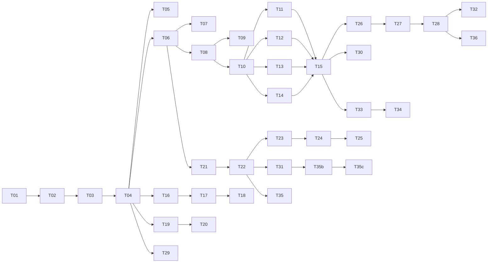

# @novi-ui/core — Implementation Tasks

| 項目 | 値 |
|------|-----|
| Status | **Draft** |
| Author | yuuto |
| Last Updated | 2026-08-19 |
| Requirements | [./requirements.md](./requirements.md) |
| Design | [./design.md](./design.md) |

> 各タスク完了時にチェック。受け入れ基準ID（AC-XX-X）または FR-XX で要件と対応付ける。
> 1タスク = 1〜3時間で完了する粒度。

---

## Phase 1: モノレポ基盤

- [x] **T-01**: pnpm workspace + Turborepo 初期化。`pnpm-workspace.yaml` / `turbo.json` / ルート `package.json` (1.5h) → [steering](../../steering/project.md) リポジトリ構成, NFR:ビルド時間
- [x] **T-02**: TypeScript 基盤。`tsconfig.base.json`（strict + `noUncheckedIndexedAccess`）と各パッケージの継承設定 (1h) → NFR:型
- [x] **T-03**: Biome 設定。lint / format ルールを確定 (1h) → [steering](../../steering/project.md) Code Style
- [x] **T-04**: `packages/core` 雛形。`package.json`（`exports` に `.` / `./testing` / `./base.css`、`sideEffects: false`、peerDeps 設定）+ `tsdown.config.ts` (1.5h) → NFR:Tree-shaking, ADR-C1
- [x] **T-05**: CI ワークフロー。typecheck / test / lint / build を PR で回す (1.5h) → NFR:型, NFR:カバレッジ（CI がこれらの強制手段になる）

---

## Phase 2: 型契約

- [x] **T-06**: `tokens.ts` 実装。`NOVI_VARIANTS` / `NOVI_SIZES` / `NOVI_COLORS` / `NOVI_RADII` と派生 union 型、`VariantMap` (1h) → FR-04
- [x] **T-07**: `tokens.ts` の型テスト。variant 実装漏れ・語彙外追加がエラーになることを `expectTypeOf` で検証 (1h) → AC-07-1, AC-07-2
- [x] **T-08**: `slots.ts` 実装。`SlotMap<S, R>` / `ClassNames<S>` (1.5h) → FR-02, FR-03
- [x] **T-09**: `slots.ts` の型テスト。必須 slot 省略でエラー / 任意 slot 省略で通る / 語彙外キーでエラー (1.5h) → AC-01-1, AC-01-2, AC-01-3
- [x] **T-10**: `props.ts` 実装。`NoviBaseProps` (0.5h) → FR-01
- [x] **T-11**: slot 契約 — 入力系 9件。Button / Input / TextArea / Checkbox / CheckboxGroup / Radio / RadioGroup / Switch / Select (3h) → FR-01
- [x] **T-12**: slot 契約 — 表示系 6件。Card / Badge / Avatar / Progress / Spinner / Skeleton (2h) → FR-01
- [x] **T-13**: slot 契約 — オーバーレイ系 4件。Modal / Popover / Tooltip / Menu (2h) → FR-01
- [x] **T-14**: slot 契約 — ナビ/構造系 4件。Tabs / Accordion / Breadcrumbs / Toast (2h) → FR-01

> T-11〜T-14 は [architecture.md §6](../../architecture.md) の slot 語彙表を**そのまま**機械可読にする作業。
> 表と実装がズレていないことを確認するテストを T-15 で入れる。

- [x] **T-15**: slot 語彙の網羅テスト。20 コンポーネント分の契約が存在し、必須 slot が語彙の部分集合であることを検証 (1h) → FR-01

---

## Phase 3: 挙動フック

- [x] **T-16**: `useImeSafeKeys` 実装。3条件 OR 判定 + `setTimeout(0)` での抑制解除 (2h) → FR-06, FR-07, ADR-C2
- [x] **T-17**: `useImeSafeKeys` のテスト。変換中 Enter で呼ばれない / 確定後 Enter で呼ばれる / 直接入力で即呼ばれる / `compositionend` 直後の keydown を抑制 (2.5h) → AC-03-1, AC-03-2, AC-03-3, AC-03-4
- [ ] **T-18**: IME 実機確認。macOS Safari / iOS Safari / Windows Chrome + MS-IME で誤送信が起きないことを確認 (1.5h) → AC-03-1, AC-03-4
  - [x] **macOS で確認（2026-08-22）**。https://novi-42r.pages.dev/ime-probe/ で
        「にほんご」の変換確定 Enter がハンドラに届かず、確定後の Enter は届くことを実機で確認
  - [x] **iOS Safari で確認（2026-08-22）**。`compositionend` の後に keydown が届く
        環境（AC-03-4 が想定している挙動差）でも誤送信なし
  - [ ] Windows Chrome + MS-IME

> **2026-08-22 追記**: CDP の `Input.imeSetComposition` を使い、ブラウザの本物の変換状態で
> Enter を送る e2e を追加した（`apps/docs/e2e/ime.spec.ts`、4件）。
> 観測点は「テーマの `onKeyDown` に届いた回数」で、抑制を外すと落ちることを確認済み。
> **これで回帰の検出は自動化できたが、T-18 の代わりにはならない。**
> Chromium の合成した変換状態を見ているだけで、macOS の日本語 IME・iOS・MS-IME の
> 実際の挙動（特に `compositionend` と keydown の順序）は環境ごとに違う。
>
> **T-18 は人が実機で日本語を打つ必要があるため自動化できない。** 自動テスト（T-17）は
> `isComposing` / `keyCode 229` / `compositionend` 直後の3経路を jsdom で網羅済みだが、
> 実際の IME の発火順序は環境依存であり、最終確認は人手で行う。

---

## Phase 4: 不安定 API の封じ込め

- [x] **T-19**: `unstable/toast.ts` 実装。RAC の `UNSTABLE_Toast` / `UNSTABLE_ToastRegion` / `UNSTABLE_ToastQueue` を安定名で再公開 (1.5h) → FR-08, AC-04-1
- [x] **T-20**: `UNSTABLE_` 直接 import 禁止の CI ガード。`packages/*/src` を走査し、`core/src/unstable/` 以外で `UNSTABLE_` を含む import があれば失敗させる (1.5h) → FR-09, AC-04-2

---

## Phase 5: トークン / base.css

- [x] **T-21**: トークン定義の単一ソース化。ライト/ダーク値を1ファイルにまとめる (1.5h) → ADR-C3
- [x] **T-22**: `base.css` 生成スクリプト。`@layer` 宣言 + reset + `:root` + `[data-novi-scheme="dark"]` + `prefers-color-scheme` を生成 (2h) → FR-11, FR-12, FR-13, ADR-C3
- [x] **T-23**: `prefers-reduced-motion` とフォーカスリングのトークン追加 (1h) → FR-11
- [x] **T-24**: トークン網羅テスト。全 `NOVI_COLORS` に対応する `--novi-color-*` と `-fg` が存在すること / 全トークンが `--novi-` 名前空間であること (1h) → FR-15
- [x] **T-25**: カラースキーム切替の検証。属性指定でダーク適用 / OS 設定でダーク適用 / 明示 light が OS より優先 (1.5h) → AC-06-1, AC-06-2, AC-06-3

> **T-25 は生成 CSS の構造検証まで。** jsdom は `@media` とカスタムプロパティのカスケードを
> 正しく評価しないため、実ブラウザでの最終確認は docs サイト（[03-docs-site](../03-docs-site/tasks.md) T-33）で行う。

---

## Phase 6: 契約テストスイート

- [x] **T-26**: `@novi-ui/core/testing` エントリ設定。`vitest` を optional peerDependency に (1h) → ADR-C1
- [x] **T-27**: `testSlotContract` 実装。必須 slot の欠落と語彙外 slot を検出する (2h) → FR-05, AC-02-1
- [x] **T-28**: `testSlotContract` 自身のテスト。必須 slot を欠いたダミーで失敗すること / 語彙外 slot を出すダミーで失敗すること / 失敗メッセージに欠落 slot 名が含まれること (2h) → AC-02-2, AC-02-3

---

## Phase 7: 制約の機械的保証

- [x] **T-29**: core に CSS を置けない CI ガード。`packages/core/src/**` に `base.css` 以外の CSS があれば失敗 (1h) → FR-10
- [x] **T-30**: 公開 API スナップショットテスト。Provider が export されていないことを含め、公開 API の変化を検知する (1.5h) → FR-14, AC-05-2
- [x] **T-30b**: `exports` の実在検査。`package.json` の `exports` が指すファイルがビルド後に実在することを CI で検査する。ESM 専用のため拡張子（`.mjs` / `.d.mts`）のズレが即座に解決不能を招く (1h) → ADR-C5
- [x] **T-30c**: メインエントリの RSC 安全性検査。`dist/index.mjs` に `react` からの import が含まれていないことを CI で検査する。混入するとパッケージ全体がクライアント専用になり ADR-04 が崩れる (1h) → ADR-C6, AC-05-1
- [x] **T-31**: `size-limit` 設定。ランタイム gzip < 2KB を CI ゲートにする (1h) → NFR:バンドル
- [x] **T-32**: カバレッジゲート 90% を CI に追加 (0.5h) → NFR:カバレッジ

---

## Phase 8: 仕上げ

- [x] **T-33**: 全公開 API に JSDoc + 使用例を1つずつ記述 (2.5h) → [architecture.md §11](../../architecture.md), [04-ai-integration](../04-ai-integration/requirements.md) G3（最も効く AI 対策）
- [x] **T-34**: `packages/core/README.md`。core の責務境界（何を担い、何を担わないか）を明記 (1.5h) → [architecture.md §3](../../architecture.md), NG1〜NG4
- [ ] **T-35**: RSC 検証。最小の Next.js Server Component ページで core を import してエラーが出ないことを確認 (1h) → AC-05-1

> **T-35 は docs アプリ（[03-docs-site](../03-docs-site/tasks.md) T-01）が出来てから実施する。**
> 静的検査（T-30c: メインエントリに react の import が無いこと）は実装・CI 済みで、
> RSC が壊れる原因はこれで潰してあるが、実アプリでの確認は別途行う。
- [ ] **T-35b**: 初回 publish。`npm publish --access public` で `@novi-ui/core` を手動公開する (1h) → [steering](../../steering/project.md) 公開（publish）

> **T-35b / T-35c は人の判断と操作が必要。**
> publish は取り消しの効かない外向きの公開行為なので、実行前に必ず本人が判断する。
> T-35c の Trusted Publisher 設定は npmjs.com の Web フォーム専用で、CLI に経路がない。
- [ ] **T-35c**: Trusted Publishing 設定。npmjs.com で Trusted Publisher を追加し、Changesets + GitHub Actions から OIDC 公開できるようにする。`id-token: write` 付与と `NODE_AUTH_TOKEN` 未設定を確認 (2h) → [steering](../../steering/project.md) 公開（publish）
- [ ] **T-36**: `@novi-ui/raster` 側から契約テストを1件流し、パッケージ間連携が成立することを確認 (1h) → FR-05

**合計見積**: 約 55h

---

## Dependencies

**クリティカルパス**: T-01 → T-04 → T-06 → T-08 → T-10 → T-11〜14 → T-15 → T-26 → T-27 → T-28 → T-36

slot 契約（T-11〜T-15）が全体のボトルネック。ここが確定するまでテーマ実装に着手してはいけない。

---

## Definition of Done（全項目チェックで完了）

- [ ] `pnpm typecheck` がエラー 0
- [ ] `pnpm test` が全通過、カバレッジ 90% 以上
- [ ] `pnpm lint` がエラー 0
- [ ] `pnpm size` が gzip 2KB 未満
- [ ] CI ガード3種（`UNSTABLE_` 直接 import / core に CSS / 公開 API スナップショット）が動作している
- [ ] 20 コンポーネント分の slot 契約が [architecture.md §6](../../architecture.md) の表と一致している
- [ ] IME 対策を実機3環境（macOS Safari / iOS Safari / Windows Chrome）で確認済み
- [ ] 全公開 API に JSDoc と使用例がある
- [ ] `@novi-ui/raster` から契約テストが実行できることを確認済み
- [ ] `@novi-ui/core` が npm に公開済みで、Trusted Publishing（OIDC）から自動公開できる状態になっている
- [ ] requirements.md の Open Questions が空
- [ ] Status を `Implemented` に更新
