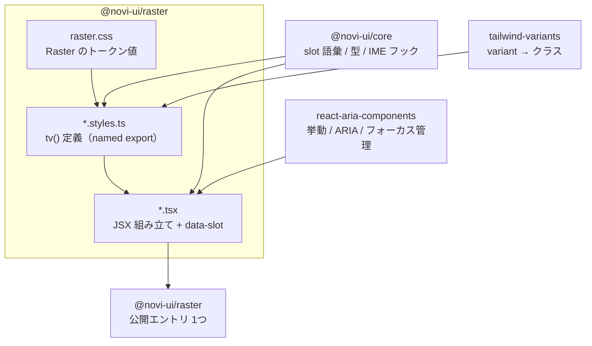

# @novi-ui/raster — Design

| 項目 | 値 |
|------|-----|
| Status | **Draft** |
| Author | yuuto |
| Last Updated | 2026-08-19 |
| Requirements | [./requirements.md](./requirements.md) |
| Architecture | [../../architecture.md](../../architecture.md) |

---

## Architecture Overview



### 1コンポーネント = 3ファイル

```
src/button/
├── button.styles.ts   tv() 定義。SlotMap で型付け。named export
├── button.tsx         RAC を組み立て、data-slot を出す。JSDoc に使用例
├── button.test.tsx    レンダリング / axe / variant / 契約テスト
└── index.ts
```

**責務の分離が命**。`.styles.ts` にロジックを書かず、`.tsx` にクラス文字列を書かない。
これを守ると、2本目のテーマは `.styles.ts` と `.tsx` の JSX 部分だけを書き直せばよくなる。

---

## 基準となる実装パターン（Button）

**この形を19個複製する。** 迷ったらこれに戻る。

```ts
// src/button/button.styles.ts
import { tv } from 'tailwind-variants'
import {
  buttonSlots, buttonRequiredSlots,
  type SlotMap, type NoviVariant, type NoviSize, type NoviColor, type VariantMap,
} from '@novi-ui/core'

const slots: SlotMap<typeof buttonSlots, (typeof buttonRequiredSlots)[number]> = {
  root: [
    'inline-flex items-center justify-center gap-2',
    'font-medium whitespace-nowrap select-none',
    'border border-transparent rounded-[--novi-radius-none]',
    'transition-[background-color,border-color,color,opacity]',
    'duration-[--novi-duration-fast] ease-[--novi-ease-standard]',
    // フォーカスリング。AC-04-5
    'outline-none focus-visible:outline focus-visible:outline-[length:--novi-focus-ring-width]',
    'focus-visible:outline-[--novi-focus-ring-color] focus-visible:outline-offset-[--novi-focus-ring-offset]',
    'disabled:opacity-40 disabled:pointer-events-none',
  ].join(' '),
  label: 'truncate',
  startContent: 'shrink-0 inline-flex',
  endContent: 'shrink-0 inline-flex',
  spinner: 'shrink-0',
}

// 語彙の実装漏れ・語彙外の追加をコンパイルエラーにする（AC-02-2）
const variant: VariantMap<NoviVariant, { root: string }> = {
  solid:   { root: 'bg-[--novi-color-primary] text-[--novi-color-primary-fg] hover:opacity-90' },
  outline: { root: 'border-[--novi-color-border] text-[--novi-color-fg] hover:bg-[--novi-color-subtle]' },
  soft:    { root: 'bg-[--novi-color-subtle] text-[--novi-color-fg] hover:brightness-95' },
  ghost:   { root: 'text-[--novi-color-fg] hover:bg-[--novi-color-subtle]' },
  plain:   { root: 'text-[--novi-color-fg] underline-offset-4 hover:underline' },
}

const size: VariantMap<NoviSize, { root: string; label: string }> = {
  sm: { root: 'h-8  px-3 text-[--novi-text-sm]', label: '' },   // 32px（AC-01-2）
  md: { root: 'h-10 px-4 text-[--novi-text-base]', label: '' }, // 40px
  lg: { root: 'h-12 px-5 text-[--novi-text-lg]', label: '' },   // 48px
}

export const buttonStyles = tv({
  slots,
  variants: { variant, size, color: { /* NOVI_COLORS 全件 */ } },
  defaultVariants: { variant: 'solid', size: 'md', color: 'default' },
})

export type ButtonStyleProps = Parameters<typeof buttonStyles>[0]
```

```tsx
// src/button/button.tsx
import { Button as RACButton } from 'react-aria-components'
import type { ButtonProps } from '@novi-ui/core'
import { buttonStyles } from './button.styles'

/**
 * ボタン。
 *
 * @example
 * <Button variant="solid" color="primary" onPress={() => save()}>
 *   保存
 * </Button>
 */
export function Button({
  variant = 'solid', size = 'md', color = 'default',
  startContent, endContent, isLoading, classNames, children, ...props
}: ButtonProps) {
  const s = buttonStyles({ variant, size, color })
  return (
    <RACButton {...props} data-slot="root" className={s.root({ class: classNames?.root })}>
      {isLoading && <span data-slot="spinner" className={s.spinner({ class: classNames?.spinner })}>…</span>}
      {startContent && (
        <span data-slot="startContent" className={s.startContent({ class: classNames?.startContent })}>
          {startContent}
        </span>
      )}
      <span data-slot="label" className={s.label({ class: classNames?.label })}>{children}</span>
      {endContent && (
        <span data-slot="endContent" className={s.endContent({ class: classNames?.endContent })}>
          {endContent}
        </span>
      )}
    </RACButton>
  )
}
```

### このパターンの要点

| 要点 | 理由 |
|---|---|
| `VariantMap<NoviVariant, ...>` で型付けする | variant の実装漏れをコンパイルエラーにする（AC-02-2） |
| 色は必ず `--novi-color-*` 経由 | ユーザーが CSS 変数だけでブランド色に寄せられる（AC-06-3 / FR-06） |
| `data-slot` を全 slot 要素に出す | テスト・視覚回帰・ユーザー上書き・AI が全部これに乗る（FR-02） |
| `classNames?.<slot>` を `class:` に渡す | tailwind-variants がマージを担当。順序衝突を自前で解かない（AC-03-3） |
| `tv()` を named export | `tv({ extend })` で拡張できる（AC-06-1 / FR-04） |
| JSDoc に使用例を1つ | IDE 経由で LLM が読む。実質的な AI 向けドキュメント（FR-14） |

---

## Raster のトークン値

`@novi-ui/core` の `base.css` が定義する変数に対し、Raster 固有の値を上書きする。

```css
/* src/raster.css */
@layer novi.base {
  [data-novi-theme='raster'], :root {
    /* 角を立てる。既定は none、最大でも sm */
    --novi-radius-none: 0px;
    --novi-radius-sm: 2px;
    --novi-radius-md: 2px;    /* Raster では md/lg も 2px に潰す */
    --novi-radius-lg: 2px;
    --novi-radius-full: 9999px; /* Avatar / Badge のみ使用 */

    /* 影は使わない */
    --novi-shadow-none: none;
    --novi-shadow-sm: none;
    --novi-shadow-md: none;
    --novi-shadow-lg: none;

    /* 彩度は primary のみ。他は chroma 0（AC-01-3） */
    --novi-color-bg:      oklch(99% 0 0);
    --novi-color-subtle:  oklch(96% 0 0);
    --novi-color-fg:      oklch(20% 0 0);
    --novi-color-muted:   oklch(50% 0 0);
    --novi-color-border:  oklch(88% 0 0);
    --novi-color-overlay: oklch(20% 0 0 / 0.45);
    --novi-color-primary: oklch(52% 0.18 250);
    --novi-color-primary-fg: oklch(99% 0 0);

    /* タイポ: 比率 1.2 */
    --novi-text-xs: 12px;  --novi-text-sm: 14px;  --novi-text-base: 16px;
    --novi-text-lg: 20px;  --novi-text-xl: 24px;  --novi-text-2xl: 30px; --novi-text-3xl: 36px;
    --novi-leading-body: 1.6;
    --novi-leading-heading: 1.25;

    /* モーションは fast のみ使う */
    --novi-duration-fast: 120ms;
  }
}
```

> **`--novi-radius-md` を 2px に潰しているのが Raster の思想**。
> API 上は `radius="lg"` が受け付けられるが、Raster では見た目が変わらない。
> これは仕様であって不具合ではない。**語彙は共通、解釈はテーマの自由**（ADR-06）。

### ダーク値

```css
[data-novi-scheme='dark'] {
  --novi-color-bg:      oklch(16% 0 0);
  --novi-color-subtle:  oklch(22% 0 0);
  --novi-color-fg:      oklch(95% 0 0);
  --novi-color-muted:   oklch(65% 0 0);   /* 4.5:1 を満たす下限を実測して決める */
  --novi-color-border:  oklch(30% 0 0);   /* 3:1 を満たす（AC-05-2） */
  --novi-color-primary: oklch(70% 0.16 250);
  --novi-color-primary-fg: oklch(16% 0 0);
}
```

`muted` と `border` の値は**目分量で決めない**。コントラスト検査を先に書き、それを通る値を採用する。

---

## 20 コンポーネントの実装方針

| # | コンポーネント | 使う RAC プリミティブ | Raster 固有の構造判断 |
|---|---|---|---|
| 1 | Button | `Button` | 上記の基準パターン |
| 2 | Input | `TextField` `Label` `Input` `Text` `FieldError` | ラベルは常に上・左揃え。プレースホルダをラベル代わりにしない |
| 3 | TextArea | `TextField` `TextArea` | リサイズは縦のみ。文字数カウンタは `description` slot |
| 4 | Checkbox / Group | `Checkbox` `CheckboxGroup` | 角丸 0 の 16px 角。チェックは 1px の線で描く |
| 5 | Radio / RadioGroup | `RadioGroup` `Radio` | 円は `radius-full` の例外。内側ドットで選択を示す |
| 6 | Switch | `Switch` | トラックは角丸 0 の矩形。**Raster では「スライドする四角」**にして円形を避ける |
| 7 | Select | `Select` `Button` `Popover` `ListBox` `ListBoxItem` | ポップオーバーは影なし・1px 境界線。トリガーと同幅 |
| 8 | Card | `div`（RAC 不要） | 影なし・1px 境界線のみ。header/footer は境界線で仕切る |
| 9 | Badge | `span` | 角丸 0。`dot` slot は 6px 角の正方形 |
| 10 | Avatar | `div` `img` | 唯一 `radius-full` を既定にする。fallback はイニシャル |
| 11 | Progress | `ProgressBar` | トラック高 2px。`indeterminate` は translate のみで表現 |
| 12 | Spinner | `div` + CSS | 回転を使うため **`rotate` 禁止の例外**。ADR-R2 参照 |
| 13 | Skeleton | `div` + CSS | `opacity` のパルスのみ。シマー（translate グラデ）は使わない |
| 14 | Modal | `ModalOverlay` `Modal` `Dialog` | 中央配置。閉じるはヘッダー右上のアイコン（architecture.md §5 テーマA） |
| 15 | Popover | `Popover` `Dialog` | `arrow` slot は描画しない（任意 slot の省略） |
| 16 | Tooltip | `TooltipTrigger` `Tooltip` | 反転色（dark 面）で表示。arrow なし |
| 17 | Menu | `MenuTrigger` `Popover` `Menu` `MenuItem` `Separator` | `itemShortcut` は右端に `tabular-nums` で揃える |
| 18 | Tabs | `Tabs` `TabList` `Tab` `TabPanel` | インジケータは下線 1px。**アクティブタブの背景は変えない** |
| 19 | Accordion | `Disclosure` `DisclosureGroup` `Button` `DisclosurePanel` | インジケータは `+/−` の線。三角矢印は使わない（回転を避ける） |
| 20 | Breadcrumbs | `Breadcrumbs` `Breadcrumb` `Link` | セパレータは `/`。現在地は `aria-current="page"` + 非リンク |
| — | Toast | core 経由の安定名 API | region は右下固定。`action` slot は `plain` variant のボタン |

> **Switch の判断が Raster の性格を最もよく表す**。一般的なピル型トグルではなく、角丸 0 の矩形が横に滑る形にする。
> これが「テーマ差は色と角丸ではなく構造」の具体例になる。

---

## 禁止クラス検査の実装（FR-07 / FR-12 / AC-01-1）

`scripts/check-design-rules.ts` を CI に組み込む。`src/**/*.styles.ts` を静的に走査する。

| 検出パターン | 理由 | 例外 |
|---|---|---|
| `shadow-` （`shadow-none` を除く） | 影は使わない | なし |
| `rounded-(md\|lg\|xl\|2xl\|3xl)` | 角丸は `sm` まで | なし |
| `border-[2-9]` `border-\d\d` | 境界線は 1px のみ | なし |
| `scale-` | 動きで飾らない | なし |
| `rotate-` | 同上 | `spinner.styles.ts` のみ許可（ADR-R2） |
| `#[0-9a-f]{3,8}` `rgb(` `oklch(` | 色は必ずトークン経由 | `raster.css` のみ許可 |
| `duration-(?!\[--novi)` | モーションはトークン経由 | なし |

例外はファイル単位のホワイトリストで管理し、**追加には理由のコメントを必須**にする。

---

## T-41: slot 語彙レビュー結果（2026-08-20）

**1本目の目的は「20個作ること」ではなく「slot 語彙が実際に機能するかを検証すること」**だった。
20コンポーネントを実装し終えた時点での結論を記す。**2本目はここから始めればよい。**

### 結論: slot 語彙の変更は不要

23契約すべてを実装し、**語彙の追加も削除も必要なかった**。
架空の設計ではなく実際に機能する語彙だったことが確認できた。

### 語彙にあるが描画しなかった slot（3件）

| slot | 判定 | 理由 |
|---|---|---|
| `popover.arrow` / `tooltip.arrow` | **意図どおり** | Raster は矢印を描かない。任意 slot を省略できることの実例そのもの |
| `menu.section` / `menu.sectionLabel` | **実装漏れだった** | 語彙にあるのに使う手段がなかった。`MenuSection` を追加して解消 |

**このレビューをしなければ Menu のセクション機能が欠けたまま公開されていた。**
語彙と実装の突き合わせは、テストでは拾えない種類の漏れを捕まえる。

### 実装中に core へ差し戻した props（4件）

いずれも「slot はあるのに、それを埋める手段が props にない」という形の不足だった。

| 契約 | 追加した props | 判明した経緯 |
|---|---|---|
| `InputProps` / `TextareaProps` | `onKeyDown` | IME 保護（`useImeSafeKeys`）を利用者へ届ける経路がなかった |
| `SelectProps` | `isOpen` / `defaultOpen` / `onOpenChange` | 開閉を制御できず、契約テストで popover を開けなかった |
| `AvatarProps` | `badge` | `badge` slot があるのに中身を渡せなかった |

### 2本目への申し送り

1. **slot 語彙はそのまま使ってよい。** 23契約すべて実装済みで過不足なし
2. **基準パターンは Button**（`src/button/`）。3ファイル構成をそのまま複製する
3. **`satisfies` で slot を定義する**（型注釈だと任意 slot が呼べない・ADR-R5）
4. **エントリ自身に `'use client'` を置く**（import 先のディレクティブは消える・ADR-R6）
5. **`unbundle: true` にする**（1ファイルだと tree-shaking が効かない・ADR-R7）
6. **`variant` は最後に宣言する**（先に書くと size のクラスに負ける）
7. **横断検査に登録する**（`variant-distinctness.test.ts` / `coverage.test.ts`）
8. RAC のプリミティブは**推測せず型定義を読む**。`Group` が `data-focus-visible` を出すなど、
   実際に確認して初めて分かる差がある

---

## Alternatives Considered

| 案 | Pros | Cons | 採否 |
|---|---|---|---|
| A: 1コンポーネント = styles / tsx / test の3ファイル | 責務が明確。2本目は styles と JSX だけ書き直せばよい | ファイル数が増える | ✅ |
| B: 1ファイルに全部入れる | ファイルが少ない | スタイルとロジックが混ざり、2本目で何を書き直すか分からなくなる | ❌ |
| C: variant を CSS だけで表現し tv を使わない | 依存が減る | 型で variant の実装漏れを検出できない（AC-02-2 が達成不能） | ❌ |
| D: 影を許可して階層を表現する | 実装が楽 | Raster の核が消える。他テーマとの差がなくなる | ❌ |
| E: 20 コンポーネントを並行実装 | 早く揃う | レビュー不能・型が固まる前に量産して総崩れになる | ❌ 1個ずつ（G5） |

---

## Decisions (ADR)

> プロジェクト全体の ADR-01〜08 は [architecture.md §10](../../architecture.md)、
> core の ADR-C1〜C3 は [../01-core/design.md](../01-core/design.md) にある。

### ADR-R7: テーマは `unbundle` 出力にする（1ファイルにまとめない）
- **Status**: Accepted (2026-08-20、実装時に判明)
- **Context**: 8コンポーネント時点で `import { Button }` のバンドルを解析したところ、**`dist/index.mjs` から 21.7 KB（＝パッケージ全体）が取り込まれていた**。tree-shaking がまったく効いていない。原因は、全コンポーネントを1ファイルにバンドルしていたこと。`sideEffects: false` は**ファイル単位**でしか効かず、1ファイルに入ってしまえばバンドラはそのファイルを読み込まざるを得ない。その中の `tv({...})` は関数呼び出しなので、バンドラは副作用がないと証明できず全部残す。
- **Decision**: tsdown の `unbundle: true` を使い、出力を入力のファイル構造どおりに分割する。
- **Consequences**:
  - (+) **raster 由来の取り込みが 21.7 KB → 3.9 KB**。Button 単体の brotli が 14.04 → 12.36 KB
  - (+) コンポーネントが増えるほど差が開く。20個時にはこの判断の有無で数倍変わる
  - (+) `'use client'` は各ファイルにも付与され、エントリでも保持される（実測確認済み）
  - (−) dist のファイル数が増える
  - (−) `/* @__PURE__ */` を毎回書く案もあるが、19個の複製で書き忘れが必ず起きる。構造で解決する方を採る

> **core には適用しない。** core の公開値は `as const` の配列リテラルだけで関数呼び出しがないため、
> 1ファイルでも tree-shaking が効く（実測 0 B / 92 B / 619 B）。問題は `tv()` を持つテーマ側に固有。

### ADR-R5: slot 定義は型注釈ではなく `satisfies` で書く
- **Status**: Accepted (2026-08-19、実装時に判明)
- **Context**: `const slots: SlotMap<...> = {...}` と型注釈で書くと、型が「任意 slot は無いかもしれない」まで広がる。その結果 `tv()` の戻り値で `s.startContent` が `undefined` を含む型になり、**実際には定義しているのに呼び出せなくなる**。
- **Decision**: `const slots = {...} satisfies SlotMap<...>` と書く。契約は検査しつつ、実際に定義した slot の情報が保たれる。
- **Consequences**:
  - (+) 任意 slot も型エラーなしで呼べる。19個の複製に同じ問題が波及しない
  - (+) 語彙外キー・必須 slot 欠落の検査は従来どおり効く
  - (−) `satisfies` を使う理由が自明でないため、基準パターンにコメントを残す必要がある

### ADR-R6: テーマのエントリファイル自身に `'use client'` を置く
- **Status**: Accepted (2026-08-19、実装時に判明)
- **Context**: `button.tsx` に `'use client'` を書いてもバンドル成果物には残らなかった。バンドラは**エントリファイル自身**のディレクティブしか成果物へ引き上げない。消えると Next.js の RSC から使ったときに分かりにくいビルドエラーになる。
- **Decision**: `src/index.ts` の先頭に `'use client'` を置く。テーマパッケージは本質的にクライアント側なので、パッケージ全体がクライアント扱いになるのは正しい。
- **Consequences**:
  - (+) RSC から素直に使える
  - (−) 目に見えない制約なので、CI（`check-dist-rules.mjs`）で検査する

> **core との違いに注意。** core は「React を一切 import しない」ことが存在理由なので逆の制約を持つ。
> テーマは「React を使うなら client を宣言する」。CI ではこの2つを別ルールとして検査している。

### ADR-R1: Raster では `radius-md` / `radius-lg` を 2px に潰す
- **Status**: Superseded by ADR-R8 (2026-08-22)
- **Context**: 語彙は core で固定されているが（ADR-06）、Raster の美学は角を立てることにある。
- **Decision**: API としては `radius` を全語彙受け付けるが、Raster のトークン値では `md` / `lg` を `sm` と同じ 2px にする。
- **Consequences**:
  - (+) docs のコード例がテーマを跨いでそのまま動く（ADR-06 の目的を満たす）
  - (+) テーマの美学が API に漏れない
  - (−) 「`radius="lg"` にしたのに変わらない」という混乱が起きうる → docs のテーマ説明に明記する

### ADR-R2: Spinner のみ `rotate` の使用を許可する
- **Status**: Accepted (2026-08-19)
- **Context**: FR-07 で `rotate` を禁止しているが、ローディング表現の代替（点滅・バー往復）はいずれも視認性か情報量で劣る。
- **Decision**: `spinner.styles.ts` のみをホワイトリスト例外とする。`prefers-reduced-motion` 時は回転を停止する。
- **Consequences**:
  - (+) 標準的で認知負荷の低いローディング表現が使える
  - (−) 禁止クラス検査に例外が1つ入る。例外は理由コメント必須で管理する

### ADR-R3: Switch を矩形にする
- **Status**: Superseded by ADR-R8 (2026-08-22)
- **Context**: 一般的なピル型スイッチは Raster の「角を立てる」原則と正面から衝突する。
- **Decision**: トラック・サムともに角丸 0 の矩形にする。
- **Consequences**:
  - (+) テーマ差が「色と角丸」ではなく構造の差であることの、最も分かりやすい実例になる
  - (−) 見慣れない形のため、初見で ON/OFF が読み取りにくい可能性がある → 状態のラベル表示を強く推奨する

### ADR-R4: Tabs のアクティブ表現を下線のみにする
- **Status**: Accepted (2026-08-19)
- **Context**: 背景の塗り分けはミニマルの原則（面を増やさない）に反する。
- **Decision**: アクティブタブは 1px の下線と文字色の変化のみで示す。背景は変えない。
- **Consequences**:
  - (+) 面の数が増えず、情報の階層が保たれる
  - (−) 下線のコントラストが不足しないよう、3:1 以上を検査で保証する必要がある

### ADR-R8: モダン化の改定 — 角丸3段・浮く層の影・indigo への転回
- **Status**: Accepted (2026-08-22)
- **Context**: yuuto さんから「Raster はレガシーに見える」という指摘。原因を分解すると
  (1) 全部品が角丸 0〜2px の完全な矩形、(2) メニューやダイアログまで平板で浮いて見えない、
  (3) hue 250 の古典的なリンク青、(4) hue 70 の泥色の warning、(5) 濃すぎる境界線、だった。
  いずれも「ミニマル」の帰結ではなく 2010 年代の画面の記憶で、思想を守ったまま置き換えられる。
- **Decision**:
  - 角丸を 3 段の階調にする（sm=6 / md=8 / lg=12px）。部位の既定は 小部品 sm / 操作類 md / 浮く面 lg。
    Switch は錠剤形、Radio は円のまま、Checkbox は sm（形の区別は保つ）
  - 影は**浮いている層だけ**に与える（menu / popover / tooltip / select / modal / toast）。
    面（card / input）は平らのまま。値は低不透明度（α ≤ 0.2）に限定しテストで縛る
  - primary を hue 250 → 265（indigo）へ。warning を hue 70 → 60（琥珀）へ。border を 92%/27% に緩和
  - 禁止クラス検査は維持し、`shadow-[var(--novi-shadow-*)]` だけを許可形に追加
- **Consequences**:
  - (+) 2026 年の道具（Linear / Vercel / shadcn 系）と同じ語法になり「古い」と読まれなくなる
  - (+) 「ミニマル＝数値で縛る」という運用は変わらない。全値が今もトークンとテストで固定されている
  - (−) ADR-R1（radius 潰し）と ADR-R3（矩形 Switch）を廃止。テーマ差の実例だった Switch の主張は失われる
  - (−) **視覚回帰の基準は実際には更新されていなかった**（2026-08-22 に spec 06 Phase A で判明）。
    `toHaveScreenshot` の `threshold` が既定 0.2 のままで、この改定が「差分 0 ピクセル」と判定されて
    通っていた。基準は 06 Phase A で締め直して更新済み（STATUS.md #29）

---

## Cross-cutting Concerns

- **フォーカスリング**: 全コンポーネントで同一の `focus-visible` 指定を使う。個別に書かず、共通のクラス断片を1箇所で定義して import する
- **無効状態**: `disabled:opacity-40 disabled:pointer-events-none` に統一。色を変えない（色数を増やさない）
- **エラー状態**: `isInvalid` 時は境界線を `danger` に変え、`errorMessage` slot を表示する。色だけに頼らずテキストを必ず伴う（WCAG 1.4.1）
- **IME**: テキスト入力と一覧選択を持つコンポーネント（Input / TextArea / Select / Menu）は core の `useImeSafeKeys` を必ず経由する（FR-08）
- **RSC**: 対話を持つコンポーネントには `'use client'` を明示する。Card / Badge / Skeleton などの静的コンポーネントには付けない
- **i18n**: `aria-label` のデフォルト文言（「閉じる」等）は props で上書き可能にする。ハードコードで固定しない

---

## Risks

| Risk | Impact | Likelihood | Mitigation |
|---|---|---|---|
| slot 語彙の不足が実装中に判明する | 高 | 中 | 判明時点で即座に core 側へ差し戻す（Ask first）。実装を回避策で進めない |
| 影禁止で Modal / Popover の階層が視認しにくい | 中 | 中 | backdrop の暗転と 1px 境界線でコントラストを確保し、視覚回帰で確認する |
| ダークの `muted` / `border` がコントラスト基準を満たさない | 中 | **高** | 値を目分量で決めず、コントラスト検査を先に書いてから値を決める |
| Switch の矩形が ON/OFF を読み取りにくい | 中 | 中 | 状態ラベルの併記を docs で強く推奨。ユーザーテストで確認 |
| 20 個の実装が途中で止まる | 高 | 中 | 1コンポーネント = 1PR。何個で止まっても公開可能な状態を保つ（G5） |
| 禁止クラス検査の例外が増え続け形骸化する | 中 | 中 | 例外はファイル単位＋理由コメント必須。例外追加は PR レビューの明示的な確認項目にする |

---

## Test Strategy

各コンポーネントに以下**5点セット**を必ず書く。20個すべてで同じ形にする。

| # | テスト | 対応 AC |
|---|---|---|
| 1 | デフォルト props でレンダリングできる | FR-01 |
| 2 | `testSlotContract` を通る（必須 slot 出力 / 語彙外 slot なし） | AC-03-1, AC-03-2 |
| 3 | axe violations 0（light / dark 両方） | AC-04-1 |
| 4 | 全 variant / size / color が対応クラスを適用する | AC-02-1, AC-02-3, AC-01-2 |
| 5 | `classNames={{ <slot>: 'x' }}` が該当要素に反映される | AC-03-3 |

加えて、該当するコンポーネントにのみ：

| テスト | 対象 | 対応 AC |
|---|---|---|
| キーボード操作（Tab / Escape / 矢印） | Modal / Popover / Menu / Select / Tabs / RadioGroup / Accordion | AC-04-2, AC-04-3, AC-04-4 |
| IME 中の Enter 抑制 | Input / TextArea / Select / Menu | AC-07-1, AC-07-2 |
| `prefers-reduced-motion` でモーション 0 | Modal / Popover / Tooltip / Toast / Spinner / Skeleton | AC-08-1, AC-08-2 |
| `tv({ extend })` で拡張できる | 全 `tv()` 定義 | AC-06-1, AC-06-2 |

パッケージ横断で1回だけ実行するもの：

| テスト | 対応 AC / FR |
|---|---|
| 禁止クラス検査（CI スクリプト） | AC-01-1, FR-07, FR-12 |
| コントラスト検査（light / dark 全トークン組み合わせ） | AC-05-1, AC-05-2, FR-10 |
| chroma 検査（primary 以外が 0 であること） | AC-01-3 |
| 視覚回帰スナップショット（20 × light/dark） | AC-05-3 |
| size-limit（Button gzip < 3KB） | NFR:バンドル |
