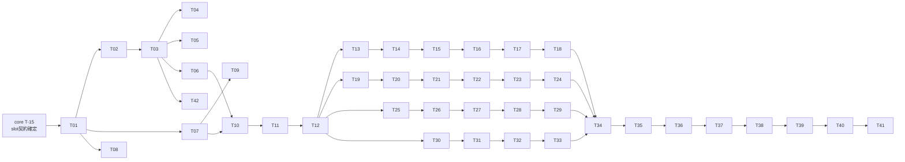

# @novi-ui/raster — Implementation Tasks

| 項目 | 値 |
|------|-----|
| Status | **Draft** |
| Author | yuuto |
| Last Updated | 2026-08-19 |
| Requirements | [./requirements.md](./requirements.md) |
| Design | [./design.md](./design.md) |
| Blocked by | [../01-core/tasks.md](../01-core/tasks.md) の T-15（slot 契約確定）まで着手不可 |

> 各タスク完了時にチェック。受け入れ基準ID（AC-XX-X）または FR-XX で要件と対応付ける。
> **1コンポーネント = 1PR**（G5）。20個揃う前でも常に公開可能な状態を保つ。

---

## Phase 1: 土台（コンポーネント実装より先にやる）

- [x] **T-01**: `packages/raster` 雛形。`package.json`（公開エントリ1つ、`sideEffects: false`、`@novi-ui/core` を依存に）+ `tsdown.config.ts` (1.5h) → NFR:バンドル, [architecture.md §11](../../architecture.md)（import 元を1つに限定）
- [x] **T-02**: **コントラスト検査スクリプトを先に書く**。light/dark の全トークン組み合わせで本文 4.5:1 / 非テキスト 3:1 を検査 (2.5h) → AC-05-1, AC-05-2, FR-10
- [x] **T-03**: `raster.css` のトークン値を確定。T-02 の検査を通る値を採用する（目分量で決めない） (2.5h) → AC-01-3, AC-05-1, AC-05-2
- [x] **T-04**: chroma 検査。`primary` 以外のトークンの chroma が 0 であることを検査 (1h) → AC-01-3
- [x] **T-05**: 禁止クラス検査スクリプト。design.md の検出パターン表を実装し、例外ホワイトリスト機構を用意 (2.5h) → AC-01-1, FR-07, FR-12
- [x] **T-06**: 共通フォーカスリング断片を1箇所に定義し、全コンポーネントから import する形にする (1h) → AC-04-5
- [x] **T-07**: テスト基盤。`vitest-axe` セットアップ + core の `testSlotContract` を呼べる状態にする + 5点セットのテストヘルパ (2h) → AC-03-1, AC-04-1
- [x] **T-08**: 視覚回帰基盤。Playwright で light/dark のスナップショットを撮る仕組み (2h) → AC-05-3

> **T-08 / T-36 は docs サイト（[03-docs-site](../03-docs-site/tasks.md)）の完成後に行う。**
> 単体でスナップショットを撮る土台を別に作るより、docs のデモをそのまま対象にする方が
> 保守対象が1つで済み、テーマ切替の見た目も同時に守れる。
- [x] **T-09**: `size-limit` 設定（Button gzip < 3KB）とカバレッジゲート 80% を CI に追加 (1h) → NFR

---

## Phase 2: 基準パターンの確立

- [x] **T-10**: **Button 実装**。design.md の基準パターンをそのまま作る。3ファイル構成・`VariantMap` 型付け・`data-slot`・named export・JSDoc (4h) → FR-01, FR-02, FR-03, FR-04, FR-05, FR-14, AC-02-1, AC-02-2
- [x] **T-11**: Button の5点セットテスト + キーボード + `tv({ extend })` 拡張テスト (2.5h) → AC-01-2, AC-03-1, AC-03-2, AC-03-3, AC-04-1, AC-04-5, AC-06-1
- [x] **T-12**: 基準パターンのレビューと固定。以降19個がこの形に従うことを README に明記 (1h) → FR-01（残り19件の前提条件）, [steering](../../steering/project.md) このプロジェクト固有の規約

> **T-10〜T-12 が終わるまで他のコンポーネントに着手しない。**
> ここで形が決まらないまま量産すると、後から19個すべてを書き直すことになる。

---

## Phase 3: 入力系（6 コンポーネント）

各タスクに5点セットのテストを含む。

- [x] **T-13**: Input (TextField)。ラベル上・左揃え、`description` / `errorMessage`、IME 対応 (3h) → FR-01, FR-08, AC-07-1, AC-07-2
- [x] **T-14**: TextArea。縦リサイズのみ、文字数カウンタは `description` slot、IME 対応 (2.5h) → FR-01, FR-08, AC-07-1
- [x] **T-15**: Checkbox + CheckboxGroup。角丸 0 の 16px 角、チェックは 1px 線 (3h) → FR-01, AC-04-1
- [x] **T-16**: Radio + RadioGroup。円は `radius-full` の例外、矢印キー移動 (3h) → FR-01, AC-04-4
- [x] **T-17**: Switch。**矩形トラック + 矩形サム**（ADR-R3）。状態ラベル併記の例を docs 用に用意 (2.5h) → FR-01, ADR-R3
- [x] **T-18**: Select。トリガー同幅ポップオーバー、影なし 1px 境界線、矢印キー・Escape (3.5h) → FR-01, AC-04-3, AC-04-4

> **IME 対応は不要と判明。** Select のトリガーは `<button>` で編集可能要素ではないため、
> IME の変換イベントがそもそも発生しない。必要になるのはテキスト入力を持つ ComboBox で、
> それは MVP の Non-Goal（NG1）。使われないコードは足さない。

---

## Phase 4: 表示系（6 コンポーネント）

- [x] **T-19**: Card。影なし・1px 境界線、header/footer を境界線で仕切る (2h) → FR-01
- [x] **T-20**: Badge。角丸 0、`dot` slot は 6px 角の正方形 (1.5h) → FR-01
- [x] **T-21**: Avatar。`radius-full` を既定にする唯一の例外、fallback はイニシャル (2h) → FR-01
- [x] **T-22**: Progress。トラック高 2px、`indeterminate` は translate のみ (2.5h) → FR-01, FR-09
- [x] **T-23**: Spinner。`rotate` 例外をホワイトリストに登録（ADR-R2）、reduced-motion で停止 (2h) → FR-09, AC-08-2, ADR-R2
- [x] **T-24**: Skeleton。`opacity` のパルスのみ、reduced-motion で減衰 (1.5h) → FR-09, AC-08-2

---

## Phase 5: オーバーレイ系（4 コンポーネント）

- [x] **T-25**: Modal。中央配置、閉じるはヘッダー右上（architecture.md §5 テーマA と一致させる）、フォーカストラップ・Escape (3.5h) → FR-01, AC-04-2, AC-04-3
- [x] **T-26**: Modal の階層視認性を視覚回帰で確認。影なしで backdrop + 1px 境界線が機能しているか (1h) → Risk 緩和
- [x] **T-27**: Popover。`arrow` slot は描画しない（任意 slot 省略の実例）、Escape で閉じる (2.5h) → FR-01, FR-13, AC-04-3
- [x] **T-28**: Tooltip。反転色（dark 面）、arrow なし、ホバーとフォーカス両方で開く (2.5h) → FR-01, AC-04-1
- [x] **T-29**: Menu (DropdownMenu)。`itemShortcut` は `tabular-nums` で右端揃え、矢印キー・Escape・IME 対応 (3.5h) → FR-01, FR-08, AC-04-3, AC-04-4, AC-07-1

---

## Phase 6: ナビ / 構造系（4 コンポーネント）

- [x] **T-30**: Tabs。インジケータは下線 1px、**背景は変えない**（ADR-R4）、矢印キー移動、下線のコントラスト 3:1 を検証 (3h) → FR-01, AC-04-4, AC-05-2, ADR-R4
- [x] **T-31**: Accordion。インジケータは `+/−` の線（回転を使わない）、Disclosure の展開・折りたたみ (2.5h) → FR-01, AC-04-1
- [x] **T-32**: Breadcrumbs。セパレータは `/`、現在地は `aria-current="page"` + 非リンク (2h) → FR-01, AC-04-1
- [x] **T-33**: Toast。core 経由の安定名 API を使う（`UNSTABLE_` を直接 import しない）、region は右下固定、`action` は `plain` variant (3.5h) → FR-01, FR-09, AC-08-1

---

## Phase 7: 仕上げと検収

- [x] **T-34**: 全20コンポーネントの契約テストを一括実行し、全件通過を確認 (1h) → AC-03-1, AC-03-2
- [x] **T-35**: 全20 × light/dark で axe を実行し violations 0 を確認 (1.5h) → AC-04-1

> **T-35 は jsdom では不十分。** axe はレイアウトと計算済みスタイルを見るため、
> 実ブラウザ（Playwright + axe-core）で行う。docs サイト完成後に T-08 と同時に実施する。
- [x] **T-36**: 全20 × light/dark の視覚回帰スナップショットを確定 (2h) → AC-05-3
- [x] **T-37**: 全 `tv()` 定義が named export されていることを検査するテスト (1h) → AC-06-2, FR-04
- [x] **T-38**: `--novi-color-primary` を上書きして全コンポーネントに反映されることを確認 (1h) → AC-06-3
- [ ] **T-39**: 実機確認。iOS Safari / Android Chrome でタップターゲットと IME を確認 (2h) → AC-07-1, NFR:対応環境
  - タップターゲット（48px）と 375px のレイアウトは `e2e/mobile.spec.ts` で自動検査済み（12件）
  - [x] **iOS Safari の IME を確認（2026-08-22）**
  - [ ] Android Chrome

> **T-39 は人が実機で操作する必要がある。** 自動化できない。
- [x] **T-40**: `packages/raster/README.md`。Raster デザイン言語の数値定義と、`radius` が潰れる仕様（ADR-R1）を明記 (2h)
- [x] **T-41**: **slot 語彙の過不足レビュー**。実装で不足・余剰だった slot を洗い出し、core への差し戻し要否を判断 (2h) → Risk 緩和
- [x] **T-42**: scoped CSS ビルドの追加。`raster.css`（`:root`）に加え `raster.scoped.css`（`[data-novi-theme='raster']`）を出力する (2h) → [03-docs-site](../03-docs-site/requirements.md) FR-07, ADR-D2

> **T-42 は docs サイトからの要求**。複数テーマが同一ページに同居するため、`:root` に撒くビルドだけでは衝突する。
> 2本目以降のテーマも同じ対応が必要になるため、テーマのテンプレートに組み込む。
> T-03（トークン値確定）の直後に着手でき、Phase 7 の完了を待つ必要はない。

**合計見積**: 約 94h

> **T-41 が本 Spec で最も重要な成果物**。1本目の目的は「20 個作ること」ではなく
> 「slot 語彙が実際に機能するかを検証すること」にある。ここで得た知見が2本目の速度を決める。

---

## Dependencies

**クリティカルパス**: core T-15 → T-01 → T-02 → T-03 → T-06 → T-10 → T-11 → T-12 → 各系統 → T-34 → T-41

- **T-02 → T-03 の順序が重要**。コントラスト検査を先に書かないと、トークン値を目分量で決めてしまい後で全部やり直しになる
- **T-12 の完了が全体のゲート**。基準パターンが固まる前に量産しない
- Phase 3〜6 は互いに独立しているため、順序を入れ替えてよい

---

## Definition of Done（全項目チェックで完了）

- [ ] 20 コンポーネントすべてが実装され、5点セットのテストを持つ
- [ ] `pnpm typecheck` がエラー 0
- [ ] `pnpm test` が全通過、カバレッジ 80% 以上
- [ ] 契約テストが 20 件すべて通過
- [ ] axe violations が light / dark ともに **0**
- [ ] コントラスト検査が全トークン組み合わせで通過（本文 4.5:1 / 非テキスト 3:1）
- [ ] 禁止クラス検査が通過（例外は `spinner.styles.ts` の `rotate` と `raster.css` の色値のみ）
- [ ] chroma 検査が通過（`primary` 以外が 0）
- [ ] `size-limit` が通過（Button gzip < 3KB）
- [ ] 視覚回帰スナップショットが 20 × light/dark 分そろっている
- [ ] 全 `tv()` 定義が named export されている
- [ ] 全公開コンポーネントに JSDoc の使用例がある
- [ ] iOS Safari / Android Chrome で実機確認済み
- [ ] **T-41 の slot 語彙レビューが完了し、2本目への申し送りが文書化されている**
- [ ] requirements.md の Open Questions が空
- [ ] Status を `Implemented` に更新
