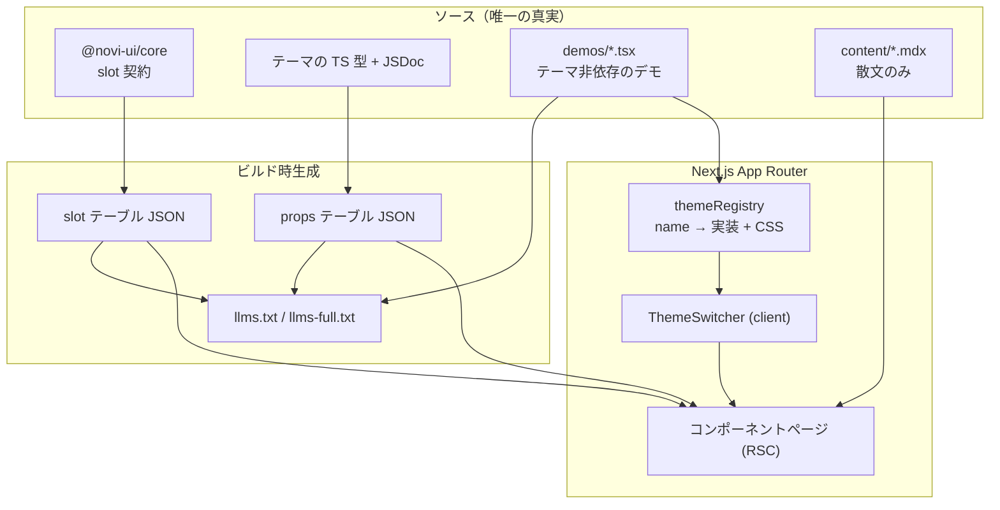

# Novi UI Docs — Design

| 項目 | 値 |
|------|-----|
| Status | **Draft** |
| Author | yuuto |
| Last Updated | 2026-08-19 |
| Requirements | [./requirements.md](./requirements.md) |
| Architecture | [../../architecture.md](../../architecture.md) |

---

## Architecture Overview



**設計の中心は「唯一の真実から全部を生成する」こと。**
props 表・slot 表・`llms.txt` を手書きすると必ず実装とズレる。
ズレたドキュメントは、人間には軽い不便だが、**AI には致命的**（誤った API を自信を持って生成する）。

---

## テーマ切替の実装（FR-01 / FR-02 / AC-01-4）

### なぜ成立するのか
[ADR-06](../../architecture.md) により、**全テーマは同一の props と variant 語彙を持つ**。
したがってデモは「どのテーマか」を知る必要がなく、コンポーネントの解決だけを外から差し替えればよい。

### テーマレジストリ

```ts
// apps/docs/lib/theme-registry.ts
import * as raster from '@novi-ui/raster'
// 2本目以降をここに足すだけで、サイト全体が対応する

export const themeRegistry = {
  raster: {
    label: 'Raster',
    description: 'ミニマル / スイス系',
    pkg: '@novi-ui/raster',   // コード例の import 文に使う（AC-02-1, AC-02-2）
    components: raster,
  },
} as const

export type ThemeName = keyof typeof themeRegistry
```

### デモの書き方（テーマ非依存）

```tsx
// apps/docs/demos/button/variants.tsx
'use client'
import { useNoviTheme } from '@/lib/use-novi-theme'

export function ButtonVariants() {
  const { Button } = useNoviTheme()   // ← ここだけがテーマ依存
  return (
    <div className="flex gap-3">
      <Button variant="solid">保存</Button>
      <Button variant="outline">キャンセル</Button>
      <Button variant="soft">下書き</Button>
      <Button variant="ghost">戻る</Button>
      <Button variant="plain">詳細</Button>
    </div>
  )
}
```

**この JSX はテーマを切り替えても1文字も変わらない**（AC-01-4）。これが本サイト最大の見せ場になる。

> **MUST NOT**: デモが `import { Button } from '@novi-ui/raster'` と直接書くこと。
> 直接 import した瞬間、そのデモはテーマ切替に追従しなくなる。CI で検査する（FR-10 と同じスクリプト）。

### コード例の表示（AC-02-1 / AC-02-2）

表示するコードは、デモのソースから **import 文だけを差し替えて**組み立てる。

```
表示コード = `import { Button } from '${themeRegistry[active].pkg}'`
           + デモソースから 'use client' と useNoviTheme 行を除去したもの
```

結果として、切り替えで変わるのは**1行目のパッケージ名だけ**になる。これ自体がドキュメントの主張になる。

---

## CSS のスコープ（FR-07）

複数テーマが同一ページに同居するため、`:root` にトークンを撒くビルドだけでは衝突する。
**各テーマパッケージは CSS を2種類出力する**（テーマ側への追加要件）。

| ファイル | セレクタ | 用途 |
|---|---|---|
| `<theme>.css` | `:root` | 通常利用。ユーザーは1行 import するだけでよい |
| `<theme>.scoped.css` | `[data-novi-theme='<name>']` | docs / 複数テーマ同居 |

docs 側は `scoped` のみを読み込み、プレビュー領域を属性で囲う。

```tsx
<div data-novi-theme={active} data-novi-scheme={scheme}>
  {/* デモ。トークンがこの範囲にだけ効く */}
</div>
```

サイトの外枠（ナビ・本文）は docs 自身のスタイルを使い、テーマの影響を受けない。
**プレビュー領域とサイト UI が混ざると、切替のたびにサイト全体が崩れて何を見ているか分からなくなる。**

---

## ちらつきの防止（AC-01-3 / AC-04-3）

テーマとスキームは `localStorage` に保存し、**`<head>` 内のインラインスクリプトで
ハイドレーション前に `<html>` の属性を設定する**。

```html
<script>
  // 描画前に属性を確定させる。これがないと初期表示で必ずちらつく
  try {
    var t = localStorage.getItem('novi-theme') || 'raster'
    var s = localStorage.getItem('novi-scheme')
    document.documentElement.dataset.noviTheme = t
    if (s) document.documentElement.dataset.noviScheme = s
  } catch (e) {}
</script>
```

`scheme` 未設定時は属性を付けない。core の `base.css` が `prefers-color-scheme` にフォールバックする（FR-09 / AC-04-2）。

> Provider を持たない設計（ADR-04）の恩恵がここで効く。
> React の状態を待たずに、属性だけで見た目が確定する。

---

## props / slot テーブルの生成（FR-05 / FR-06 / AC-03-2）

| 生成物 | ソース | 手段 |
|---|---|---|
| props 表 | テーマの TypeScript 型 + JSDoc | `react-docgen-typescript` 相当でビルド時に JSON 化 |
| slot 表 | `@novi-ui/core` の `<component>Slots` / `<component>RequiredSlots` | contract を直接 import して JSON 化 |

slot 表は core の contract を**そのまま読む**ため、原理的にズレようがない。
props 表は型定義から抽出するため、実装を変えれば自動追従する（AC-03-2）。

生成物は `apps/docs/.generated/` に出力し、コミットしない。

---

## ページ構成

```
/                          トップ。テーマ切替の対比を最上部で見せる（AC-05-3）
/docs/getting-started      インストール・セットアップ
/docs/theming              トークン一覧・CSS 変数での上書き・tv({ extend })
/docs/themes/<name>        各テーマのデザイン言語（Raster の数値定義など）
/docs/components/<name>    20 コンポーネントのリファレンス
/llms.txt                  AI 向け要約（04-ai-integration で詳細定義）
/llms-full.txt             AI 向け全文
```

### コンポーネントページの構造（全ページ共通）

1. 名前 + 1行説明
2. ライブデモ（テーマ切替の影響を受ける）
3. コード例（import 文が active テーマに追従）
4. props 表（生成）
5. slot 表（生成）
6. アクセシビリティ注記（キーボード操作・ARIA）
7. 使い分けの注意（散文。MDX で手書きする唯一の部分）

---

## Alternatives Considered

| 案 | Pros | Cons | 採否 |
|---|---|---|---|
| A: テーマレジストリ + スコープ付き CSS | 単一サイトで保守1本 / デモが1つで済む / 切替が即時 | テーマ側に scoped CSS ビルドを課す | ✅ |
| B: テーマごとに iframe で隔離 | CSS の衝突が原理的に起きない | LCP / INP が悪化（AC-05-1 未達リスク）/ 切替が遅い / 高さ同期が面倒 | ❌ |
| C: テーマごとに独立サイト | 世界観を作り込める | 対比が消える（最大の見せ場が失われる）/ 保守が本数分 | ❌ |
| D: デモを MDX に直書き | 記述が素直 | テーマ非依存に書けず、切替に追従しない | ❌ |
| E: props 表を手書き | 初期が楽 | 必ず実装とズレる。AI の生成精度を直接落とす | ❌ |

---

## Decisions (ADR)

### ADR-D1: プレビュー領域とサイト UI のスタイルを分離する
- **Status**: Accepted (2026-08-19)
- **Context**: テーマのトークンがサイト全体に効くと、切替のたびにナビや本文まで変わり、何を比較しているか分からなくなる。
- **Decision**: テーマの CSS は `[data-novi-theme]` 配下のプレビュー領域にのみ適用する。サイト UI は docs 独自のスタイルを使う。
- **Consequences**:
  - (+) 比較対象が明確になり、切替の意味が伝わる
  - (+) サイト UI の品質をテーマと独立に作り込める
  - (−) docs 用のスタイルを別途持つ必要がある（自作ライブラリを自サイトで使わないことになる）
  - (−) 上記の見え方の問題は、トップページで「サイト自体も Novi で作れる」例を1つ置くことで補う

### ADR-D2: テーマパッケージに scoped CSS ビルドを課す
- **Status**: Accepted (2026-08-19)
- **Context**: 通常利用では `:root` にトークンを撒くのが最も簡単だが、docs では複数テーマが同居する。
- **Decision**: 各テーマは `<theme>.css`（`:root`）と `<theme>.scoped.css`（`[data-novi-theme]`）の2種を出力する。
- **Consequences**:
  - (+) 通常利用の手軽さ（import 1行）を保ったまま、docs の要求も満たせる
  - (−) テーマ側のビルド設定が1つ増える。2本目以降も同じ対応が必要 → テーマのテンプレートに組み込む

### ADR-D5: Node のバージョンを `.node-version` に集約する
- **Status**: Accepted (2026-08-20、デプロイ時に判明)
- **Context**: Cloudflare Pages の既定 Node が 22.16.0 で、ビルドが2回失敗した。tsdown は `engines` に `^22.18.0 || >=24.11.0` を要求しており、22.18 未満では Node ネイティブの TS 読み込みが無いため `tsdown.config.ts` を読むのに `unrun`（未インストールの optional peer）を要求して落ちる。しかも `package.json` の `engines` が `>=22` と**実態より緩く**、22.16 を許してしまっていた。
- **Decision**: `.node-version`（22.22.2）を唯一の情報源にする。CI は `node-version-file` で参照し、`engines` は tsdown の要求に合わせて `^22.18.0 || >=24.11.0` に狭める。
- **Consequences**:
  - (+) ローカル・GitHub Actions・Cloudflare Pages が同じ Node で動く
  - (+) `engines` が実態と一致し、`engine-strict=true` により**古い Node ではインストール時点で止まる**
  - (+) Cloudflare 側のダッシュボード設定（`NODE_VERSION`）に頼らずリポジトリで完結する
  - (−) Node を上げるときは `.node-version` と `engines` の両方を見る必要がある

### ADR-D6: docs のビルドは turbo 経由で行う
- **Status**: Accepted (2026-08-20、デプロイ時に判明)
- **Context**: `pnpm --filter @novi-ui/docs build` は docs だけをビルドするため、`core/dist/index.mjs` が無い状態で IR 生成が走って失敗する。docs の生成パイプラインは**ビルド済みの core を読む**設計（利用者が受け取る API と一致させるため）なので、依存の順序が必要になる。
- **Decision**: `pnpm turbo run build --filter=@novi-ui/docs` を使う。`turbo.json` の `dependsOn: ["^build"]` により core → raster → docs の順で実行される。
- **Consequences**:
  - (+) 依存順序をビルドツールが保証する。手順書に順番を書いて守らせる必要がない
  - (+) Cloudflare Pages・CI・ローカルで同じコマンドが使える
  - (−) docs だけを速く回したい場合も core のビルド判定が入る（turbo のキャッシュがあるので実害は小さい）

### ADR-D4: Cloudflare Pages に静的エクスポートで配信する
- **Status**: Accepted (2026-08-19)
- **Context**: Vercel Hobby は非商用の個人利用に限定され、「そのプロジェクトの制作に関わった誰かの金銭的利益のための利用」を商用と定義している。本サイトは複数の UI ライブラリを紹介するポートフォリオの一部であり、受託の営業導線になりうるため規約上グレーになる。Vercel Pro は $20/月。
- **Decision**: Cloudflare Pages に配信する。Next.js は `output: 'export'` の完全静的エクスポートにして、ホスト固有のランタイム機能に依存しない。
- **Consequences**:
  - (+) **費用 0円**。帯域無制限で、商用利用が明示的に許可されている
  - (+) 静的エクスポートなので、どのホストにも移せる。ホストロックインが消える
  - (+) Cloudflare Web Analytics は Cookie を使わず、同意バナーが不要
  - (−) Vercel 固有の DX（プレビューコメント等）は使えない
  - (−) ランタイムの Server Components / streaming が使えない。**本サイトには不要**（props / slot 表も `llms.txt` もビルド時生成のため）
  - (−) core の AC-05-1（RSC 検証）は**ビルド時レンダリングでの検証**になる。
    Provider 必須の設計が混入していればビルドが落ちるため目的は達成できるが、
    ランタイム streaming の検証にはならない点を認識しておく

### ADR-D3: 初期表示の属性設定をインラインスクリプトで行う
- **Status**: Accepted (2026-08-19)
- **Context**: React の状態でテーマを持つと、ハイドレーション完了まで既定テーマが表示されちらつく。
- **Decision**: `<head>` のインラインスクリプトで `localStorage` を読み、`<html>` の data 属性を描画前に確定させる。
- **Consequences**:
  - (+) FOUC が発生しない。RSC と両立する
  - (−) インラインスクリプトが1つ入る。CSP を使う場合は nonce が必要になる

---

## Cross-cutting Concerns

- **状態管理**: テーマ / スキームのみ。`localStorage` + `<html>` の data 属性。グローバルステート管理ライブラリは使わない
- **RSC 境界**: ページ本体は Server Component（静的エクスポートのため**ビルド時**にレンダリングされる）。デモとテーマ切替 UI のみ `'use client'`
- **エラーハンドリング**: デモが解決できないコンポーネントを参照した場合は**ビルドを失敗させる**（FR-10）。実行時フォールバックは入れない（気付けなくなるため）
- **監視**: Cloudflare Web Analytics で Core Web Vitals を継続測定（AC-05-1）。Cookie を使わないため同意バナーが不要で、プライバシー方針とも整合する
- **SEO**: 全コンポーネントページを静的生成し、`metadata` を持たせる

---

## Risks

| Risk | Impact | Likelihood | Mitigation |
|---|---|---|---|
| テーマが1本しかない状態では切替の価値が伝わらない | 高 | **高** | 2本目が出るまでは、トップで「light/dark + variant 一覧」の対比を主役にする。切替 UI 自体は最初から作っておく |
| scoped CSS の生成漏れでトークンが漏れる | 中 | 中 | プレビュー領域外にテーマトークンが効いていないことを視覚回帰で検査 |
| props 生成が型の複雑さで失敗する | 中 | 中 | 生成失敗をビルドエラーにする。複雑な型は props 側を単純化する方を選ぶ |
| インラインスクリプトが CSP に抵触する | 低 | 低 | nonce 対応を Next.js の設定で行う |
| デモが増えてバンドルが膨らみ LCP が悪化 | 中 | 中 | デモは動的 import + `content-visibility` で遅延。Lighthouse を CI で監視 |

---

## Test Strategy

| 層 | 対象 | 手段 |
|---|---|---|
| Unit | テーマレジストリの解決 | Vitest |
| Unit | コード例の import 文置換 | Vitest（AC-02-1, AC-02-2） |
| Build | デモがテーマを直接 import していないこと | CI スクリプト（FR-10） |
| Build | props / slot の生成が成功すること | ビルド失敗で検知（AC-03-2, AC-03-3） |
| Build | `llms.txt` / `llms-full.txt` が生成されること | ビルド後の存在と内容の検査（AC-06-3） |
| E2E | テーマ切替で全デモが変わる | Playwright（AC-01-1） |
| E2E | 切替がナビゲーション・リロードで維持される | Playwright（AC-01-2, AC-01-3） |
| E2E | スキーム切替と OS 追従 | Playwright（AC-04-1, AC-04-2, AC-04-3） |
| 視覚回帰 | テーマ × スキームの全組み合わせ | Playwright スナップショット |
| 視覚回帰 | プレビュー領域外にテーマトークンが漏れていないこと | Playwright |
| a11y | 全ページ | axe（AC-05-2） |
| Performance | Core Web Vitals | Lighthouse CI（AC-05-1） |
