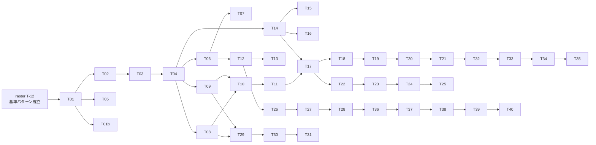

# Novi UI Docs — Implementation Tasks

| 項目 | 値 |
|------|-----|
| Status | **Draft** |
| Author | yuuto |
| Last Updated | 2026-08-19 |
| Requirements | [./requirements.md](./requirements.md) |
| Design | [./design.md](./design.md) |
| Blocked by | [../02-theme-raster/tasks.md](../02-theme-raster/tasks.md) の T-12（基準パターン確立）まで本格着手は不可 |

> 各タスク完了時にチェック。受け入れ基準ID（AC-XX-X）または FR-XX で要件と対応付ける。

---

## Phase 1: 基盤

- [x] **T-01**: `apps/docs` 雛形。Next.js 16 App Router + Fumadocs + **静的エクスポート（`output: 'export'`）** の設定 (2.5h) → FR-11
- [x] **T-01b**: Cloudflare Pages 連携。GitHub 連携でのビルド設定 + プレビューデプロイ (1.5h) → FR-12, NFR:費用

> **確定した設定**（2026-08-20 デプロイ済み: https://novi-42r.pages.dev ）
> - Build command: `pnpm turbo run build --filter=@novi-ui/docs`（[ADR-D6](./design.md)）
> - Build output directory: `apps/docs/out`
> - Node: `.node-version`（22.22.2）で統一（[ADR-D5](./design.md)）
>
> `novi.pages.dev` は他者が取得済みのため URL は `novi-42r`。
> **Pages はプロジェクト名を後から変更できない**ため、変えるなら作り直しになる。
- [x] **T-02**: テーマパッケージに scoped CSS ビルドを追加。`<theme>.css`（`:root`）と `<theme>.scoped.css`（`[data-novi-theme]`）の2種出力 (2h) → FR-07, ADR-D2
- [x] **T-03**: `themeRegistry` 実装。テーマ名 → 実装 / ラベル / パッケージ名 の対応表 (1.5h) → FR-01
- [x] **T-04**: `useNoviTheme` フック。レジストリからコンポーネントを解決する (1.5h) → FR-01
- [x] **T-05**: 初期属性設定のインラインスクリプト。`localStorage` → `<html>` の data 属性を描画前に確定 (1.5h) → AC-01-3, AC-04-3, ADR-D3
- [x] **T-06**: プレビュー領域コンポーネント。`data-novi-theme` / `data-novi-scheme` で囲い、サイト UI と分離する (2h) → FR-07, ADR-D1
- [x] **T-07**: docs 独自のサイト UI スタイル。テーマの影響を受けない外枠 (2.5h) → ADR-D1

---

## Phase 2: 生成パイプライン（手書きドキュメントを作らないための土台）

- [x] **T-08**: props テーブル生成。テーマの TS 型 + JSDoc から JSON を出力 (3h) → FR-05, AC-03-1, AC-03-2
- [x] **T-09**: slot テーブル生成。core の contract を直接読んで JSON を出力 (2h) → FR-06, AC-03-3
- [x] **T-10**: 生成失敗をビルドエラーにする。`.generated/` は gitignore (1h) → AC-03-2
- [x] **T-11**: props / slot 表の表示コンポーネント (2.5h) → AC-03-1, AC-03-3

---

## Phase 3: 切替 UI とコード例

- [x] **T-12**: テーマ切替 UI。選択が `localStorage` に永続化される (2h) → FR-02, FR-03, AC-01-1, AC-01-2
- [x] **T-13**: カラースキーム切替 UI。未設定時は OS 追従 (1.5h) → FR-09, AC-04-1, AC-04-2
- [x] **T-14**: コード例コンポーネント。デモのソースから `'use client'` と `useNoviTheme` 行を除去し、import 文に active テーマのパッケージ名を差し込む (3h) → FR-04, AC-02-1, AC-02-2
- [x] **T-15**: コピーボタン。import 文を含む完全なコードをクリップボードへ (1h) → AC-02-3
- [x] **T-16**: デモがテーマを直接 import していないことを検査する CI スクリプト (1.5h) → FR-10

---

## Phase 4: コンテンツ

- [x] **T-17**: コンポーネントページのテンプレート。デモ / コード / props / slot / a11y 注記 / 使い分け の7ブロック構成 (2.5h) → AC-03-1, AC-03-3
- [x] **T-18**: デモ作成 — 入力系 6件（Button / Input / TextArea / Checkbox / Radio / Switch / Select）(4h) → AC-01-4
- [x] **T-19**: デモ作成 — 表示系 6件（Card / Badge / Avatar / Progress / Spinner / Skeleton）(3h) → AC-01-4
- [x] **T-20**: デモ作成 — オーバーレイ系 4件（Modal / Popover / Tooltip / Menu）(3.5h) → AC-01-4
- [x] **T-21**: デモ作成 — ナビ/構造系 4件（Tabs / Accordion / Breadcrumbs / Toast）(3.5h) → AC-01-4
- [x] **T-22**: `/docs/getting-started`。インストールと最小構成（Provider 不要であることを明記）(2h) → [01-core](../01-core/requirements.md) AC-05-1, AC-05-2
- [x] **T-23**: `/docs/theming`。トークン一覧・CSS 変数上書き・`tv({ extend })` の実例 (3h) → AC-06-1（02-theme-raster）
- [x] **T-24**: `/docs/themes/raster`。Raster デザイン言語の数値定義、`radius` が潰れる仕様（ADR-R1）の説明 (2h)
- [x] **T-25**: 各コンポーネントの「使い分けの注意」散文（20件）(4h) → [design.md](./design.md) ページ構成 7ブロックの第7項（唯一の手書き部分）

---

## Phase 5: トップページ

- [x] **T-26**: トップページ設計。**スクロールなしで「複数の美学を切り替えられる」ことが分かる**構成 (3h) → AC-05-3
- [x] **T-27**: トップの対比デモ。テーマが1本の間は light/dark + variant 一覧を主役にする (2.5h) → Risk 緩和
- [x] **T-28**: 「サイト自体も Novi で作れる」ことを示すセクションを1つ置く (2h) → ADR-D1 の補償

---

## Phase 6: AI 向け出力

> 詳細は [../04-ai-integration/](../04-ai-integration/) で定義する。ここでは配信のみ。

- [x] **T-29**: `/llms.txt` ルート。生成済みデータから要約を配信 (1.5h) → FR-08, AC-06-1
- [x] **T-30**: `/llms-full.txt` ルート。props / slot / 使用例の全文を配信 (2h) → FR-08, AC-06-2
- [x] **T-31**: ビルド時の自動再生成をパイプラインに組み込む (1h) → AC-06-3

---

## Phase 7: 品質ゲートとデプロイ

- [x] **T-32**: E2E — テーマ切替で全デモが変わる / ナビゲーションとリロードで維持される (2.5h) → AC-01-1, AC-01-2, AC-01-3
- [x] **T-33**: E2E — スキーム切替と OS 追従、ちらつきなし (2h) → AC-04-1, AC-04-2, AC-04-3
- [x] **T-34**: 視覚回帰 — テーマ × スキームの全組み合わせ (2h) → AC-01-1, AC-04-1, NFR:ちらつき
- [x] **T-35**: 視覚回帰 — プレビュー領域外にテーマトークンが漏れていないこと (1.5h) → FR-07
- [x] **T-36**: axe を全ページで実行し violations 0 を確認 (1.5h) → AC-05-2
- [x] **T-37**: Lighthouse CI 導入。LCP ≤ 2.5s / INP ≤ 200ms / CLS ≤ 0.1 をゲートにする (2h) → AC-05-1
- [x] **T-38**: デモの動的 import + `content-visibility` による遅延読み込み最適化 (2h) → AC-05-1
- [x] **T-39**: Cloudflare Web Analytics 設定。Cookie 同意バナーなしで Core Web Vitals を計測する (1h) → FR-13, AC-05-1
  - 2026-08-22 本番で確認: beacon.min.js が 200、`/cdn-cgi/rum` への POST が 204、Cookie 0 件
- [ ] **T-40**: 本番デプロイとスモークテスト。無料枠（帯域無制限 / 500ビルド per 月）に収まることを確認 (1h) → FR-11, FR-12, AC-05-1, AC-06-1, AC-06-2, NFR:費用

**合計見積**: 約 85h

---

## Dependencies

**クリティカルパス**: raster T-12 → T-01 → T-03 → T-04 → T-14 → T-17 → T-18〜21 → T-32 → T-39

- **T-02（scoped CSS）はテーマパッケージ側の変更**。raster の Spec 完了後に追加で入る作業として扱う
- **T-08 / T-09（生成パイプライン）を先に通す**。手書きの props 表を一度でも作ると、そのまま腐る

---

## Definition of Done（全項目チェックで完了）

- [ ] テーマ切替で 20 コンポーネント全デモの見た目が変わる
- [ ] **デモの JSX がテーマ切替で1文字も変わらない**（AC-01-4）
- [ ] コード例の import 文が active テーマに追従する
- [ ] props 表 / slot 表がソースから生成されており、手書き箇所がない
- [ ] テーマ / スキームの選択がリロードで維持され、ちらつきがない
- [ ] `/llms.txt` と `/llms-full.txt` がビルドで自動生成される
- [ ] axe violations 0
- [ ] Lighthouse で LCP ≤ 2.5s / INP ≤ 200ms / CLS ≤ 0.1
- [ ] プレビュー領域外にテーマトークンが漏れていない
- [ ] デモがテーマを直接 import していないことを CI が保証している
- [ ] Cloudflare Pages に本番デプロイ済みでスモークテスト通過
- [ ] ホスト固有のランタイム機能に依存していない（完全静的エクスポート）
- [ ] 運用費が 0円（無料枠内）に収まっている
- [ ] requirements.md の Open Questions が空
- [ ] Status を `Implemented` に更新
