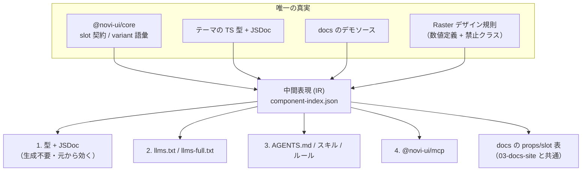

# Novi UI AI Integration — Design

| 項目 | 値 |
|------|-----|
| Status | **Implemented** |
| Author | yuuto |
| Last Updated | 2026-08-20 |
| Requirements | [./requirements.md](./requirements.md) |
| Architecture | [../../architecture.md](../../architecture.md) |

---

## Architecture Overview

**唯一の真実から4経路すべてを生成する。** これが本 Spec の設計そのもの。



### 中間表現（IR）を挟む理由
4つの出力先それぞれがソースを直接読むと、**同じ抽出ロジックが4回書かれ、必ずズレる**。
`component-index.json` を1つ作り、全出力先はそれだけを読む。

```jsonc
// .generated/component-index.json（形）
{
  "version": "0.1.0",
  "conventions": {
    "noProvider": true,
    "propNaming": { "disabled": "isDisabled", "onClick": "onPress" },
    "emitsDataSlot": true
  },
  "variants": ["solid", "outline", "soft", "ghost", "plain"],
  "sizes": ["sm", "md", "lg"],
  "colors": ["default", "primary", "secondary", "success", "warning", "danger"],
  "themes": {
    "raster": {
      "pkg": "@novi-ui/raster",
      "label": "Raster",
      "designRules": {
        "numeric": { "heights": { "sm": 32, "md": 40, "lg": 48 }, "typeScale": 1.2, "borderWidth": 1 },
        "prohibited": ["shadow-*", "rounded-md 以上", "border-2 以上", "scale-*", "rotate-*"],
        "colorRule": "色は --novi-color-* 経由のみ。リテラル値を書かない"
      }
    }
  },
  "components": [
    {
      "name": "Button",
      "summary": "ボタン",
      "implementedBy": ["raster"],
      "props": [
        { "name": "variant", "type": "'solid'|'outline'|'soft'|'ghost'|'plain'", "default": "'solid'", "doc": "見た目の強さ" },
        { "name": "isDisabled", "type": "boolean", "default": "false", "doc": "無効化する" },
        { "name": "onPress", "type": "(e: PressEvent) => void", "doc": "押下時。onClick ではない" }
      ],
      "slots": { "all": ["root", "startContent", "label", "endContent", "spinner"], "required": ["root", "label"] },
      "example": "<Button variant=\"solid\" color=\"primary\" onPress={save}>保存</Button>",
      "a11y": "キーボードの Enter / Space で発火する。onPress はタッチ・ペン・キーボードを統一的に扱う"
    }
  ]
}
```

生成失敗はビルド失敗にする（FR-09 / AC-02-3）。**古い生成物を配信するくらいなら落とす。**

---

## 経路1: 型 + JSDoc（最優先・設定ゼロ）

生成物ではない。**01-core / 02-theme-raster の Spec で既に必須化済み**。ここでは要件だけ再掲する。

| 施策 | 効果 | 定義場所 |
|---|---|---|
| variant を union literal 型にする | 誤った値が型エラーになる（AC-01-4） | core FR-04 |
| 全公開 API に JSDoc + 使用例1つ | エディタが LLM に自動で渡す | core T-33 / raster FR-14 |
| props 名を RAC 慣習に統一 | 一貫性があるため推測が当たりやすい | ADR-05 |

> **これが最も効く。** ユーザーの設定が一切要らず、あらゆるエディタ・エージェントに自動で届く。
> `llms.txt` も MCP も、この土台の上の補強にすぎない。

---

## 経路2: llms.txt / llms-full.txt

### `/llms.txt` の構成（FR-02 / FR-04 / AC-03-1 / AC-03-3）

**冒頭の3行が最重要。** AI が最初に読む部分に、最も間違えやすい規約を置く。

```markdown
# Novi UI

> React Aria Components を基盤にした React UI ライブラリ。
> 1つの core に複数の美学（テーマ）を持つ。

## 必ず守ること（他ライブラリと違う点）
- **Provider は不要**。import してそのまま使う。ラップしない
- **`disabled` ではなく `isDisabled`**、**`onClick` ではなく `onPress`** を使う（React Aria 準拠）
- 全コンポーネントは `data-slot="<名前>"` を出力する。スタイル上書きはこれを狙う
- variant は `solid | outline | soft | ghost | plain` の5つのみ
- size は `sm | md | lg`、color は `default | primary | secondary | success | warning | danger`
- 色は `--novi-color-*` の CSS 変数を使う。リテラルの色値を書かない

## インストール
...

## コンポーネント
- [Button](https://.../docs/components/button): ボタン
- [Input](https://.../docs/components/input): テキスト入力
...

## Optional
- [Theming](https://.../docs/theming): トークンと tv({ extend }) による拡張
- [llms-full.txt](https://.../llms-full.txt): 全 props / slot / 使用例
```

### `/llms-full.txt`（FR-03 / AC-03-2）

`component-index.json` を人間可読な Markdown に展開したもの。1コンポーネントあたり：
名前 / 概要 / props 表 / slot 一覧 / variant / 使用例 / a11y 注記。

サイズ上限 500KB を超えたら、**要約せずにコンポーネントを分割配信**する（情報を削らない）。

---

## 経路3: リポジトリ内のエージェント指示

| ファイル | 対象 | 内容 |
|---|---|---|
| `AGENTS.md`（ルート） | 汎用エージェント | slot 契約 / 禁止クラス / API 命名 / 3ファイル構成 / 「core に CSS を書かない」 |
| `.claude/skills/add-component/` | Claude Code | 新規コンポーネント追加の手順（契約の追加 → styles → tsx → 5点セットテスト → docs デモ） |
| `.cursor/rules/novi.mdc` | Cursor | `AGENTS.md` の要約 |

`AGENTS.md` は**リポジトリで作業するエージェント向け**（US-05）。ライブラリ利用者向けの `llms.txt` とは対象が違う。
両者を混ぜない。

`AGENTS.md` の核心部分：

```markdown
## 新規コンポーネントを追加する手順
1. `packages/core/src/contracts/<name>.contract.ts` に slot 語彙と props 型を追加
2. `packages/raster/src/<name>/<name>.styles.ts` — tv() を `SlotMap` で型付けし named export
3. `packages/raster/src/<name>/<name>.tsx` — RAC を組み立て、全 slot に data-slot を出す
4. `<name>.test.tsx` に5点セット（レンダリング / 契約 / axe / variant / classNames）
5. `apps/docs/demos/<name>/` にテーマ非依存のデモ

## 絶対にやらないこと
- core に CSS を書く
- テーマから `UNSTABLE_` を直接 import する
- `shadow-*` / `rounded-md` 以上 / `border-2` 以上 / `scale-*` / `rotate-*` を使う
- リテラルの色値を書く（`--novi-color-*` を使う）
- Provider を必要とする設計を入れる
```

---

## 経路4: MCP サーバ `@novi-ui/mcp`

### ツール定義（FR-05）

| ツール | 入力 | 出力 | 対応 AC |
|---|---|---|---|
| `list_components` | なし | 全コンポーネント名 + 1行説明 + 実装テーマ | AC-04-1 |
| `get_component` | `name`, `theme?` | props / slot / variant / 使用例 / a11y 注記 | AC-04-2 |
| `get_design_rules` | `theme` | 数値デザイン規則 + 禁止クラス一覧 + 色の扱い | AC-04-3, AC-06-1, FR-12 |
| `search_components` | `query`（自然文） | 該当候補。**なければ「未実装」と明示** | AC-04-4, FR-06 |

### 未実装の扱い（FR-06）

```
入力: 「日付を選ばせたい」
出力: 「DatePicker は現在未実装です（MVP 20 の対象外）。
      react-aria-components の DatePicker を直接使うか、実装を待ってください。
      近い実装として Select がありますが、日付選択の代替にはなりません。」
```

**近い候補で誤魔化さない。** 曖昧な提案は AI に幻覚を生成させる直接の原因になる。

### セキュリティ設計（FR-10 / FR-11）

| 方針 | 実装 |
|---|---|
| 資格情報を扱わない | 環境変数・ファイルシステム・ネットワークにアクセスしない |
| データは同梱のみ | `component-index.json` をパッケージに同梱し、それだけを読む |
| 一次配布元のみ | `@novi-ui/mcp` として自 npm から配布。第三者製ラッパを推奨しない |

**読み取り専用・オフライン動作**にすることで、供給網リスクの大半を構造的に排除する。

---

## 精度の回帰テスト（NFR:精度 / AC-01-1〜4）

「AI が正しく書けるか」を主観で判断しない。**テストにする。**

```
1. 20 コンポーネントそれぞれについて、日本語の指示文を1つ用意する
   例: 「Novi で、確認と取消のボタンを持つダイアログを作って」
2. llms-full.txt を文脈に与えて生成させる
3. 生成コードを一時プロジェクトに置き `tsc --noEmit` を実行
4. 型エラー 0 を合格とする
5. 併せて禁止クラス検査を実行し、0 件を合格とする（AC-06-1）
```

**この工程は CI で自動実行しない（決定 2026-08-19、ADR-A5）。** LLM 呼び出しが従量課金になり、
運用費 0円という前提を崩すため。**リリース前と `llms` 生成ロジックの変更時**に、既存の AI 環境から手動実行する。

不合格なら `llms.txt` の規約セクションを補強する — つまり**テストが文書を改善するループ**になる。

---

## Alternatives Considered

| 案 | Pros | Cons | 採否 |
|---|---|---|---|
| A: IR を挟んで4経路を生成 | 抽出ロジックが1つ。ズレが原理的に起きない | 中間ファイルが1つ増える | ✅ |
| B: 各出力先が直接ソースを読む | 中間物がない | 抽出ロジックが4重化し、必ずズレる | ❌ |
| C: AI 向けドキュメントを手書き | 表現を作り込める | 必ず腐る。腐った情報は無いより悪い | ❌ |
| D: MCP を最優先で作る | 情報量が最大 | 設定が必要で届く範囲が最も狭い。費用対効果が最も低い | ❌ 4番目に置く |
| E: 未実装を近い候補で代替提案 | 親切に見える | 幻覚の直接原因になる | ❌ |

---

## Decisions (ADR)

### ADR-A1: 中間表現 `component-index.json` を挟む
- **Status**: Accepted (2026-08-19)
- **Context**: docs の props 表、`llms.txt`、MCP、`AGENTS.md` が同じ情報を必要とする。
- **Decision**: ソースから IR を1つ生成し、全出力先は IR だけを読む。
- **Consequences**:
  - (+) 抽出ロジックが1箇所。実装を変えれば全出力が追従する（AC-02-1）
  - (+) 03-docs-site の生成パイプラインとそのまま共通化できる
  - (−) 中間ファイルの形が変わると全出力先に波及する → IR のスキーマをテストで固定する

### ADR-A2: 対策の優先順位を「型 → llms.txt → AGENTS.md → MCP」とする
- **Status**: Accepted (2026-08-19)
- **Context**: MCP は情報量が最大だが、ユーザーに設定を要求するため届く範囲が最も狭い。
- **Decision**: 設定コストが低い順に整備する。MCP は4番目。
- **Consequences**:
  - (+) 設定をしないユーザーにも効果が届く。効果の総量が最大になる
  - (−) 「MCP 対応」という分かりやすい訴求が後回しになる

### ADR-A3: MCP サーバを読み取り専用・オフラインにする
- **Status**: Accepted (2026-08-19)
- **Context**: 公開 MCP レジストリには、開発ツールを装って認証情報を窃取する事例がある。
- **Decision**: 同梱の `component-index.json` のみを読み、環境変数・FS・ネットワークに一切触れない。
- **Consequences**:
  - (+) 供給網リスクを構造的に排除できる。監査も容易
  - (−) 最新情報の取得にはパッケージ更新が必要になる。バージョンと同期するため、むしろ正しい挙動

### ADR-A5: 精度回帰テストを CI で自動実行しない
- **Status**: Accepted (2026-08-19)
- **Context**: 20 コンポーネント分の生成テストは LLM 呼び出しを伴い、CI で毎回回すと従量課金が発生する。本プロジェクトは運用費 0円を前提としている。
- **Decision**: CI に組み込まず、リリース前と `llms` 生成ロジックの変更時に、既存の AI 環境から手動で実行する。
- **Consequences**:
  - (+) 運用費 0円の前提を守れる
  - (+) LLM の非決定性による CI のランダム失敗が起きない
  - (−) 実行忘れが起きうる → リリース手順のチェックリストに入れて担保する
  - (−) 退行の検知が遅れる。ただし合否基準が「型エラー0 / 禁止クラス0」という機械的なものなので、検知自体は確実

### ADR-A6: IR 生成器をリポジトリ直下に置き、出力先を引数で受ける
- **Status**: Accepted (2026-08-20)
- **Context**: IR は当初 `apps/docs/scripts/` にあった。MCP パッケージも同じ IR を必要とするが、
  `packages/mcp` が `apps/docs` に依存するのは依存の向きが逆。
- **Decision**: `scripts/generate-component-index.mjs --out <path>` に移し、docs と MCP が
  それぞれ自分の位置に受け取る。スキーマ定義（`scripts/ir-schema.mjs`）も同じ階層に置き、
  生成時の検証と MCP のテストが同一の定義を使う。
- **Consequences**:
  - (+) 出力先が増えても生成器は1つのまま。パッケージ間の依存も増えない
  - (+) 検証が1箇所なので、出力先ごとに緩さが生まれない
  - (−) docs のスクリプトが2箇所（root と `apps/docs/scripts/`）に分かれる。
    root にあるのは「全出力先の共通物」、docs にあるのは「docs 固有の出力」という切り分けにする

### ADR-A7: 検索は契約の `@keywords` だけを見る
- **Status**: Accepted (2026-08-20)
- **Context**: `search_components` の照合対象を説明文の全文にすると、「選ぶ」「表示」のような
  一般語で無関係なものが当たる。ADR-A4 が排除したはずの「近いものを返す」が、
  検索の側から復活してしまう。
- **Decision**: 契約の `@keywords` と名前だけを照合する。日本語は助詞・活用で語が分断されるため、
  意味の核（漢字・カタカナ）が順番どおりに現れるかで判定する。英語は語境界で照合する
  （`tab` が `table` に当たると、未実装の Table を Tabs として答えてしまう）。
- **Consequences**:
  - (+) 誤検知が構造的に起きにくい。検証では未実装 12 問すべてで「未実装」を返した
  - (−) 検索語の質が検索の質を決める。`@keywords` に一般語を入れると台無しになるため、
    その禁止を `AGENTS.md` とスキルに明記する

### ADR-A4: 未実装コンポーネントを代替提案しない
- **Status**: Accepted (2026-08-19)
- **Context**: 「近いもの」を返すと AI がそれを実装済みと解釈して誤ったコードを書く。
- **Decision**: 未実装と明示し、上流の RAC を使う選択肢を提示するにとどめる。
- **Consequences**:
  - (+) 幻覚の主要因を1つ潰せる
  - (−) 「使えない」と返す場面が増える。誠実さを優先する

---

## Cross-cutting Concerns

- **バージョン整合**: IR に `version` を持たせ、`llms.txt` と MCP の応答に含める。AI が古い情報を使っているか判別できる
- **CI**: IR の生成 → 各出力の生成 → 差分検査、をビルドパイプラインに組み込む（FR-08）
- **配信**: `llms.txt` / `llms-full.txt` は docs サイトから配信（03-docs-site の T-29〜31）
- **ライセンス表記**: MCP パッケージにも同一ライセンスを明記する

---

## Risks

| Risk | Impact | Likelihood | Mitigation |
|---|---|---|---|
| IR のスキーマ変更で全出力が壊れる | 中 | 中 | IR のスキーマテストを持つ。変更時は全出力の生成テストを回す |
| `llms-full.txt` が肥大化して文脈を圧迫する | 中 | 中 | 500KB 上限を検査。超えたら分割配信（要約による情報削減はしない） |
| 精度の回帰テストが不安定（LLM の非決定性） | 中 | **高** | 合否を「型エラー0 / 禁止クラス0」という機械的基準に限定する。文章の一致は見ない |
| MCP を作ったが誰も設定しない | 低 | 中 | ADR-A2 の優先順位により、そもそも MCP に期待を寄せていない |
| 生成テストの実行コストが高い | 中 | 中 | CI 毎回ではなくリリース前と `llms` 生成変更時のみ |

---

## Test Strategy

| 層 | 対象 | 手段 |
|---|---|---|
| Unit | IR 生成ロジック | Vitest |
| Schema | IR が期待スキーマに従うこと | スキーマ検証テスト |
| Build | 生成失敗でビルドが落ちること | CI（AC-02-3, FR-09） |
| Build | 手書きの API 情報が存在しないこと | リポジトリ走査スクリプト（AC-02-2） |
| Content | `/llms.txt` の冒頭に3規約が含まれること | 文字列検査（AC-03-3, FR-04） |
| Size | `llms.txt` < 20KB / `llms-full.txt` < 500KB | ビルド時検査 |
| MCP | 4ツールが仕様どおり応答すること | MCP クライアントからの実接続テスト（AC-04-1〜4） |
| MCP | 未実装クエリで「未実装」と返すこと | 実接続テスト（FR-06, AC-04-4） |
| Security | 環境変数 / FS / ネットワークへのアクセスがないこと | 依存監査 + ソース走査（FR-11） |
| 精度回帰 | 20 指示文の生成コードが型エラー 0 / 禁止クラス 0 | リリース前に実行（AC-01-1〜4, AC-06-1, AC-06-2） |
