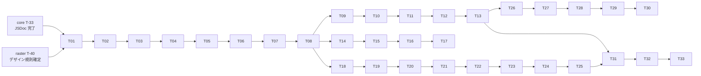

# Novi UI AI Integration — Implementation Tasks

| 項目 | 値 |
|------|-----|
| Status | **Implemented** |
| Author | yuuto |
| Last Updated | 2026-08-20 |
| Requirements | [./requirements.md](./requirements.md) |
| Design | [./design.md](./design.md) |
| Blocked by | [../03-docs-site/tasks.md](../03-docs-site/tasks.md) の T-08 / T-09（生成パイプライン）と共通基盤 |

> 各タスク完了時にチェック。受け入れ基準ID（AC-XX-X）または FR-XX で要件と対応付ける。
> **優先順位は ADR-A2 に従う: 型 → llms.txt → AGENTS.md → MCP。**

---

## Phase 0: 経路1（型 + JSDoc）— 他 Spec で完了済みの確認のみ

- [x] **T-01**: 確認作業。variant が union literal 型であること / 全公開 API に JSDoc の使用例があること / props 名が RAC 慣習に統一されていることを検査する (1h) → AC-01-2, AC-01-3, AC-01-4

> 実装は 01-core（T-33）と 02-theme-raster（FR-14）で完了している。ここでは**漏れの検査のみ**行う。
> 最も効く経路なので、他に着手する前に必ず潰す。

---

## Phase 1: 中間表現（IR）

- [x] **T-02**: `component-index.json` のスキーマ定義 (2h) → ADR-A1
- [x] **T-03**: IR 生成スクリプト — core の contract から slot / variant 語彙を抽出 (2.5h) → FR-01
- [x] **T-04**: IR 生成スクリプト — テーマの TS 型 + JSDoc から props を抽出（03-docs-site T-08 と共通化）(3h) → FR-01, AC-02-1
- [x] **T-05**: IR 生成スクリプト — docs のデモソースから使用例を抽出 (2h) → FR-01
- [x] **T-06**: IR 生成スクリプト — Raster の数値デザイン規則と禁止クラス一覧を取り込む (1.5h) → FR-12
- [x] **T-07**: IR のスキーマ検証テスト (1.5h) → ADR-A1 の Risk 緩和
- [x] **T-08**: 生成失敗時にビルドを落とす設定 (1h) → FR-09, AC-02-3

---

## Phase 2: 経路2（llms.txt / llms-full.txt）

- [x] **T-09**: `/llms.txt` 生成。冒頭の「必ず守ること」セクションに Provider 不要 / `isDisabled`・`onPress` / `data-slot` の3点を配置 (2.5h) → FR-02, FR-04, AC-03-1, AC-03-3
- [x] **T-10**: `/llms-full.txt` 生成。全コンポーネントの props / slot / variant / 使用例 / a11y 注記 (2.5h) → FR-03, AC-03-2
- [x] **T-11**: サイズ検査。`llms.txt` < 20KB / `llms-full.txt` < 500KB。超過時は分割配信に切り替える (1.5h) → NFR:サイズ
- [x] **T-12**: `/llms.txt` の内容検査テスト。冒頭3規約が含まれることを文字列で確認 (1h) → AC-03-3, FR-04
- [x] **T-13**: IR に `version` を持たせ、両ファイルに出力する (0.5h) → Cross-cutting:バージョン整合

---

## Phase 3: 経路3（リポジトリ内のエージェント指示）

- [x] **T-14**: ルートの `AGENTS.md`。slot 契約 / 禁止クラス / API 命名 / 3ファイル構成 / 「絶対にやらないこと」 (2.5h) → FR-07, AC-05-1
- [x] **T-15**: `.claude/skills/add-component/` スキル。新規コンポーネント追加の5手順 (2h) → AC-05-2
- [x] **T-16**: `.cursor/rules/novi.mdc`。`AGENTS.md` の要約 (1h) → AC-05-1
- [x] **T-17**: 手書きの API 情報がリポジトリに存在しないことを検査するスクリプト (1.5h) → AC-02-2

---

## Phase 4: 経路4（MCP サーバ）

- [x] **T-18**: `packages/mcp` 雛形。`component-index.json` を同梱し、それだけを読む構成 (2h) → FR-10, ADR-A3
- [x] **T-19**: `list_components` 実装 (1.5h) → FR-05, AC-04-1
- [x] **T-20**: `get_component` 実装。props / slot / variant / 使用例 / a11y 注記を返す (2.5h) → FR-05, AC-04-2
- [x] **T-21**: `get_design_rules` 実装。数値規則 + 禁止クラス + 色の扱いを返す (2h) → FR-05, FR-12, AC-04-3
- [x] **T-22**: `search_components` 実装。**未実装は「未実装」と明示し、代替提案をしない** (2.5h) → FR-05, FR-06, AC-04-4, ADR-A4
- [x] **T-23**: セキュリティ検査。環境変数 / FS / ネットワークへのアクセスがないことをソース走査と依存監査で確認 (2h) → FR-11, ADR-A3
- [x] **T-24**: MCP クライアントからの実接続テスト。4ツールすべての応答を検証 (2.5h) → AC-04-1, AC-04-2, AC-04-3, AC-04-4
- [x] **T-25**: `packages/mcp/README.md`。一次配布元のみを使うべき理由（供給網リスク）を明記 (1h) → FR-10

---

## Phase 5: 精度の回帰テスト（**CI 自動化しない / 手動実行**・ADR-A5）

- [x] **T-26**: 20 コンポーネント分の日本語指示文を用意する (2h) → AC-01-1
- [x] **T-27**: 生成 → 一時プロジェクト配置 → `tsc --noEmit` のハーネスを実装 (3h) → AC-01-1
- [x] **T-28**: 生成コードに対する禁止クラス検査を組み込む (1.5h) → AC-06-1, AC-06-2
- [x] **T-29**: 合否基準を機械的なものだけに限定する（型エラー0 / 禁止クラス0。文章の一致は見ない）(1h) → Risk 緩和, ADR-A5
- [x] **T-30**: 不合格時に `llms.txt` の規約セクションを補強するループを運用手順として文書化 (1h) → NFR:精度, AC-01-1
- [x] **T-30b**: リリース手順のチェックリストに「精度回帰テストの手動実行」を追加する。CI で自動化しないため、実行忘れをここで担保する (0.5h) → ADR-A5

---

## Phase 6: 統合

- [x] **T-31**: ビルドパイプラインに組み込む。IR 生成 → 各出力生成 → 差分検査 (2h) → FR-08
- [x] **T-32**: 03-docs-site の `/llms.txt` `/llms-full.txt` 配信ルートと接続 (1h) → [03-docs-site](../03-docs-site/requirements.md) AC-06-1, AC-06-2, AC-06-3
- [x] **T-33**: `@novi-ui/mcp` の npm 公開 (1h) → FR-10

**合計見積**: 約 60h

---

## Dependencies

**クリティカルパス**: core T-33 → T-01 → T-02 → T-03〜08 → T-09 → T-10 → T-26 → T-27 → T-31 → T-33

- **T-01 を最初にやる**。最も効く経路（型 + JSDoc）に漏れがあるなら、他をやる前に直す
- Phase 2 / 3 / 4 は T-08 完了後は**互いに独立**。優先順位は ADR-A2 に従い 2 → 3 → 4 の順で着手する
- **MCP（Phase 4）は最後でよい**。設定コストが高く届く範囲が狭いため

---

## Definition of Done（全項目チェックで完了）

- [x] 全 AI 向け出力が `component-index.json` から生成されており、手書きの API 情報が存在しない
- [x] props を1つ追加すると `llms-full.txt` と MCP 応答の両方に自動反映される
- [x] 生成失敗時にビルドが落ちる（古い生成物を配信しない）
- [x] `/llms.txt` の冒頭に「Provider 不要」「`isDisabled` / `onPress`」「`data-slot`」の3規約がある
- [x] `llms.txt` < 20KB / `llms-full.txt` < 500KB
- [x] `AGENTS.md` / Claude Code スキル / Cursor ルールが配置されている
- [x] MCP の4ツールが実接続テストを通過
- [x] `search_components` が未実装クエリに対して代替提案をしない
- [x] MCP が環境変数 / FS / ネットワークに一切アクセスしない
- [x] 精度回帰テストが 22 件すべてで型エラー 0 / 禁止クラス 0（**手動実行**。CI には組み込まない）
- [x] リリース手順チェックリストに精度回帰テストの手動実行が入っている
- [x] `@novi-ui/mcp` が npm に公開済み
- [x] requirements.md の Open Questions が空
- [x] Status を `Implemented` に更新
