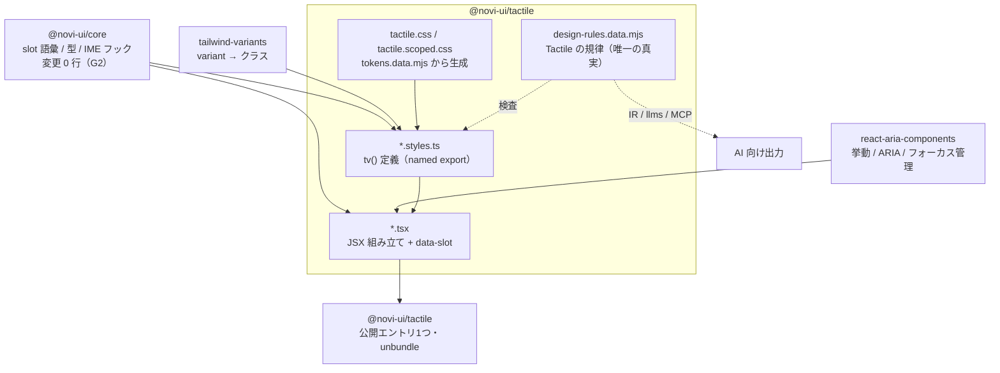

# @novi-ui/tactile — Design

| 項目 | 値 |
|------|-----|
| Status | **Draft** |
| Author | yuuto |
| Last Updated | 2026-08-22 |
| Requirements | [./requirements.md](./requirements.md) |
| Architecture | [../../architecture.md](../../architecture.md) |
| 申し送り元 | [../02-theme-raster/design.md](../02-theme-raster/design.md) T-41（8項目すべて取り込み済み） |

---

## Architecture Overview

構造は Raster と同一（意図的に）。**変わるのは各箱の中身だけ**で、箱の配置が同じであることが
「テーマは `.styles.ts` と `.tsx` の JSX 部分だけ書き直せばよい」という設計の検証になる。



### 1コンポーネント = 3ファイル（Raster と同一）

```
src/button/
├── button.styles.ts   tv() 定義。satisfies SlotMap。named export
├── button.tsx         RAC を組み立て、data-slot を出す。JSDoc に使用例
├── button.test.tsx    5点セット + 該当する追加テスト
└── index.ts
```

### T-41 申し送り8項目の反映先

| # | 申し送り | 本設計での扱い |
|---|---|---|
| 1 | slot 語彙はそのまま使える | 語彙変更なし。`satisfies SlotMap` で全契約を実装 |
| 2 | 基準パターンは Button の3ファイル構成 | そのまま複製。§基準パターン参照 |
| 3 | slot は `satisfies` で定義（ADR-R5） | 全 `.styles.ts` に適用。基準パターンにコメントで理由を残す |
| 4 | `'use client'` はエントリ自身に（ADR-R6） | `src/index.ts` 先頭に置き、`check-dist-rules.mjs` が検査 |
| 5 | `unbundle: true`（ADR-R7） | `tsdown.config.ts` に適用。metafile 検査も移植 |
| 6 | `variant` は最後に宣言 | 基準パターンに順序をコメントで固定 |
| 7 | 横断検査に登録 | `variant-distinctness.test.ts` / `coverage.test.ts` を Tactile 用に持つ |
| 8 | RAC は型定義を読む | 各コンポーネント着手時の手順に組み込み（tasks.md）。シート化する Modal / Select で特に必須 |

---

## 着手条件の充足 — Modal / Select / Tabs の DOM 構造差

[architecture.md §12](../../architecture.md) の着手条件を、実装前にここで固定する。
**この3つの構造差がテーマ横断テスト（T-45）で機械的に検査される**（AC-02-1〜3）。

### 1. Modal — 中央ダイアログ → ボトムシート

[architecture.md §5](../../architecture.md) のテーマ B を実装で回収する。

```
Raster                                Tactile
backdrop（中央寄せ grid）             backdrop（下端寄せ flex）
└─ panel（中央・max-w-md・4面角丸）   └─ panel（下端固定・全幅・上2角のみ角丸・
   └─ header ── title / closeButton        translate-y スライドイン・pb: safe-area）
   └─ body                               └─ (grabber: 装飾・data-slot なし・aria-hidden)
   └─ footer（右揃えの操作列）           └─ title（header なしの単独見出し）
                                         └─ body
                                         └─ footer（縦積み・フルワイド・closeButton はここ）
```

- `closeButton` は **footer 内のフルワイドボタン**。名前が同じで位置が違う（AC-02-1）
- `header` slot は**描画しない**。任意 slot 省略の実例（AC-02-5）
- `size` の解釈: シートの**最大高**（sm=40dvh / md=60dvh / lg=80dvh / full=100dvh）。中身がそれより低ければ中身の高さ。Raster では幅だったものが Tactile では高さになる。**語彙は共通、解釈はテーマの自由**（ADR-06 の実例）
- grabber は幅 36×高さ 5px・`radius-full`。`data-slot` なし・`aria-hidden="true"`・フォーカス不可（AC-03-4 / AC-05-6）

### 2. Select — アンカー型ポップオーバー → 下端シート型ピッカー

```
Raster                                Tactile
trigger（h-40px・トリガー同幅に      trigger（h-48px・角丸 md）
popover をアンカー）                 popover（トリガーを無視して viewport 下端に固定・
└─ popover ── listbox ── option         全幅・上2角のみ角丸・pb: safe-area）
   （トリガーの直下・同幅・8px 角丸）  └─ listbox ── option（行高 48px 以上）
```

- RAC `Popover` の配置 API にトリガー基準をやめさせ、CSS で `position: fixed; inset-inline: 0; bottom: 0` に固定する（`placement` に依存しない。実装は RAC の型定義を読んで確定する — 申し送り8）
- `option` は最小 48px 行高 + 選択中はチェックマーク表示（AC-02-2、一覧の行高規則）
- **iOS のネイティブピッカーと同じ操作モデル**。モバイル利用者が既に知っている形にする

### 3. Tabs — 下線 → セグメンテッドコントロール

```
Raster                                Tactile
root                                  root
└─ list（背景なし・下線 1px 相当の    └─ list（subtle の塗りトラック・radius-md・p-1）
   border-b。tab ごとの下線で選択表示）  └─ indicator（選択中 tab の背面を塗る面・
└─ panel                                    radius-sm・影 sm・translate で移動）
                                         └─ tab（背景なし・indicator の上に乗る）
                                      └─ panel
```

- Raster は `indicator: 'hidden'`（未使用の任意 slot）。**Tactile では `indicator` が主役**になる。同じ語彙の未使用/主役の対比が、任意 slot の設計意図の実証になる（AC-02-3）
- indicator の移動は `translate` のみ（FR-09 の範囲内）。実装は RAC の `Tab` が出す `data-selected` を利用し、追加の状態管理を持たない

### 追加の構造差（着手条件外だが同時に固定する）

| コンポーネント | Raster | Tactile |
|---|---|---|
| Toast | region 右下・横並び | **region 上端中央**・全幅（下端はシート・キーボードと競合するため上を取る） |
| Accordion | インジケータ `+/−`（回転なし） | **シェブロン回転**（rotate 例外に登録・ADR-T4） |
| Switch | 錠剤形 28×16px | 錠剤形 **51×31px**（iOS 実寸。タップ寸法をパーツ自体が満たす） |
| Menu | トリガー直下・コンパクト | 下端シート（Select と同じ配置原理）・行高 48px |

---

## Tactile のトークン値

> **⚠️ 色の値は [06-tones-and-colors](../06-tones-and-colors/requirements.md) が所有する（2026-08-22 確定）。**
> トーン = light **L50**/C0.080・dark L76/C0.075（L54 から訂正・06 requirements.md 参照）、カラーセット = Textile Dyes 8色（既定 Indigo hue 255）、
> 中立色は選択色の hue に染まる。以下の色仮値（teal hue 195 / 中立 hue 260 等）は 06 制定前の記録であり、
> **実装は最初から 06 の値で行う**。寸法・モーション・影など色以外のトークンは引き続き本 Spec が所有する。

`tokens.data.mjs` を唯一の真実とし、`tactile.css` / `tactile.scoped.css` / IR がすべてここから生成される
（Raster の #22 の教訓: CSS 変数名の作り方も1箇所に置く）。

```js
// packages/tactile/scripts/tokens.data.mjs（抜粋・確定値は T-03 のコントラスト検査を通してから）

// 角丸: none 以外は 8px 以上（FR-09）。指の面は丸い。
// sm=8px は 24px 級の小部品（Checkbox の箱）が円に見えない上限
export const TACTILE_RADII = {
  none: '0px', sm: '8px', md: '14px', lg: '20px', full: '9999px',
}

// 影: 面にも許可。α ≤ 0.24 を tokens.test が縛る
export const TACTILE_SHADOWS = {
  none: 'none',
  sm: '0 1px 3px oklch(20% 0.01 260 / 0.10), 0 1px 2px oklch(20% 0.01 260 / 0.06)',
  md: '0 6px 16px oklch(20% 0.01 260 / 0.14), 0 2px 4px oklch(20% 0.01 260 / 0.08)',
  lg: '0 -8px 32px oklch(20% 0.01 260 / 0.18), 0 -2px 8px oklch(20% 0.01 260 / 0.08)', // 上向き: シート用
}

// タイポ: 本文 17px（iOS の本文寸法）
export const TACTILE_TEXT = {
  xs: '13px', sm: '15px', base: '17px', lg: '21px', xl: '26px', '2xl': '32px', '3xl': '40px',
}

// 高さ: 最小段でも 44px を超える（FR-07）
export const TACTILE_CONTROL_HEIGHTS = { sm: 40, md: 48, lg: 56 }
// sm=40px は視覚寸法。実効タップ領域は擬似要素で 44px に拡張する（§タップ領域の作り方）

// モーション: 出現/消失/状態変化で3段
export const TACTILE_MOTION = {
  'duration-fast': '120ms',   // 状態変化（hover / press / check）
  'duration-base': '200ms',   // 消失
  'duration-slow': '260ms',   // 出現（シートのスライドイン）
  'ease-standard': 'cubic-bezier(0.2, 0, 0, 1)',
  'ease-emphasized': 'cubic-bezier(0.05, 0.7, 0.1, 1)', // 減速主体。オーバーシュートなし
}

// 中立色: chroma 0.004〜0.02 の温度のある灰（hue 260 = 寒色寄り）
// 値は T-02 のコントラスト検査 + chroma 帯域検査を通して確定する
const NEUTRAL_LIGHT = {
  bg:     'oklch(98% 0.005 260)',
  subtle: 'oklch(94.5% 0.008 260)',
  fg:     'oklch(22% 0.015 260)',
  muted:  'oklch(47% 0.012 260)',   // 4.5:1 の下限は検査が決める
  border: 'oklch(90% 0.008 260)',
  'border-strong': 'oklch(72% 0.01 260)',
  overlay: 'oklch(20% 0.01 260 / 0.45)',
}
// dark はシートが「持ち上がる」ほど明るくなる elevation 原理:
// bg 15% → panel（浮く面）22% で背景色差 1.2:1 以上を検査で保証（AC-06-3）
```

- **意味色**: primary は Raster の indigo (hue 265) から**独立に選ぶ**。Tactile は teal（hue 195 目安・chroma ≤ 0.19）。2テーマを並べたときに一目で別物と分かることが docs の主役になる
- **`--novi-shadow-lg` が上向き**なのは Tactile の性格そのもの。浮く面が下端から来るため、影は上に落ちる

### タップ領域の作り方（G5 / AC-01-5）

視覚寸法とタップ寸法を分離する。小さく見える部品（Checkbox / Radio の 24px・Breadcrumbs のリンク等）は、
**`before:` 擬似要素で当たり判定だけを 44px に広げる**。

```ts
// styles/tap-target.ts — 共通断片（focus-ring と同じ配置）
export const tapTarget = [
  'relative isolate',
  // 当たり判定のみ。視覚には現れない
  'before:absolute before:left-1/2 before:top-1/2 before:-translate-x-1/2 before:-translate-y-1/2',
  'before:size-[max(100%,44px)] before:content-[""]',
].join(' ')
```

- 検査は2段（AC-01-1 / AC-01-2）: 静的検査が `h-` 指定の下限を見て、Playwright が**実効領域**（要素本体 + 擬似要素）を実測する
- 隣接する対話要素同士の**当たり判定の重なり**は Playwright 検査に含める（44px に広げた結果、隣のターゲットを侵食していないこと）

---

## 基準パターン（Button）— Raster からの差分だけを示す

3ファイル構成・`satisfies SlotMap`・`VariantMap` 型付け・named export・JSDoc は Raster と**完全に同一**。
複製時に書き換えるのは次の4点だけ。

```ts
// button.styles.ts — Raster との差分
const slots = {
  root: [
    'inline-flex items-center justify-center gap-2',
    'font-medium whitespace-nowrap select-none',
    'border border-transparent',
    // 差分1: 押下フィードバック。指の下で沈む（pressed 状態のみ scale 可・FR-09）
    'transition-[background-color,border-color,color,opacity,scale]',
    'duration-[var(--novi-duration-fast)] ease-[var(--novi-ease-standard)]',
    'data-[pressed]:scale-[0.97]',
    'motion-reduce:data-[pressed]:scale-100',  // AC-09-2
    focusRing,
    disabledState,
    tapTarget,  // 差分2: 共通のタップ領域断片
  ].join(' '),
  // …他 slot は Raster と同一
} satisfies SlotMap<typeof buttonSlots, (typeof buttonRequiredSlots)[number]>

// 差分3: 高さ 40/48/56（Raster: 32/40/48）・水平余白広め
const size: VariantMap<NoviSize, { root: string }> = {
  sm: { root: 'h-10 px-4 text-[length:var(--novi-text-sm)]' },
  md: { root: 'h-12 px-5 text-[length:var(--novi-text-base)]' },
  lg: { root: 'h-14 px-6 text-[length:var(--novi-text-base)]' },
}

// 差分4: solid に影 sm（Tactile は面が持ち上がる）。押下中は影を消して「沈む」
const variant: VariantMap<NoviVariant, { root: string }> = {
  solid: { root: 'bg-[var(--c)] text-[var(--c-fg)] shadow-[var(--novi-shadow-sm)] data-[pressed]:shadow-[var(--novi-shadow-none)]' },
  // …outline / soft / ghost / plain は影なし。宣言順は Raster と同じく必ず最後（申し送り6）
}
```

`button.tsx` は **Raster とほぼ同一になる見込み**。これは欠点ではなく G7 の観測データになる
（「.tsx が同一なら、それは core に引き上げる候補」— architecture.md §7 の判断基準で棚卸しする）。

---

## 20 コンポーネントの実装方針

| # | コンポーネント | 使う RAC プリミティブ | Tactile 固有の構造判断 |
|---|---|---|---|
| 1 | Button | `Button` | 上記基準パターン。solid に影 sm・押下で沈む |
| 2 | Input | `TextField` ほか | **入力 16px 以上**（AC-01-3）。ラベルは上・タップで input にフォーカス。h-48px |
| 3 | TextArea | `TextField` `TextArea` | 同上。最小高 96px（2行分） |
| 4 | Checkbox / Group | `Checkbox` `CheckboxGroup` | 箱 24px・radius-sm(8px)・チェック時は塗り面 + 白チェック。**タップ領域は擬似要素で 44px**（AC-01-5 の主対象）。Radio との形の区別（角丸四角 vs 円）は保つ |
| 5 | Radio / RadioGroup | `RadioGroup` `Radio` | 円 24px・内側ドット。タップ領域 44px。**行全体をラベルにして行タップで選択** |
| 6 | Switch | `Switch` | 錠剤形 **51×31px**（iOS 実寸）。サム 27px・押下中はサムが横に 2px 伸びる（width 変化・scale 不使用） |
| 7 | Select | `Select` `Button` `Popover` `ListBox` | **下端シート型ピッカー**（§着手条件 2）。行高 48px・選択中はチェックマーク |
| 8 | Card | `div` | 影 sm で持ち上げる・境界線なし・radius-lg。**背景を設定する面は文字色も設定する**（STATUS #2） |
| 9 | Badge | `span` | radius-full の錠剤形。`dot` は 8px の円 |
| 10 | Avatar | `div` `img` | radius-full。バッジ位置は右下 |
| 11 | Progress | `ProgressBar` | トラック高 **6px**・radius-full。indeterminate は translate のみ |
| 12 | Spinner | `div` + CSS | 回転（rotate 例外)。Raster と同じ構造でよい |
| 13 | Skeleton | `div` + CSS | opacity パルス。radius は文脈に合わせ md 既定 |
| 14 | Modal | `ModalOverlay` `Modal` `Dialog` | **ボトムシート**（§着手条件 1）。grabber・footer 縦積み・safe-area |
| 15 | Popover | `Popover` `Dialog` | アンカー型のまま（シート化しない）。radius-lg・影 md。`arrow` は描画しない |
| 16 | Tooltip | `TooltipTrigger` `Tooltip` | タッチでは hover が無いため**主要経路にしない**。表示は Raster 同様反転面・radius-sm。docs に「タッチでは長押し等に依存せず、重要情報は Tooltip に置かない」と明記 |
| 17 | Menu | `MenuTrigger` `Popover` `Menu` `MenuItem` | **下端シート**（Select と同じ配置原理）。行高 48px・セクション見出しは sticky |
| 18 | Tabs | `Tabs` `TabList` `Tab` `TabPanel` | **セグメンテッドコントロール**（§着手条件 3）。indicator が主役 |
| 19 | Accordion | `Disclosure` ほか | シェブロン回転（rotate 例外・ADR-T4）。trigger 行高 48px 以上 |
| 20 | Breadcrumbs | `Breadcrumbs` `Breadcrumb` `Link` | セパレータはシェブロン。**リンクのタップ領域 44px**（縦に薄いのが典型的な違反源） |
| — | Toast | core 経由の安定名 API | **region 上端中央・全幅**。スワイプ消去は付けない（NG6 と同根） |

---

## 禁止クラス検査（FR-09 / FR-15）

`design-rules.data.mjs` を Tactile 用に新規作成する（Raster と共有しない — 規律そのものが違う）。
検査スクリプト本体（`check-design-rules.mjs`）は**ロジックが同一なら複製し、G7 の棚卸し対象に含める**。

| 検出パターン | 理由 | 例外 |
|---|---|---|
| `shadow-`（`shadow-none` / `shadow-[var(--novi-shadow-*)]` を除く） | 影はトークン経由のみ | なし |
| `rounded-` の任意値（`rounded-[var(--novi-radius-*)]` を除く） | 角丸はトークン経由のみ | なし |
| `border-[2-9]` `border-\d\d` | 境界線は 1px まで | なし |
| `scale-`（`data-[pressed]:scale-*` / `motion-reduce:...scale-100` を除く） | scale は押下フィードバック限定（FR-09） | なし（除外は pattern 側で表現） |
| `rotate-` `animate-spin` | 回転は限定 | `spinner.styles.ts` / `accordion.styles.ts`（ADR-T4・理由コメント必須） |
| リテラル色値 | 色はトークン経由 | `tokens.data.mjs` のみ |
| `duration-`（`duration-[var(--novi-duration-*)]` を除く） | モーションはトークン経由 | なし |
| `h-[1-9](?!\d)\b` 等、対話要素 root の 44px 未満の高さ | タップ下限（AC-01-1） | 非対話要素の装飾（dot / grabber 等）はファイル内注記で除外 |
| `text-\[length:var\(--novi-text-(xs\|sm)\)\]` が `input` / `textarea` slot に付く | 16px 未満の入力は iOS でズーム（AC-01-3） | なし |

追加でトークン自体の検査（`tokens.test.ts`）:

| 検査 | 対応 |
|---|---|
| 影の α がすべて 0.24 以下 | FR-09 |
| `none` 以外の radius が 8px 以上 | FR-09 |
| 中立色の chroma が 0.004〜0.02 の帯域内 | 数値定義（帯域**外れ**も落とす: 0 は Raster 化、0.02 超は色付き） |
| 意味色の chroma が 0 < c ≤ 0.19 | ADR-06 |
| light / dark 全組み合わせのコントラスト（4.5:1 / 3:1 / 浮く面 1.2:1） | AC-06-1〜3 |
| duration が 3 値とも定義され、slow ≥ base ≥ fast | 数値定義 |

---

## docs / AI 統合（テーマ追加の全登録点）

Raster の実装で判明した「テーマを増やすときに触る場所」を全部列挙する。**1つでも漏れると
「サイトには居るが AI からは見えない」状態になる**ため、tasks.md で個別タスクにする。

| 登録点 | 内容 | 根拠 |
|---|---|---|
| `apps/docs/lib/theme-registry.ts` | メタ情報1行（label / description / pkg）。**実装を置かない** | STATUS #23（900KB 事故） |
| `apps/docs/lib/theme-components.tsx` | `import * as tactile` の1行。実装を引き込む唯一の場所 | 同上 |
| `apps/docs/app/docs/themes/tactile/` | テーマ紹介ページ。デザイン言語の数値表と Raster との対比 | docs 構成 |
| `tactile.scoped.css` の読み込み | 同一ページ2テーマ同居のため scoped ビルド必須 | Raster T-42 / AC-07-4 |
| IR（`generate-component-index.mjs`） | `themes.tactile` を追加。designRules / tokenTypes を tactile の `*.data.mjs` から読む | ADR-A6 / STATUS #13, #15, #22 |
| `llms.txt` 生成 | テーマ選択の説明とインストール手順に tactile を追加 | 04-ai-integration |
| MCP | `list_components` が「実装しているテーマ」に tactile を返す（IR 由来なので IR 登録で自動反映されることを**確認**する） | AC-04-1（04 spec） |
| accuracy | プロンプト22件をテーマ指定ありで実行し、tactile 指定時に tactile の import が出ることを確認 | ADR-A5 |
| 視覚回帰 / mobile / theme-switching e2e | tactile 分のプロジェクト追加。**320px と 375px の2幅**で検査 | STATUS #24, #25 |
| リリース設定 | `package.json` に `repository` 宣言（**無いと publish の瞬間に 422**・STATUS #19）。初回は手動 publish → Trusted Publisher 設定（STATUS #20） | steering |

---

## T-48 / T-49: 棚卸しと契約レビュー結果（2026-08-22）

**この Spec の知的成果物。** 20個作ること自体は Raster で確立した型の複製で、
答えを出すべきだったのは次の2つだった。

### T-49: 契約は構造から独立していたか → **独立していた**

| 指標 | 結果 |
|---|---|
| **core への差し戻し** | **0 件**（Raster では4件発生した）。G2 達成 |
| 語彙の追加・削除 | **0 件** |
| 描画しなかった slot | `popover.arrow` / `tooltip.arrow` の2つだけ。Raster と同じ（任意 slot の省略） |
| 契約テスト | 23件すべて通過 |

Raster の T-41 は「語彙の変更は不要」と結論したが、それは1本での結論であり、
**語彙が Raster に都合よく作られていただけである可能性**を排除できていなかった。
2本目を**構造の違う形で**通して、初めて「契約は構造から独立している」と言える。

具体的には、次のすべてが**語彙を1つも変えずに**実現できた。

- `closeButton` を header から footer へ移す（同じ名前・違う位置）
- `popover` をアンカー配置から viewport 下端固定へ変える（同じ名前・違う配置手段）
- `indicator` を「描画しない」から「実体を持つ塗り面」へ変える（任意 slot の解釈差）
- `header` を描画しないまま `title` だけ描く（部分的な省略）

> **1本目では確認できなかったこと**: Raster は `header` を必ず描いていたため、
> 「必須でない slot を落としても契約テストが通る」ことは実装で確かめられていなかった。

### T-48: 何を core に引き上げるか → **何も引き上げない**

`.tsx` の一致率は 16/20 が **100%**（button 98.1 / select 90.7 / tabs 89.8 / modal 71.4）。
基準1（同一）と基準2（スタイル非含有）は満たすが、**基準3（構造の自由を奪わない）で全滅する**。

判断の根拠と v0.3 の条件は [architecture.md §7](../../architecture.md) に ADR として記録した。
要点は「一致している 16 個は共通なのではなく、**2本ともたまたま同じ構造を選んだだけ**」。
構造差を作った4つの一致率が低いのは正常で、**100% はまだ差を作る必要がなかったという意味**しかない。

---

## Alternatives Considered

| 案 | Pros | Cons | 採否 |
|---|---|---|---|
| A: **タッチファースト**（本案） | architecture §5 テーマBの机上検証を実装で回収できる。Modal/Select/Tabs の DOM 差＝着手条件を満たす。a11y の未検査軸（タップ寸法・入力ズーム・safe-area）を持ち込める | デスクトップでは大味に見える（意図した性格） | ✅ |
| B: 装飾的テーマ（グラデ / ガラス） | 見た目のインパクト。ポートフォリオ映え | **差が色と装飾に収束**し、着手条件を満たせない。禁止クラス検査で縛る規律も立てにくい | ❌ |
| C: 高密度テーマ（データテーブル向け 24px 行高） | 実務需要はある | Raster と同じ「ポインタ前提・線で切る」側にあり、構造差が出ない。Raster の size 拡張で足りてしまう | ❌ |
| D: Raster を fork して寸法だけ伸ばす | 最速 | 「色と角丸（と寸法）を変えただけ」の見本になり、プロジェクトの主張を自ら否定する | ❌ |
| E: シートをドラッグ開閉対応にする | モバイルの体験が上がる | RAC 非担保。Pointer Events・慣性・キーボード代替・フォーカス管理を自前で持ち、工数とリスクが跳ねる | ❌ NG6（別 Spec） |

---

## Decisions (ADR)

### ADR-T1: 2本目はタッチファーストにする
- **Status**: Accepted (2026-08-22)
- **Context**: 着手条件は「Modal・Select・Tabs の DOM 構造が実際に違うこと」。テーマ差が「色と角丸」に収束するリスクは Impact: 致命 と評価されている。
- **Decision**: 上記 Alternatives の通り、構造差を最も自然に生む「タッチファースト」を採る。名は Tactile。
- **Consequences**:
  - (+) architecture.md §5 の机上検証（ボトムシート Modal）が実装で検証される
  - (+) タップ寸法・入力ズーム・safe-area という新しい検査軸が資産になる
  - (−) デスクトップでの情報密度は Raster に劣る。これは仕様（2テーマ体制の答え）

### ADR-T2: シートの配置は RAC の Popover 配置に頼らず CSS で固定する
- **Status**: Accepted (2026-08-22)
- **Context**: RAC の `Popover` はトリガー基準のアンカー配置が前提。Select / Menu を下端シートにするには、この配置ロジックの外に出る必要がある。RAC の配置計算と CSS の固定が競合すると、リサイズ時に位置が飛ぶ。
- **Decision**: `Popover` は開閉・フォーカス管理・Escape だけに使い、配置は **`!important` を付けたユーティリティ**（`!fixed !top-auto !inset-x-0 !bottom-0 !max-w-none !max-h-[85dvh]`）で上書きする。
- **T-13 の実測結果（2026-08-22）**。3手段を順に試し、勝てるのは `!important` だけと判明した:

  | 手段 | 結果 |
  |---|---|
  | 通常のクラス | ✗ インラインスタイルに負ける |
  | `style` prop | ✗ 実装は `{...popoverProps.style, ...renderProps.style}` の順に見えるが、位置は**測定後に再適用**されるため RAC の `top` / `left` / `max-height` が最終的に勝つ |
  | スタイルシートの `!important` | ✓ インラインに勝つ（実ブラウザで `position:fixed` / `left:0` / `bottom:0` / `max-height:85dvh` を確認） |

  代替案（`ModalOverlay` 系に置き換える）は採らない。RAC の `Select` は `Popover` + `ListBox` の組で
  `aria-activedescendant`・フォーカス復帰・タイプアヘッドを担保しており、器を変えると
  **a11y の担保を自前で書き直すことになる**。変えるのは見た目だけでよい。
- **Consequences**:
  - (+) 挙動（RAC 担保）と配置（テーマの自由）の責務が切れる。a11y の担保に一切触れない
  - (−) `!important` は強い手段で、利用者が `classNames` で位置を上書きできなくなる → README に明記する
  - (−) RAC のバージョン更新で当たり方が変わりうる。`select/rac-placement.test.tsx` が
    「style prop では勝てない」という前提そのものを固定しており、前提が変われば落ちる

### ADR-T3: `size` の解釈は Modal では最大高、Select/Menu では行密度にする
- **Status**: Accepted (2026-08-22)
- **Context**: ADR-06 により語彙はテーマ間で共通だが、解釈はテーマに属する。中央ダイアログの `size` は幅の意味だったが、全幅シートに幅の段階は存在しない。
- **Decision**: Modal の `size` はシートの最大高（40/60/80dvh、full=100dvh）。Select / Menu の `size` はトリガー寸法と行高の段階。docs のテーマページに Raster との解釈差を明記する。
- **Consequences**:
  - (+) 同一コードがテーマ切替でそのまま動く（ADR-06 の目的）
  - (−) 「lg にしたのに幅が変わらない」という混乱がありうる → docs で図解する（Raster の ADR-R1 と同種の割り切り）

### ADR-T4: rotate の例外を Spinner + Accordion シェブロンの2件にする
- **Status**: Accepted (2026-08-22)
- **Context**: Raster は「+/−」で回転を避けたが、それは面を増やさないミニマルの帰結。Tactile の性格では、開閉方向を身体的に示すシェブロン回転の方が誤操作を減らす。
- **Decision**: `accordion.styles.ts` を rotate 例外に登録する（理由コメント必須・`prefers-reduced-motion` では回転なしで上下反転アイコン差し替え）。装飾目的の rotate は引き続き禁止。
- **Consequences**:
  - (+) 開閉状態が動きで読める
  - (−) 例外が2件に増える。例外追加は PR レビューの明示確認項目（Raster と同運用）

### ADR-T5: 押下フィードバックの scale を「唯一の scale 許可点」にする
- **Status**: Accepted (2026-08-22)
- **Context**: タッチでは hover が存在せず、「押せている」確認は押下中の視覚変化しかない。opacity だけでは指の下に隠れて見えない。
- **Decision**: `data-[pressed]:scale-[0.96〜0.99]` のみ許可し、静的検査のパターンで「pressed 修飾子付き以外の scale」を落とす。`motion-reduce` では scale を外し背景色変化のみにする（AC-09-2）。
- **Consequences**:
  - (+) 押下の手応えが出る。装飾スケール（hover で拡大等）は依然入り込めない
  - (−) 検査の正規表現が複雑になる。**検査は変異させて確かめる**（検証の原則）: わざと裸の `scale-95` を置いて落ちることを確認するテストを検査自体に付ける

### ADR-T6: 中立色は chroma 0.004〜0.02 の帯域で縛る
- **Status**: Accepted (2026-08-22)
- **Context**: Raster の「chroma 0」は検査可能で強い規律だった。Tactile が単に「chroma 0 以外」だと、規律が消えて目分量に戻る。
- **Decision**: 中立色の chroma を **0.004〜0.02 の帯域**で検査する。0（Raster 化）も 0.02 超（色付き面）も落とす。hue は 260 に統一し、hue のばらつきも ±10 で検査する。
- **Consequences**:
  - (+) 「温度のある灰」が主観でなく数値になる。Raster との対比も数値で示せる
  - (−) 帯域の根拠は感覚に由来する（iOS の systemGray 系が概ねこの帯域にある）。値の微調整はあり得るが、**検査を先に書いてから**動かす

---

## Cross-cutting Concerns

- **フォーカスリング**: Raster と同じく共通断片1箇所（`styles/focus-ring.ts`）。タッチ主体でも AC-05-5 は落とさない
- **タップ領域**: 共通断片 `styles/tap-target.ts`。擬似要素方式（§タップ領域の作り方）
- **無効状態**: `disabled:opacity-40 disabled:pointer-events-none` に統一（Raster と同一）
- **エラー状態**: `isInvalid` 時は境界線 + `errorMessage` slot。色だけに頼らない（WCAG 1.4.1）
- **IME**: Input / TextArea / Menu は core の `useImeSafeKeys` を経由（FR-10）。Select は不要（実測済み・Raster T-18）
- **RSC**: エントリ `src/index.ts` の先頭に `'use client'`（ADR-R6 準拠・check-dist-rules が検査）
- **i18n**: `aria-label` 既定文言は props で上書き可能にする
- **safe-area**: 画面端に固定する面（Modal / Select / Menu / Toast）は `pb-[max(16px,env(safe-area-inset-bottom))]` 形式で加算（FR-13）。デスクトップでは 0 にフォールバック（AC-10-3）
- **contract テストの観測点**: オーバーレイ5種は portal 描画のため **`baseElement`** を見る（STATUS #4）
- **背景を設定する面は文字色も設定する**（STATUS #2）。`surface-contrast.test.ts` を Tactile にも持つ

---

## Risks

| Risk | Impact | Likelihood | Mitigation |
|---|---|---|---|
| RAC Popover の配置上書きが安定しない（ADR-T2） | 高 | 中 | T-13 の最初に spike で確定。だめなら Select/Menu のシートは `ModalOverlay` 系で組む代替案に切り替える（挙動担保は同等） |
| 実装が Raster の複製になり構造差が出ない | 致命 | 低 | 着手条件3件を**先にテーマ横断テストとして書く**（T-45 を Phase 2 で先行実装）。テストが構造差を強制する |
| core への差し戻しが発生する（G2 違反） | 高 | 中 | FR-16: 発生時点で実装を止めて記録。回避策で進めない。T-41 の実績（4件差し戻し済み）から語彙は安定していると期待できるが、ゼロ主張はしない |
| タップ領域 44px 化が隣接要素と重なる | 中 | 高 | Playwright で隣接対話要素の当たり判定重複を実測検査（AC-01-2 の一部）。重なる場合は gap をトークンで広げる |
| ダークで影が見えず階層が消える | 中 | 高 | AC-06-3（背景色差 1.2:1）を**トークン検査で先に**固定してから値を決める |
| dvh / safe-area は jsdom で検証不能 | 中 | 確実 | 実ブラウザ検査に寄せる（Playwright の viewport + `--use-mobile-user-agent`）。safe-area は CSS 変数の注入でエミュレート |
| 2本目でも「20個の実装が途中で止まる」 | 高 | 中 | 1コンポーネント = 1PR（G6）。何個で止まっても公開可能な状態を保つ |
| 検査例外（rotate 2件・scale 押下）が形骸化の入口になる | 中 | 中 | 例外はファイル単位 + 理由コメント必須 + **変異テスト**（わざと違反を置いて落ちることを検査するテスト）を検査自体に付ける |

---

## Test Strategy

### 各コンポーネントの5点セット（Raster と同一の形）

| # | テスト | 対応 AC |
|---|---|---|
| 1 | デフォルト props でレンダリングできる | FR-01 |
| 2 | `testSlotContract` を通る（オーバーレイは `baseElement` 観測） | AC-03-1, AC-03-2 |
| 3 | axe violations 0（light / dark 両方） | AC-05-1 |
| 4 | 全 variant / size / color が対応クラスを適用する | AC-04-1, AC-04-3, AC-01-4 |
| 5 | `classNames={{ <slot>: 'x' }}` が該当要素に反映される | AC-03-3 |

### 該当コンポーネントのみ

| テスト | 対象 | 対応 AC |
|---|---|---|
| キーボード操作（Tab / Escape / 矢印） | Modal / Popover / Menu / Select / Tabs / RadioGroup / Accordion | AC-05-2〜4 |
| IME 中の Enter 抑制 | Input / TextArea / Menu | AC-08-1, AC-08-2 |
| reduced-motion でモーション 0・scale なし | シート持ち / Spinner / Skeleton / Button | AC-09-1〜3 |
| `tv({ extend })` で拡張できる | 全 `tv()` 定義 | AC-07-1 |
| grabber が data-slot なし・aria-hidden・フォーカス外 | Modal / Select / Menu | AC-03-4, AC-05-6 |

### パッケージ横断（1回だけ）

| テスト | 対応 |
|---|---|
| 禁止クラス検査（+ 変異テスト） | FR-09, FR-15 |
| トークン検査（影α / radius下限 / chroma帯域 / コントラスト / duration段階） | AC-06-1〜3, FR-09 |
| variant-distinctness / coverage / surface-contrast | AC-04-1, STATUS #2 |
| named export 検査 | AC-07-2 |

### テーマ横断（docs の e2e・本 Spec の中心）

| テスト | 内容 | 対応 AC |
|---|---|---|
| **構造差テスト（新設）** | 同一 props で両テーマを描画し、closeButton の祖先 / popover の配置 / indicator の性質を比較 | AC-02-1〜3 |
| props 型同一性 | 型レベルで両テーマの公開 props が core 契約と一致（`expectTypeOf`） | AC-02-4 |
| タップ領域実測 | 375px 実ブラウザで全対話要素 ≥ 44px + 隣接重複なし | AC-01-2 |
| 入力 font-size 実測 | 計算済みスタイルで ≥ 16px | AC-01-3 |
| safe-area | inset 注入環境でシート下端余白を実測 | AC-10-1〜3 |
| スキーム切替 / 視覚回帰 / mobile(320+375) | Raster の既存 spec に tactile プロジェクトを追加 | AC-06-4, NFR |
