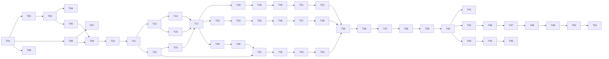

# @novi-ui/tactile — Implementation Tasks

| 項目 | 値 |
|------|-----|
| Status | **Draft** |
| Author | yuuto |
| Last Updated | 2026-08-22 |
| Requirements | [./requirements.md](./requirements.md) |
| Design | [./design.md](./design.md) |
| Blocked by | なし（Raster 完成済み・core 安定・着手条件は design.md で充足） |

> 各タスク完了時にチェック。受け入れ基準ID（AC-XX-X）または FR-XX で要件と対応付ける。
> **1コンポーネント = 1PR**（G6）。23契約が揃う前でも常に公開可能な状態を保つ。
>
> **Raster との最大の違いは実装順**: 入力系からではなく、**着手条件の3つ（Modal / Select / Tabs）を
> Button の直後に作る**。「構造差が出ない」が本 Spec の致命リスクであり、最も早く潰す。

---

## Phase 1: 土台（コンポーネント実装より先にやる）

- [x] **T-01**: `packages/tactile` 雛形。`package.json`（`repository` 宣言を最初から入れる・STATUS #19 / `sideEffects: false` / `publishConfig.access: public`）+ `tsdown.config.ts`（**`unbundle: true`**・ADR-R7）+ `src/index.ts` 先頭に `'use client'`（ADR-R6） (1.5h) → NFR:バンドル
- [x] **T-02**: **トークン検査を先に書く**。コントラスト（本文 4.5:1 / 非テキスト 3:1 / 浮く面の背景色差 1.2:1）+ chroma 帯域（中立 0.004〜0.02・hue 260±10 / 意味色 ≤ 0.19）+ 影 α ≤ 0.24 + radius 下限 10px + duration 3段 (3h) → AC-06-1〜3, FR-09, ADR-T6
- [x] **T-03**: `tokens.data.mjs` の値を確定し、`generate-theme-css.mjs` で `tactile.css` / `tactile.scoped.css` を出力。**T-02 の検査を通る値を採用する（目分量で決めない）** (2.5h) → FR-06, AC-07-4, STATUS #22
- [x] **T-04**: `design-rules.data.mjs`（design.md の検出パターン表）+ `check-design-rules.mjs`。**変異テスト付き**（裸の `scale-95` / 43px 高 / 15px 入力をわざと置いて落ちることを検査） (3h) → FR-09, FR-15, AC-01-1, ADR-T5
- [x] **T-05**: 共通断片 `styles/focus-ring.ts`（Raster から流用可否を確認して複製）+ **`styles/tap-target.ts`（擬似要素 44px 方式・新規）** (1.5h) → AC-05-5, AC-01-5, G5
- [x] **T-06**: テスト基盤。vitest + vitest-axe + `testSlotContract` + 5点セットヘルパを Raster の `vitest.config.ts` に倣って構成 (1.5h) → AC-03-1, AC-05-1
- [x] **T-07**: 横断検査の器を先に作る。`variant-distinctness.test.ts` / `coverage.test.ts` / `surface-contrast.test.ts` を Tactile 用に用意（申し送り7・STATUS #2） (1.5h) → AC-04-1
- [x] **T-08**: `.size-limit.json`（Raster と同一 budget: 初回 14KB / 全体 35KB）+ `check-treeshaking.mjs` + カバレッジゲート 80% を CI に追加 (1h) → NFR

---

## Phase 2: 基準パターンの確立

- [x] **T-09**: **Button 実装**。design.md の差分4点（押下 scale・tap-target・高さ 40/48/56・solid の影）を適用した基準パターン。`satisfies SlotMap`・`VariantMap`・variant は最後に宣言・named export・JSDoc (3h) → FR-01〜05, FR-18, AC-04-1, AC-04-2
- [x] **T-10**: Button の5点セット + キーボード + `tv({ extend })` + **押下 scale が `motion-reduce` で消えるテスト** (2h) → AC-01-4, AC-03-1〜3, AC-05-1, AC-05-5, AC-07-1, AC-09-2
- [x] **T-11**: 基準パターンのレビューと固定。以降の全コンポーネントがこの形に従うことを `packages/tactile/README.md` に明記 (1h) → G6 の前提

> **T-09〜T-11 が終わるまで他のコンポーネントに着手しない。**（Raster T-12 と同じゲート）

---

## Phase 3: 着手条件の3つ（本 Spec の核心。ここで構造差を確定させる）

> **T-13 完了（2026-08-22）。** シートの配置は `!important` を付けたユーティリティで行う。
> 通常のクラスも `style` prop も RAC の位置決めに負ける（位置は測定後に再適用されるため）。
> 代替案の ModalOverlay 置き換えは採らない — RAC の Select は Popover + ListBox の組で
> a11y を担保しており、器を変えると担保を自前で書き直すことになる。詳細は ADR-T2。

- [x] **T-12**: **構造差テストを先に書く（Red）**。同一 props で Raster / Tactile を描画し比較する `structure-divergence.test.tsx`。closeButton の祖先（header vs footer）/ indicator の性質 / props 型同一性（`expectTypeOf`）。`@novi-ui/raster` を devDependency に追加 (2.5h) → AC-02-1, AC-02-3, AC-02-4, Risk「複製になる」の緩和
- [x] **T-13**: **Select の配置 spike**。RAC の型定義と実 DOM を読み、`Popover` のアンカー配置を CSS 固定（`fixed inset-x-0 bottom-0`）で上書きできるか確定する。**できなければ ADR-T2 の代替案（ModalOverlay 系）に切り替え、ADR を更新してから進む** (2h) → ADR-T2, 申し送り8
- [x] **T-14**: Modal（ボトムシート）。grabber（装飾・aria-hidden）・footer 縦積みフルワイド closeButton・`size`=最大高（ADR-T3）・safe-area・スライドイン 260ms (4h) → AC-02-1, AC-02-5, AC-03-4, AC-05-2, AC-05-3, AC-05-6, AC-09-1, AC-10-1〜3, FR-13
- [x] **T-15**: Select（下端シート型ピッカー）。T-13 の結論で実装。行高 48px・選択チェックマーク・矢印キー / Escape (3.5h) → AC-02-2, AC-05-3, AC-05-4
- [x] **T-16**: Tabs(セグメンテッドコントロール)。塗りトラック + `indicator` 面 + `translate` 移動・矢印キー (3h) → AC-02-3, AC-05-4
- [x] **T-17**: T-12 の構造差テストを Green にし、**jsdom で観測できない配置系（popover の bottom 固定）を docs e2e に起票**。ここで「着手条件充足」を PR 本文で宣言する (1.5h) → AC-02-1〜4

> **T-17 完了（2026-08-22）。着手条件を満たした。** 構造差テスト11件が Green。
> closeButton の祖先（header vs footer）/ indicator の有無と性質 / popover の配置手段 /
> props 型の同一性を、**Raster を実際に import して**突き合わせている。
> 以降の17契約は、構造の証明が済んだ上での量産になる。
>
> 実装中に Raster の既存不具合を1件発見: `animate-[novi-fade-in_…]` を参照しながら
> `@keyframes` がどこにも定義されておらず、開閉アニメーションが無音で効いていなかった。
> Tactile は生成 CSS に keyframes を持たせ、参照名の定義有無を検査に加えた。
> **Raster 側も同じ手当てが要る**（別タスクとして起票）。

---

## Phase 4: 入力系（残り 5 コンポーネント）

各タスクに5点セット + tap-target 実測（jsdom で可能な範囲の静的検査）を含む。

- [x] **T-18**: Input。入力 16px 以上・h-48・ラベル上・IME (2.5h) → FR-10, AC-01-3, AC-08-1, AC-08-2
- [x] **T-19**: TextArea。最小高 96px・IME (2h) → FR-10, AC-08-1
- [x] **T-20**: Checkbox + CheckboxGroup。箱 24px + 擬似要素で 44px（**AC-01-5 の主対象**）・行タップで切替 (3h) → AC-01-5, AC-05-1
- [x] **T-21**: Radio + RadioGroup。円 24px + 44px 領域・行全体ラベル・矢印キー (2.5h) → AC-05-4
- [x] **T-22**: Switch。51×31px（パーツ自体が 44px 相当を満たす）・押下でサム伸長（width 変化・scale 不使用） (2.5h) → FR-07, FR-09

---

## Phase 5: 表示系（6 コンポーネント）

- [x] **T-23**: Card。影 sm・境界線なし・radius-lg・**背景と文字色をセットで設定**（STATUS #2） (2h) → FR-01
- [x] **T-24**: Badge。radius-full 錠剤形 (1.5h) → FR-01
- [x] **T-25**: Avatar。radius-full・badge 右下 (1.5h) → FR-01
- [x] **T-26**: Progress。トラック 6px・radius-full・indeterminate は translate (2h) → FR-01, FR-11
- [x] **T-27**: Spinner。rotate 例外登録・reduced-motion 停止 (1.5h) → FR-11, AC-09-3
- [x] **T-28**: Skeleton。opacity パルス・radius-md (1h) → FR-11, AC-09-3

---

## Phase 6: オーバーレイ / ナビ系（残り 7 コンポーネント）

- [x] **T-29**: Popover。アンカー型のまま・radius-lg・影 md・arrow 省略 (2h) → FR-17, AC-05-3
- [x] **T-30**: Tooltip。反転面・タッチで主要経路にしない旨を JSDoc と docs に明記 (2h) → FR-01, FR-18
- [x] **T-31**: Menu。下端シート（T-13 の結論を再利用）・行高 48px・IME・矢印キー / Escape (3.5h) → FR-10, AC-05-3, AC-05-4, AC-08-1
- [x] **T-32**: Accordion。シェブロン回転（**rotate 例外登録 + 理由コメント**・ADR-T4）・reduced-motion で回転なし差し替え・trigger 48px (2.5h) → ADR-T4, AC-09-1
- [x] **T-33**: Breadcrumbs。シェブロン区切り・**リンクの縦タップ領域 44px**（薄いリンクが典型違反源） (2h) → FR-07
- [x] **T-34**: Toast。**region 上端中央・全幅**・safe-area(top)・action は `plain` (3h) → FR-11, FR-13, AC-09-1

---

## Phase 7: パッケージ検収

> **23契約すべて実装済み（2026-08-22）。** 435テスト・カバレッジ 98.9%・
> size-limit 20.04KB（上限 35KB）・tree-shaking 4.3KB（上限 8KB）。
> 移植した検査が Input / TextArea の実バグ（ghost と plain が同じクラスを生む）を
> 見つけている。plain の `px-0` が size 側の `px-4` に負けていた（申し送り6 と同じ形）。

- [x] **T-35**: 23契約の契約テスト一括実行・全通過（オーバーレイは `baseElement` 観測・STATUS #4） (1h) → AC-03-1, AC-03-2
- [x] **T-36**: 横断検査（variant-distinctness / coverage / surface-contrast / named export / 禁止クラス+変異）全通過 (1.5h) → AC-04-1, AC-07-2, FR-15
- [x] **T-37**: size-limit + tree-shaking 検査（metafile で dist 取り込み < 5KB） (1h) → NFR
- [x] **T-38**: `--novi-color-primary` 上書きの反映確認 + `tactile.scoped.css` で Raster と同居して衝突しないこと (1.5h) → AC-07-3, AC-07-4
- [x] **T-39**: `packages/tactile/README.md`。デザイン言語の数値表・Raster との対比・`size` 解釈差（ADR-T3） (2h) → FR-18

---

## Phase 8: docs / AI 統合（design.md の登録点一覧に対応）

- [x] **T-40**: `theme-registry.ts` に1行 + `theme-components.tsx` に1行 + scoped CSS 読み込み。**バンドル増をページ種別ごとに実測**し、デモ無しページに tactile が乗っていないことを確認（STATUS #23） (2h) → docs FR-01
- [x] **T-41**: テーマ紹介ページ `/docs/themes/tactile/`。数値対比表・`size` 解釈差・「デスクトップ密度なら Raster」の使い分け指針 (2.5h) → ADR-T1, ADR-T3
- [x] **T-42**: IR に `themes.tactile` を追加（designRules / tokenTypes は tactile の `*.data.mjs` から）→ llms.txt / props 表に反映。**MCP の `list_components` が tactile を返すことを実接続で確認** (2.5h) → ADR-A6, 04 AC-04-1
- [x] **T-43**: e2e 拡張。視覚回帰（tactile × 20 × light/dark）・theme-switching・**mobile を 320px / 375px の2幅**に拡張（STATUS #24, #25） (3h) → AC-06-4, NFR
- [x] **T-44**: **タッチ品質の実測 e2e（新設 `touch.spec.ts`）**。375px で全対話要素 ≥ 44px・隣接当たり判定の重複なし・入力 font-size ≥ 16px・safe-area 注入時のシート下端余白 (3h) → AC-01-2, AC-01-3, AC-10-1〜3
- [x] **T-45**: docs 側の構造差検証（e2e）。Select シートの viewport 下端固定（jsdom で見られなかった分・T-17 起票分） (1.5h) → AC-02-2
- [x] **T-46**: accuracy にテーマ指定プロンプトを追加し、tactile 指定で tactile の import / 実在 export だけが出ることを確認（**手動実行・ADR-A5**） (1.5h) → FR-18

---

## Phase 9: リリースと v0.2 の判断

- [x] **T-47**: 0.1.0 公開済み。Trusted Publisher 設定済み（raster と同一: repo `yuuto22009911-hash/novi` / file `release.yml` / permissions `publish`）。Release ワークフローの成功も確認し、自動公開経路を検証済み（Trusted Publisher は既存パッケージにしか設定できない・STATUS #20）→ npmjs で Trusted Publisher 設定 → 以降の自動公開経路を1回検証 (2h) → steering.md 公開手順
- [x] **T-48**: **重複の棚卸し（G7・v0.2 の判断）**。Raster / Tactile の `.tsx` を突き合わせ、architecture.md §7 の3基準（バイト単位同一 / スタイル非含有 / 構造の自由を奪わない）で core への引き上げ候補を列挙。**引き上げ自体は Ask first**（slot 契約と同格の変更として扱う）。結果を architecture.md に ADR として追記 (3h) → G7
- [x] **T-49**: **contract 妥当性の最終レビュー**（Raster T-41 に相当）。2本目でも語彙の追加・削除・差し戻しが 0 だったかを確認し、3本目への申し送りを書く。0 でなければ FR-16 の記録と突き合わせる (2h) → G2, FR-16
- [ ] **T-50**: 実機確認（人の操作が必要）。iOS Safari / Android Chrome でタップ・シート・safe-area・IME (2h) → NFR:対応環境
  - [x] **iOS Safari 実施済み（2026-08-23・iPhone 17 Pro / iOS 26.4）**。タップ・ボトムシート・下端シート・セグメンテッド・dvh・入力ズーム回避を実測。
        **Input / TextArea の既定 variant が境界線を失っていた**のを発見し修正（下記）
  - [ ] Android Chrome（この環境にエミュレータ・実機ともに無い）
  - [ ] 横向き（landscape）。シートに左右 safe-area の加算が無く、ノッチ側に潜る可能性が残る
  - [ ] IME 実入力。`useImeSafeKeys` は core と同一実装で、iOS Safari は core T-18 で確認済み
- [ ] **T-51**: STATUS.md 更新。完成状態・数値・3本目への申し送りの所在を記録 (0.5h)

**合計見積**: 約 88h

> **T-48 / T-49 が本 Spec の知的成果物**。20個作ること自体は Raster で確立した型の複製であり、
> 「契約は構造から独立している」「何を core に上げるべきか」の2つの答えがこの Spec の存在理由。

---

## Dependencies

**クリティカルパス**: T-01 → T-02 → T-03 → T-05 → T-09 → T-11 → T-12/T-13 → T-14〜16 → **T-17（着手条件充足）** → 量産 → T-35 → docs 統合 → T-47 → T-48/T-49

- **T-02 → T-03 の順序が重要**（Raster と同じ）。検査を先に書かないとトークン値を目分量で決めてしまう
- **T-12 は Red のまま T-14〜16 に入る**（TDD）。構造差テストが先にあることで「Raster の複製」への退行を機械的に防ぐ
- **T-13 の spike が本 Spec 最大の技術リスク**。結論次第で Select / Menu の実装手段が変わるため、Phase 3 の最初に置く
- Phase 4〜6 は互いに独立。順序の入れ替え可

---

## Definition of Done（全項目チェックで完了）

- [ ] 23契約すべてが実装され、5点セットのテストを持つ
- [ ] **`git diff --stat packages/core` が 0 行**（G2）。0 でない場合は FR-16 の記録がある
- [ ] 構造差テスト（closeButton 祖先 / popover 配置 / indicator 性質 / props 型同一）が全通過（着手条件）
- [ ] `pnpm typecheck` エラー 0 / `pnpm test` 全通過 / カバレッジ 80% 以上
- [ ] 契約テスト 23件全通過・axe violations 0（light / dark）
- [ ] トークン検査全通過（コントラスト / chroma 帯域 / 影α / radius 下限 / duration 段階）
- [ ] 禁止クラス検査 + 変異テスト通過（例外は spinner / accordion の rotate と tokens.data.mjs の色値のみ）
- [ ] タップ実測（≥44px・隣接重複なし）・入力 16px・safe-area の e2e 通過
- [ ] size-limit 通過（初回 14KB / 全体 35KB）・tree-shaking 検査通過
- [ ] 視覚回帰 20 × light/dark・mobile 320/375px 通過
- [ ] docs（registry / テーマページ / IR / llms / MCP / accuracy）に tactile が載っている
- [ ] npm 公開済み・Trusted Publisher 設定済み・自動公開経路を1回検証済み
- [ ] **T-48 の棚卸しと T-49 の契約レビューが文書化され、architecture.md に ADR が追記されている**
- [ ] iOS Safari / Android Chrome で実機確認済み
- [ ] requirements.md の Open Questions が空
- [ ] Status を `Implemented` に更新
