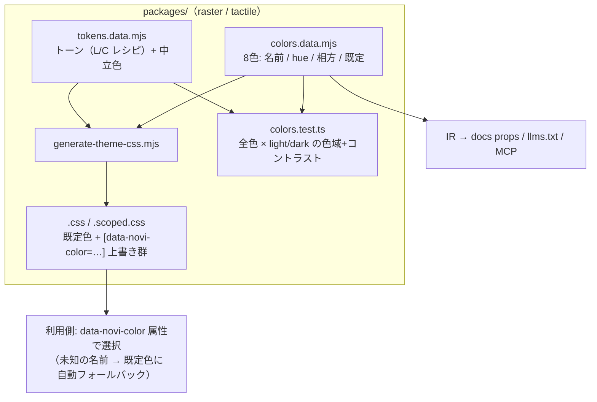

# Tones & Colors — Design

| 項目 | 値 |
|------|-----|
| Status | **Approved**（値は承認済み。実装詳細は Draft） |
| Author | yuuto |
| Last Updated | 2026-08-22 |
| Requirements | [./requirements.md](./requirements.md) |
| 検証記録 | Raster: [Print Inks 提案書]・Tactile: [Textile Dyes 提案書]（Artifact。48判定の実計算を含む） |

---

## Architecture Overview



**コンポーネントと core はこの図に登場しない。** 全部品は既に `--novi-color-*` しか参照しておらず、
変数の定義側だけが変わる（FR-04 / G3）。

---

## 生成される CSS の形（ADR-C02）

実行時に `oklch(L C var(--hue))` を合成する案は採らず、**全値を生成時に事前計算**する。

```css
/* raster.css（生成物・抜粋） */
[data-novi-theme='raster'], :root {
  /* 既定色 = Ink。data-novi-color 未指定・未知の名前はこの値のまま（FR-05） */
  --novi-hue: 268;
  --novi-color-primary: oklch(44% 0.09 268);
  --novi-color-primary-fg: oklch(98.5% 0.004 268);
  --novi-color-secondary: oklch(44% 0.09 35);        /* 相方 Brick */
  --novi-color-secondary-fg: oklch(98.5% 0.005 35);
}
[data-novi-theme='raster'][data-novi-color='brick'], :root[data-novi-color='brick'] {
  --novi-hue: 35;
  --novi-color-primary: oklch(44% 0.09 35);
  /* … secondary は相方 Ink の値 … */
}
[data-novi-scheme='dark'] { /* 各色の dark 値も同様に生成 */ }
```

| 判断 | 理由 |
|---|---|
| 事前計算 | Graphite / Greige の例外 C、モデル別トーン、dark の別値を1つの式で表せない。生成なら全部ただのデータ |
| フォールバックはセレクタ不一致で実現 | 未知の色名はどの `[data-novi-color=…]` にも一致しない → 既定値が生きる。**JS もランタイム判定も不要**（AC-01-4） |
| 既存 CSS に同梱（FR-03） | 増分は gzip で +543 B（Raster 実測）。import を増やすと AI が入れ忘れる（Provider を持たない理由と同じ） |
| `--novi-hue` も出力 | Tactile の中立色染めと、利用者の拡張（自作の派生色）が参照できる |

### Tactile の中立色（FR-06）

Tactile では中立色トークン自体も色ごとに生成する（8色 × 中立 12 値 × 2スキーム ≈ 200 行弱・容認）。

```
light: bg 97.6%/0.006/H・surface 99.3%/0.004/H・subtle 94.5%/0.009/H・
       border 90%/0.011/H・border-strong 63%/0.013/H・muted 47%/0.012/H・fg 22%/0.015/H
dark:  bg 14%/0.012/H・subtle 20%/0.014/H・surface 24%/0.014/H・
       border 30%/0.015/H・border-strong 55%/0.014/H・muted 70%/0.012/H・fg 94%/0.008/H
```

> **確定値（T-02 の検査を通した結果）。** 実装時に3点が仮値から動いた:
> `subtle` を 94 → 94.5（primary を文字色に使う `soft` variant のため）、
> `border-strong` を 68 → 63（bg に対する 3:1）、
> dark の `bg`/`surface` を 15/21.5 → **14/24**（背景色差 1.2:1 を満たす下限）。
> dark は **bg < subtle < surface** の順を保つ（持ち上がるほど明るい）。
> Raster の中立色は既存のまま変更しない（chroma 0・FR-07）。
>
> **「浮き」の伝達手段はスキームで違う。** light は影、dark は明度差。
> AC-06-3 の 1.2:1 は dark 限定の基準で、light に当てると白い面を白い地に置けなくなる。

---

## トーンとセットの決定値

**[requirements.md の決定表](./requirements.md) が唯一の真実。** ここには実装が知るべき差分だけを書く。

| | Raster — Print Inks | Tactile — Textile Dyes |
|---|---|---|
| primary light / dark | L44 C0.090 / L74 C0.090 | **L50** C0.080 / L76 C0.075 |
| 無彩枠 | Graphite: C 0.020 / 0.017（hue 270） | Greige: C 0.022 / 0.018（hue 80） |
| 中立色 | 染まらない（既存値・chroma 0） | 選択色の hue に染まる |
| 既定色 | ink | indigo |
| primary-fg | 全色 light=白系 / dark=黒系（検証済み） | 同左 |
| 天井（記録） | L44 で C 0.095（律速 Ochre） | **L50 が実用上限**（律速 Peacock/`subtle`。L52 は余裕 0.1 未満・L54 以上は不成立） |

---

## Alternatives Considered

| 案 | Pros | Cons | 採否 |
|---|---|---|---|
| A: 事前計算 + 属性切替（本案） | JS 0・フォールバック自動・全値が検査可能 | CSS 行数が増える（生成なので保守負担なし） | ✅ |
| B: `oklch(L C var(--novi-hue))` の実行時合成 | CSS が短い | 例外（無彩枠・dark 別値・モデル差）で式が破綻。検査対象が「式」になり実値を固定できない | ❌ |
| C: 色ごとに別 CSS ファイル（colors/ink.css） | 使う色だけ読める | 節約は数百 B。import 忘れ・切替に再ロードが必要になり AC-01-3 を満たせない | ❌ |
| D: JS API（setColor('ink')） | 明示的 | Provider を持たない原則（ADR-04）に反する。属性で足りる | ❌ |
| E: 自由 hue を受け付ける | 柔軟 | コントラスト保証が不可能になり G4 が崩壊。`--novi-color-*` 手動上書きが既にある | ❌ NG1 |

---

## Decisions (ADR)

### ADR-C01: トーンはモデルが所有し、カラーセットはモデルごとに設計する
- **Status**: Accepted (2026-08-22)
- **Context**: 当初「色は全モデル共通8本」で設計したが、共通セットでは全モデルの色域制約の積集合に縛られる（Teal が Raster の C 上限を 0.075 に固定していた）。またコンセプト面でも、ラインごとに色展開が違うのがアパレルの自然。
- **Decision**: モデル = トーン + セット。Raster「印刷インク」/ Tactile「織物の染料」。hue の重複はゼロにし、入れない色で性格を作る。
- **Consequences**:
  - (+) Raster の C が 0.075 → 0.090 に回復。各モデルの色が最大限生きる
  - (+) 「同じ染料を別の生地で」から「生地に合う染料を選ぶ」へ。メタファーがより正確になった
  - (−) モデル間で色名が通用しない → フォールバック規則（FR-05）で吸収

### ADR-C02: 色は事前計算した CSS + `data-novi-color` 属性 + セレクタ不一致フォールバック
- **Status**: Accepted (2026-08-22)
- **Context**: 上記 Alternatives。切替の実証は Colorways デモ・上書きの反映は Raster T-38 テストで確認済み。
- **Decision**: 生成器が全色の全値を出力。属性はテーマルートに置く。未知の名前は自動的に既定色。
- **Consequences**: (+) JS 0 B・RSC 安全・SSR 可 (−) 生成器のテンプレートが1段複雑になる

### ADR-C03: 相方（差し色）は同一セット内の色を `secondary` に割り当てる
- **Status**: Accepted (2026-08-22)
- **Context**: 差し色に新しい hue を導入すると検査対象が倍増する。印刷の2色刷り・服のバイカラーは「同じ棚の色を組む」文化。
- **Decision**: 各色が相方を1つ持ち、`--novi-color-secondary(-fg)` に相方の値が入る。語彙（ADR-06）は変えない。
- **Consequences**: (+) 未検査色ゼロ・コーデが自動で付く (−) secondary を「第2ブランド色」として使っていた利用者には意味が変わる → docs で明記

### ADR-C04: トーンの成立範囲は「セット全色の sRGB 色域 × コントラスト」の掃引で決める
- **Status**: Accepted (2026-08-22)
- **Context**: 天井はコントラストでなく色域が決めることが多く（暗い鮮やかな黄・青緑は sRGB に無い）、目分量では見えない。
- **Decision**: トーン・セットの変更時は必ず掃引を再実行し、上限から 0.005〜0.010 の余白を取る。掃引ロジックは `colors.test.ts` に常設し、変異テスト（域外値をわざと足すと落ちる）を付ける。
- **Consequences**: (+) 「なぜこの値か」に常に数値の答えがある (−) Tactile light の字コントラストは 4.6〜4.9 と基準側に寄る（=「淡さ」の対価。承認済み）

### ADR-C05: 属性名は `data-novi-color`
- **Status**: Accepted (2026-08-22)
- **Context**: `data-novi-theme` / `data-novi-scheme` が既にある。
- **Decision**: 同列の `data-novi-color`。値は kebab-case の色名。docs の保存キーは `novi-color`（モデルごとに保存・FR-12）。

---

## Cross-cutting Concerns

- **リリース**: Raster の既定 primary が indigo(C0.18) → Ink(C0.090) に変わる。0.x minor + changeset に「なぜ」を明記。視覚回帰 42 枚を全更新（ADR-R8 の手続きを踏襲）
- **スキーム切替との直交性**: color × scheme × theme の3属性は独立。生成 CSS はこの直交性を壊さない順序で出力する（@layer 既存規約に従う）
- **docs**: 色選択 UI はテーマ切替と同じヘッダーに置く。FOUC 対策のインラインスクリプトに color を追加
- **AI（04 系）**: `design-rules.data.mjs` と同様に `colors.data.mjs` を IR に載せ、llms.txt / MCP / accuracy が同じ語彙を読む（STATUS #13 の原則）
- **spec 05 との関係**: Tactile 実装は**最初からこの spec のトーン・色で作る**（spec 05 の色仮値は本 spec が置き換えた）

---

## Risks

| Risk | Impact | Likelihood | Mitigation |
|---|---|---|---|
| Raster の色改定が既存利用者の見た目を変える | 中 | 確実 | 意図した変更として changeset・README・docs テーマページで告知。0.x minor |
| Tactile light の字コントラスト余白が小さい（4.6〜4.9） | 中 | — | 実装時に神経質な丸めをしない（生成値をそのまま使う）。検査は 4.5 ちょうどでなく 4.5 以上を固定 |
| 生成器のバグで一部の色だけ値がズレる | 高 | 低 | colors.test が**生成 CSS をパースして**全値を検査する（データではなく成果物を見る・検証の原則） |
| docs の色 UI がテーマ切替と干渉する | 低 | 中 | 属性は独立（直交性）。e2e に theme × color の組み合わせ切替を1本足す |
| 相方=secondary の意味変更に利用者が気づかない | 中 | 中 | docs theming ページに Before/After を明記 |

---

## Test Strategy

| テスト | 内容 | 対応 |
|---|---|---|
| `colors.test.ts`（新設・両テーマ） | 生成 CSS をパースし、全色 × light/dark で: 色域内 / 地への 4.5:1（Tactile は染まった地）/ 面上文字 4.5:1 / トーン値一致 / 意味色不変 / 相方一致 | AC-02, AC-03, AC-04, FR-08, FR-09 |
| 変異テスト | 域外値（Raster に hue200/C0.10）を注入すると落ちる | AC-03-4 |
| jsdom | 属性切替で `--novi-color-primary` が変わる / 未知の名前で既定色 | AC-01-1〜4 |
| e2e（docs） | 色 UI の切替・保存・FOUC なし・theme × color 直交 | FR-12 |
| 視覚回帰 | 既定色で全コンポーネント（基準更新）+ 色切替の代表2色 × 2テーマ | リリース |
| accuracy | 色名の語彙をプロンプトで検査（存在しない色名を出さない） | AC-05-2 |
