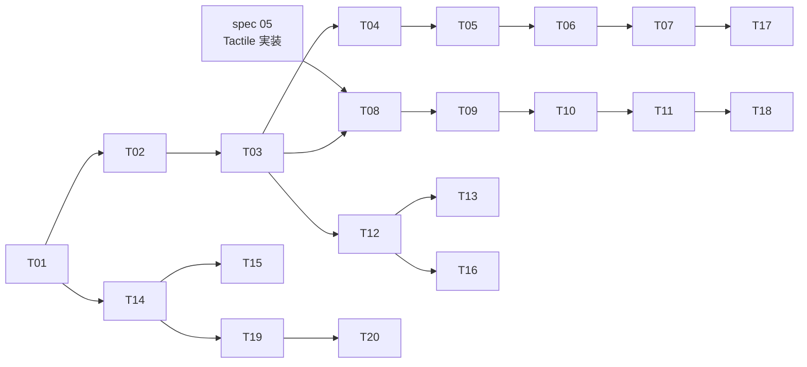

# Tones & Colors — Implementation Tasks

| 項目 | 値 |
|------|-----|
| Status | **Draft** |
| Author | yuuto |
| Last Updated | 2026-08-22 |
| Requirements | [./requirements.md](./requirements.md) |
| Design | [./design.md](./design.md) |

> **推奨順序: Phase A（Raster + 基盤）→ spec 05（Tactile 実装）→ Phase B（Tactile 色 + 横断）。**
> Tactile を旧仮値（teal）で実装してから塗り替えるのは二度手間。spec 05 は最初から本 spec の
> トーン・色で作る。Phase A は spec 05 と独立に今すぐ着手できる。

---

## Phase A: Raster の色改定と基盤（spec 05 と独立・先行可）

> **完了（2026-08-22）。** 実装で判明した2点を記録する:
> 1. **視覚回帰が色の変更を検出できていなかった。** `toHaveScreenshot` の `threshold` 既定 0.2 が緩く、
>    primary を別の色に差し替えても「差分 0 ピクセル」と判定される。ADR-R8（角丸 0→12px・hue 転回・影の追加）が
>    基準を1枚も更新せずに通っていたのはこれが原因で、STATUS.md の「基準 42 枚を全て更新した」は事実と違っていた。
>    `threshold: 0.05` に締め、色を戻すと落ちることを変異で確認済み。
>    さらに **基準は判定するのと同じ Linux で撮る**運用に変えた（`update-snapshots.yml`）。
>    環境差（比 0.02）と本物の色変更（比 0.03）は近すぎ、閾値では分離できないため
> 2. **`data-novi-color` はテーマ宣言と同じ要素に置く必要がある。** `data-novi-theme` が入れ子になっていると
>    内側が既定色を宣言し直し、外側の色指定はそこで止まる（docs がこの構造）。T-12 はこれを前提に組む

- [x] **T-01**: `packages/raster` に `colors.data.mjs` 新設（8色: name / hue / pair / default、Graphite の例外 C）+ `tokens.data.mjs` にトーン（L44/C0.090・L74/C0.090）を移す (2h) → FR-01, G1
- [x] **T-02**: **`colors.test.ts` を先に書く（Red）**。生成 CSS をパースして全色 × light/dark の色域・地 4.5:1・面 4.5:1・トーン一致・意味色不変・相方一致を検査 + **変異テスト**（hue200/C0.10 注入で落ちる） (3h) → AC-02-1, AC-03-1〜4, AC-04-1〜2, FR-08, FR-09
- [x] **T-03**: `generate-theme-css.mjs` 拡張。既定色 + `[data-novi-color=…]` 上書き群を `raster.css` / `raster.scoped.css` に出力（事前計算・ADR-C02）。T-02 を Green にする (3h) → AC-01-1〜4, FR-02, FR-03, FR-05
- [x] **T-04**: 既定 primary の置換（indigo C0.18 → Ink C0.090）に伴う修正。`surface-contrast` / `variant-distinctness` / トークン検査の期待値更新。**コンポーネントと core の diff が 0 行であることを確認** (2h) → G3, FR-04
- [x] **T-05**: jsdom テスト: 属性切替で primary が変わる / 未指定・未知名で Ink (1.5h) → AC-01-2, AC-01-4
- [x] **T-06**: 視覚回帰の基準更新（Raster 20 × light/dark・ADR-R8 と同じ手続き）+ 代表色（brick / forest）での追加ショット (2h) → リリース準備
- [x] **T-07**: changeset（minor・「なぜ」に色改定の経緯）+ `packages/raster/README.md` に Print Inks の表とフォールバック規則 (1.5h) → Constraints

## Phase B: Tactile の色（spec 05 実装後）

- [ ] **T-08**: `packages/tactile` に `colors.data.mjs`（8染料）+ トーン（L54/C0.080・L76/C0.075）+ 中立色の染め生成（8色分の中立トークン群） (3h) → FR-01, FR-06
- [ ] **T-09**: `colors.test.ts`（Tactile 版・**染まった地に対する**コントラスト測定 + 変異テスト） (2h) → AC-03-1
- [ ] **T-10**: 生成器で `tactile.css` / `tactile.scoped.css` へ出力・jsdom テスト（未知名 → indigo） (2.5h) → AC-01-4, AC-02-3
- [ ] **T-11**: README（Textile Dyes の表・Raster との対の説明） (1h)

## Phase C: docs / AI 統合

- [ ] **T-12**: docs に色選択 UI（ヘッダー・モデルごとの色一覧・保存キー `novi-color`・FOUC 対策インラインスクリプト拡張） (3h) → AC-01-3, FR-12
  - [x] **`ColorPicker` をライブラリのコンポーネントとして追加（2026-08-23・PR #12）**。core に契約、両モデルに実装、
        ダッシュボードのショーケースに搭載して色が選べる。色の一覧はモデルが持ち、利用側は色名を書かない
  - [ ] サイトのヘッダーへの搭載と `novi-color` の永続化（FOUC 対策のインラインスクリプト拡張を含む）
  > **色見本は `data-novi-color` では作れない**（STATUS #42）。docs は `<html>` にもテーマを宣言するため、
  > 色の上書きを配下に効かせるとページ全体が塗られる。色ごとの値を `--novi-swatch-<id>` として
  > テーマルートで宣言する形にした。ヘッダー搭載時もこの前提は変わらない
- [ ] **T-13**: theming ページ更新: トーン×色の説明・secondary の意味変更（相方）・フォールバック規則・`--novi-color-*` 手動上書きとの関係 (2h) → ADR-C03
- [ ] **T-14**: IR に `colors` を追加（`colors.data.mjs` から）→ props 表 / llms.txt / MCP `get_design_rules` に色語彙・既定色・フォールバックを載せる (2.5h) → AC-05-1, FR-11
- [ ] **T-15**: accuracy に色指定プロンプトを追加（「Raster で赤系」→ brick/bordeaux が出る・存在しない色名を出さない）**手動実行・ADR-A5** (1.5h) → AC-05-2
- [ ] **T-16**: e2e: 色切替 × テーマ切替 × スキーム切替の直交確認 + モバイル幅で色 UI が使える (2h) → Cross-cutting

## Phase D: リリースと申し送り

- [ ] **T-17**: Raster リリース（Phase A 完了時点で先行可・**PR #3 が CI 全緑。マージ待ち**）: `pnpm accuracy` 手動実行 → version PR → 公開 (1h)
- [ ] **T-18**: Tactile 側リリース（spec 05 のリリースに同乗） (0.5h)
- [ ] **T-19**: ルックブック / 提案書 Artifact 群の内容を docs のテーマページに移植し、Artifact は記録として凍結 (2h)
- [ ] **T-20**: 3本目のモデルへの申し送り: 「新モデルのセット設計手順」（コンセプト → 候補 hue → 掃引 → 余白 → 提案書）を短くまとめて 06 design.md に追記 (1h) → G7 系譜

**合計見積**: 約 39h（A: 15h / B: 8.5h / C: 11h / D: 4.5h）

---

## Dependencies

- **T-02 → T-03 の順序が本プロジェクトの不変手順**（検査を先に書いてから値と生成を確定する）
- Phase A と spec 05 は独立。**Phase A を先に出すと、spec 05 は最初から確定トーンで実装できる**

---

## Definition of Done

- [ ] 両テーマの `colors.data.mjs` / トーンが requirements.md の決定表と一致
- [ ] `colors.test.ts` が両テーマで全通過（生成 CSS をパースする方式・変異テスト付き）
- [ ] `git diff --stat packages/core` と全 `*.styles.ts` / `*.tsx` が 0 行
- [ ] 未知の色名 → 既定色のフォールバックがテストで固定されている
- [ ] docs の色 UI・llms.txt・MCP・accuracy が同じ `colors.data.mjs` から出ている
- [ ] 視覚回帰の基準更新が完了し、CI が緑
- [ ] Raster minor リリース済み（changeset に経緯）
- [ ] requirements.md の Open Questions が空・Status を `Implemented` に更新
