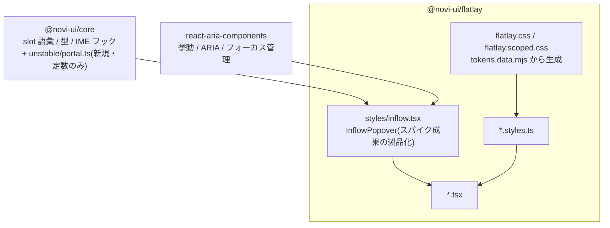

# @novi-ui/flatlay — Design

| 項目 | 値 |
|------|-----|
| Status | **Approved** |
| Author | yuuto |
| Last Updated | 2026-08-26 |
| Requirements | [./requirements.md](./requirements.md) |
| Architecture | [../../architecture.md](../../architecture.md) |
| 申し送り元 | [../05-theme-tactile/design.md](../05-theme-tactile/design.md) T-48/T-49 + Raster T-41(全項目取り込み) |

---

## Architecture Overview

構造は両テーマと同一(3ファイル構成・`satisfies SlotMap`・named export・unbundle)。
Flatlay 固有の箱は2つ: **`styles/inflow.tsx`**(インフロー再配置の唯一の実装)と
**core の `unstable/portal.ts`**(upstream 依存の封じ込め・ADR-F5)。



### スパイクからの申し送り(そのまま実装の前提にする)

1. **インフロー展開は「Popover の再配置」で実装する。** 自前の開閉描画(方式A/B)は Select のコレクション構築とフォーカス初期化が壊れるため禁止(requirements Background に記録)
2. ポータル先はトリガー直後のフロー内コンテナ。inline 座標は `static! max-h-none! w-auto! transform-none!` で無効化
3. `isNonModal` を必ず付ける(スクロールロック・aria-hide を発動させない)
4. 検証ページ `apps/docs/app/flatlay-probe/` は T-45 相当の構造差検査に昇格させてから削除する

---

## 着手条件の充足 — 3モデルの構造差を実装前に固定する

[architecture.md §12](../../architecture.md) の致命リスク「テーマ差が色と角丸に収束する」への回答。
**この3つの構造差がテーマ横断テストで機械検査される**(AC-02-1〜4)。

### 1. Modal — 中央ダイアログ → ボトムシート → **全画面テイクオーバー**

```
Raster                    Tactile                     Flatlay
backdrop(中央寄せ grid)  backdrop(下端寄せ flex)    backdrop(= テイクオーバーの地。viewport 全面)
└─ panel(中央・max-w-md) └─ panel(下端固定・全幅)   └─ panel(全幅・書類のヘッダ行から始まる)
   ├─ header ── title ×     ├─ (grabber)               ├─ header ── closeButton(左上「← 戻る」)── title
   ├─ body                  ├─ title                    ├─ body(罫線区切りの本文)
   └─ footer(右揃え)       ├─ body                     └─ footer(罫線上の操作行・左揃え)
                            └─ footer(縦積み・全幅)
```

- **z-index を使わない**: ModalOverlay は `fixed inset-0` だが、DOM 順(body 末尾のポータル)だけで最前になる。`fixed` の使用は modal.styles.ts の例外1号(FR-03)
- `closeButton` は **header の左端**(書類の「← 戻る」)。右上アイコン(Raster)/ footer フルワイド(Tactile)に続く第3の位置。**名前が同じで位置が違う**の3例目
- `size` の解釈: テイクオーバーでは面積が固定(全画面)なので、**本文の最大行長**(sm=32rem / md=44rem / lg=56rem / full=制限なし)として解釈する。幅(Raster)・高さ(Tactile)・**行長(Flatlay)** — 語彙は共通、解釈はテーマの自由の3例目

### 2. Select — アンカー型 → 下端シート → **インフロー押し下げ**

```
Raster                    Tactile                     Flatlay
trigger(h-40)            trigger(h-48)              trigger(h-32・帳票の行)
└─ popover(トリガー直下  └─ popover(viewport 下端   └─ popover(トリガー直下の「フロー内」。
   に浮く・同幅・影)        に固定・全幅・上向き影)     後続を押し下げる。影なし・罫線のみ)
   └─ listbox ── option     └─ listbox(行高48+✓)      └─ listbox ── option(行高28・罫線区切り)
```

- 実装は `styles/inflow.tsx`(スパイクの InflowPopover)経由。**popover slot は「押し下げ面」**として実体を持つ
- 選択中の表示はチェックマークではなく**行頭の `▸`**(帳票のインデックス記号)
- 開時に listbox が viewport 外に出る場合は `scrollIntoView({ block: 'nearest' })` で追従(T-14 で検証)

### 3. Tabs — 下線 → セグメンテッド → **地続きタブ**

```
Raster                    Tactile                     Flatlay
list(border-b 1px)       list(subtle の塗りトラック) list(タブ = 罫線で囲まれた耳)
└─ tab(下線で選択表示)   ├─ indicator(動く塗り面)   ├─ tab(非アクティブ: 4辺罫線)
panel                     └─ tab                      └─ indicator(アクティブタブの下辺罫線を
                          panel                          消して panel と一体化させる切れ目)
                                                      panel(上辺罫線・アクティブ位置だけ開く)
```

- 書類フォルダの耳。アクティブタブは `-mb-px` + `border-b-transparent` で panel と地続きになる
- `indicator` slot は Raster では未使用、Tactile では動く塗り面、**Flatlay では「切れ目」**— 任意 slot の解釈差の3例目

### 追加の構造差(同時に固定)

| コンポーネント | Raster | Tactile | Flatlay |
|---|---|---|---|
| Toast | region 右下・浮く | region 上端中央・浮く | **region はフロー挿入の帯**(アプリの先頭に置く。浮かない・ADR-F4) |
| Menu | トリガー直下・浮く | 下端シート | **インフロー押し下げ**(Select と同じ配置原理)。`itemShortcut` を mono で右端に(初の主役化) |
| Popover | アンカー型・影 | アンカー型・影 | **インフロー注記面**(罫線で囲まれた押し下げ面) |
| Tooltip | 反転面・浮く | 反転面・浮く | 反転面・浮く(**例外2号**。ポインタ追従の一時表示はフロー化不能・ADR-F6) |
| Accordion | +/−・境界線 | シェブロン回転・カード | **Flatlay の主役**(もともとインフロー展開)。インジケータは `▸/▾` の mono 記号・回転なし |

---

## Flatlay のトークン値

> 色は [06](../06-tones-and-colors/requirements.md) の枠組みに従い、決定値(requirements 参照)を `tokens.data.mjs` / `colors.data.mjs` に写す。
> 以下の中立・寸法は仮値で、**T-02 の検査を通る値だけを採用する**(目分量で決めない)。

```js
// packages/flatlay/scripts/tokens.data.mjs(抜粋・仮値)

// 角丸: 書類の直角。2px は「断裁の丸み」程度
export const FLATLAY_RADII = { none: '0px', sm: '2px', md: '2px', lg: '4px', full: '9999px' }

// 影: 全段 0 0 #0000(none にしない — リング合成の教訓・Tactile ADR)
export const FLATLAY_SHADOWS = { none: '0 0 #0000', sm: '0 0 #0000', md: '0 0 #0000', lg: '0 0 #0000' }

// タイポ: 本文 16(入力ズーム回避を維持)、ラベル・注記は 13 の mono が声
export const FLATLAY_TEXT = { xs: '11px', sm: '13px', base: '16px', lg: '18px', xl: '22px', '2xl': '26px', '3xl': '32px' }

// フォント: タイポの声(G6)。テーマ CSS が --novi-font-* を初めて上書き・消費する
export const FLATLAY_FONTS = {
  sans: "system-ui, sans-serif",
  mono: "ui-monospace, 'SFMono-Regular', Menlo, Consolas, monospace",
}

// 高さ: 帳票の行。ポインタ/キーボード前提の密度(タッチ検査は Tactile の領分)
export const FLATLAY_CONTROL_HEIGHTS = { sm: 28, md: 32, lg: 40 }

// モーション: 1本。展開は即時(FR-12)、fade 系のみ 100ms
export const FLATLAY_MOTION = {
  'duration-fast': '100ms', 'duration-base': '100ms', 'duration-slow': '100ms',
  'ease-standard': 'cubic-bezier(0.2, 0, 0, 1)', 'ease-emphasized': 'cubic-bezier(0.2, 0, 0, 1)',
}

// 中立: 染まらない紙。罫線だけが data-novi-color の hue に染まる(生成器が色ごとに出力)
const NEUTRAL_LIGHT = {
  bg: 'oklch(98.8% 0 0)', subtle: 'oklch(95.5% 0 0)',
  fg: 'oklch(22% 0 0)', muted: 'oklch(46% 0 0)',
  // border / border-strong は色ごとに生成: oklch(88% 0.025 <hue>) / oklch(58% 0.03 <hue>)
  overlay: 'oklch(98.8% 0 0)',  // テイクオーバーの地 = 紙(暗転しない・ADR-F2)
}
// dark: bg 15% / subtle 20% / fg 94% / muted 70%、罫線 oklch(32% 0.022 <hue>) / oklch(55% 0.03 <hue>)
```

- **overlay が「紙色」**なのが Flatlay の性格: テイクオーバーは暗転(影の親戚)ではなく、新しい紙に差し替わる
- 意味色は両テーマ同系(success 155 帯 / warning 60 帯 / danger 27 帯)で L/C をトーンに合わせ、T-02 で確定。**Redline を入れない理由**(赤 = 意味色に予約)を docs のテーマ紹介ページに明記する

---

## 基準パターン(Button)— 両テーマからの差分

3ファイル構成・型付け・宣言順(variant 最後)・JSDoc は完全に同一。差分は4点。

```ts
// button.styles.ts — 差分
const slots = {
  root: [
    'inline-flex items-center justify-center gap-2',
    'font-medium whitespace-nowrap select-none',
    'border border-[var(--novi-color-border-strong)]',       // 差分1: 既定で罫線を持つ(帳票の枠)
    'rounded-[var(--novi-radius-sm)]',
    'transition-[background-color,border-color,color] duration-[var(--novi-duration-fast)]',
    focusRing,
    disabledState,
  ].join(' '),
  label: 'truncate',
  // 差分2: 数値やショートカットを差し込む startContent/endContent は mono + tabular-nums
  startContent: 'shrink-0 inline-flex font-(family-name:--novi-font-mono) tabular-nums',
  endContent: 'shrink-0 inline-flex font-(family-name:--novi-font-mono) tabular-nums',
  spinner: 'shrink-0',
} satisfies SlotMap<...>

// 差分3: 押下は反転(スタンプ)。scale は書かない(FR-11)
const variant: VariantMap<NoviVariant, { root: string }> = {
  solid: { root: 'bg-[var(--c)] text-[var(--c-fg)] data-[pressed]:bg-[var(--c-fg)] data-[pressed]:text-[var(--c)]' },
  outline: { root: 'text-[var(--c)] data-[pressed]:bg-[var(--c)] data-[pressed]:text-[var(--c-fg)]' },
  // soft / ghost / plain も同じ原理(pressed で面と文字が入れ替わる)
}

// 差分4: 高さ 28/32/40(帳票の行)
const size = { sm: { root: 'h-7 px-2.5 text-[length:var(--novi-text-sm)]' },
               md: { root: 'h-8 px-3 text-[length:var(--novi-text-base)]' },
               lg: { root: 'h-10 px-4 text-[length:var(--novi-text-base)]' } }
```

---

## 禁止クラス検査(FR-02〜04, FR-12)

`design-rules.data.mjs` を Flatlay 用に新規作成(規律そのものが違うため共有しない)。

| 検出パターン | 理由 | 例外 |
|---|---|---|
| `z-\d+` / `z-[` / `zIndex` | z 軸を持たない | **なし** |
| `fixed` / `absolute` | 浮く面を作らない | `modal.styles.ts`(テイクオーバー)/ `tooltip.styles.ts`(例外2号)・理由コメント必須 |
| `shadow-`(`shadow-[var(--novi-shadow-*)]` を除く) | 影は嘘 | なし(トークン自体が全段 `0 0 #0000`) |
| `transition-[height]` / `transition-[max-height]` / `animate-[.*(height\|slide)` | 展開は即時 | なし |
| `scale-` / `translate-` / `rotate-` / `animate-spin` | 動きで飾らない・押下は反転 | `spinner.styles.ts` のみ(両テーマと同じ) |
| `rounded-` の任意値(トークン経由を除く) | 角丸は直角規律 | なし |
| リテラル色値 | 色はトークン経由 | `tokens.data.mjs` / `color-set.ts` のみ |
| `sticky` | 滞留も重なり(ADR-F4) | なし |

トークン検査(`tokens.test.ts`): 影が全段 `0 0 #0000` / radius が 0・2・2・4 / duration 3値同一 /
中立 chroma 0 / 罫線 chroma 0.02〜0.03 帯 + border-strong 3:1 / 48判定 + フォールバック。

---

## Decisions (ADR)

### ADR-F1: 展開・格納はアニメーションしない(即時)
- **Status**: Accepted (2026-08-24)
- **Context**: 押し下げは大きなレイアウト変化で、height transition を付けると後続コンテンツが滑り続けて読めない。帳票の様式としても「パタッと開く」が正しい。
- **Decision**: 展開・格納は即時。`transition-[height]` 系を検査で禁止する(FR-12)。fade は開く中身自体の 100ms のみ許可。
- **Consequences**: (+) 実装が単純・CLS 議論も消える (−) 現代的な「なめらかさ」は意図的に捨てる。テーマ紹介ページで思想として語る

### ADR-F2: テイクオーバーの地は暗転ではなく紙
- **Status**: Accepted (2026-08-24)
- **Context**: overlay の暗転は「背後に何かがある」ことの表現 = z 軸の語彙。
- **Decision**: `--novi-color-overlay` を bg と同じ紙色にする。テイクオーバーは新しい紙への差し替え。
- **Consequences**: (+) 原理が一貫する (−) 「モーダルが開いた」感が薄れるため、header の「← 戻る」と罫線で文書の切り替わりを明示する

### ADR-F3: 押下表現は反転(スタンプ)
- **Status**: Accepted (2026-08-24)
- **Context**: scale(Tactile)は物理の言葉、色変化のみ(Raster)は控えめすぎて Flatlay の性格が出ない。
- **Decision**: `data-pressed` で面と文字を入れ替える。全 variant で同じ原理。
- **Consequences**: (+) モーションゼロで最強の押下フィードバック (−) 反転後の組み合わせもコントラスト検査対象になる(T-02 に含める)

### ADR-F4: Toast はフロー挿入のみ。sticky も使わない
- **Status**: Accepted (2026-08-24)
- **Context**: sticky はスクロール中にコンテンツへ重なる = z 軸。
- **Decision**: region はアプリ先頭に置くフローの帯。スクロールで見えなくなってよい(帳票の朱書きはページ先頭にある)。docs に配置の推奨を明記。
- **Consequences**: (+) 例外が増えない (−) 長いページでは通知に気づきにくい。重要な確認は Toast でなく Modal(テイクオーバー)を使う、という使い分けを docs に書く

### ADR-F5: `UNSTABLE_portalContainer` は core の unstable に定数として封じ込める
- **Status**: Accepted (2026-08-24)
- **Context**: core は React を import しない(存在理由)ため、InflowPopover 実装そのものは core に置けない。しかし upstream の不安定名がテーマに散るのは ADR-07 違反。
- **Decision**: `core/src/unstable/portal.ts` が `export const INFLOW_PORTAL_PROP = 'UNSTABLE_portalContainer' as const` と型ヘルパを持つ。テーマは `{ [INFLOW_PORTAL_PROP]: container }` で使い、実装は `flatlay/src/styles/inflow.tsx` の1ファイルに限定(CI 検査・FR-09)。
- **Consequences**: (+) RAC が改名しても修正は core 1 行 (+) React 非依存の core 規約を守る (−) 間接参照のぶん読み手に一段の跳躍を要求する(理由コメントで補う)

### ADR-F6: Tooltip は唯一の浮き(例外2号)
- **Status**: Accepted (2026-08-24)
- **Context**: hover 追従の一時表示はフローに入れられない(レイアウトが動くと hover が外れる)。
- **Decision**: tooltip.styles.ts のみ absolute を許可(理由コメント必須)。docs に「重要情報を Tooltip に置かない」(Tactile と同文)を明記。
- **Consequences**: (+) 実用性を保つ (−) 「z 軸ゼロ」の主張に注釈が付く。例外が2つで固定であることを NG1 で縛る

### ADR-F7: タイポの声は mono の運用で出す(Web フォント同梱はしない)
- **Status**: Accepted (2026-08-24)
- **Context**: 依存ゼロ原則(steering)。書体ファイルを配ることはできない。
- **Decision**: `--novi-font-mono` に精密なシステムスタックを定義し、数値・ショートカット・コード・ラベル slot が消費する。`tabular-nums` を数値 slot の既定にする。
- **Consequences**: (+) `--novi-font-*` 消費ゼロ問題(デザイン診断 P2)がライブラリ側から解消し始める (−) 環境で字形が揺れる。寸法検査は文字幅に依存させない

---

## Risks

| Risk | Impact | Likelihood | Mitigation |
|---|---|---|---|
| RAC 更新で `UNSTABLE_portalContainer` が改名・削除される | 高 | 中 | ADR-F5 の封じ込め + RAC バージョン固定。改名検知テスト(prop 名が Popover の型に存在するか)を core に置く |
| 押し下げで利用者が展開位置を見失う | 中 | 中 | `scrollIntoView(nearest)` + 罫線で展開面を明示。docs のデモで体験を確認 |
| 反転押下が isSelected 系の選択表現と衝突する | 中 | 中 | 選択は `▸` 記号 + 罫線で示し、反転は press の瞬間だけに限定 |
| Modal 内で Select を開くと押し下げがテイクオーバー内で起きる | 低 | 高 | 仕様どおり(テイクオーバーも1枚の文書)。契約テストでネスト時の動作を1本書く |
| 3本目でも一致率 100% の .tsx が多く、v0.3 判断が空振る | 低 | 中 | それ自体が観測結果(G7)。棚卸しを T 番号付きで必ず実施し architecture §7 に追記 |

---

## Test Strategy

両テーマの5点セット + 追加検査をそのまま踏襲し、Flatlay 固有に以下を足す。

| テスト | 対象 | 対応 |
|---|---|---|
| **押し下げ実測**(開で Y 増・閉で復帰) | Select / Menu / Popover | AC-01-1, AC-01-2 |
| z-index ゼロ / fixed・absolute 例外リスト / sticky 禁止(変異テスト付き) | 全 styles | AC-01-3, AC-01-4 |
| テイクオーバーが viewport 全面 & z-index 非依存(DOM 順検証) | Modal | AC-02-1, FR-06 |
| 3モデル構造差の横断比較 | Modal / Select / Tabs | AC-02-4 |
| 罫線だけが染まる(chroma 帯域 + 中立 0) | tokens | AC-06-2 |
| 反転押下のコントラスト(pressed 状態の面/文字) | Button ほか | ADR-F3 |
| 印刷スナップショット | 展開を含む1ページ | AC-08-1 |
| キーボード通し(スパイクの再現を恒久化) | Select / Menu | AC-05-1, AC-05-2 |
